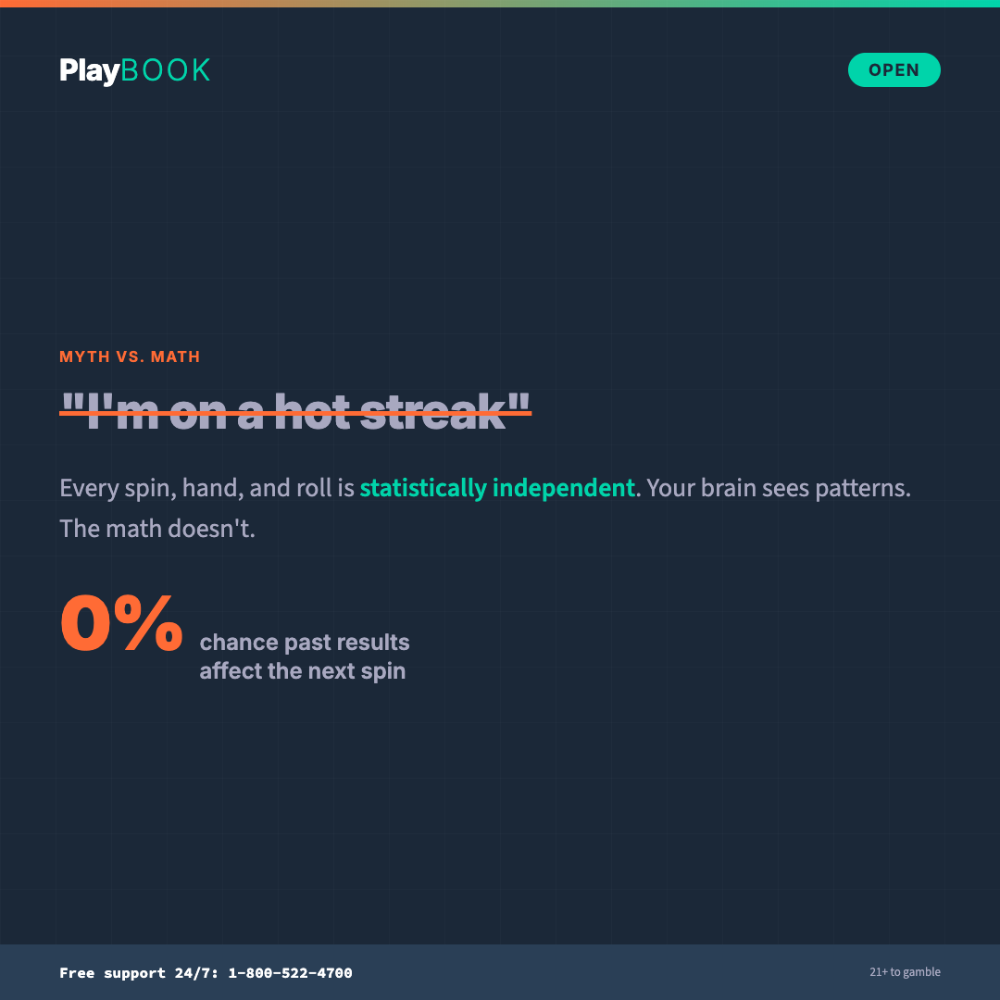
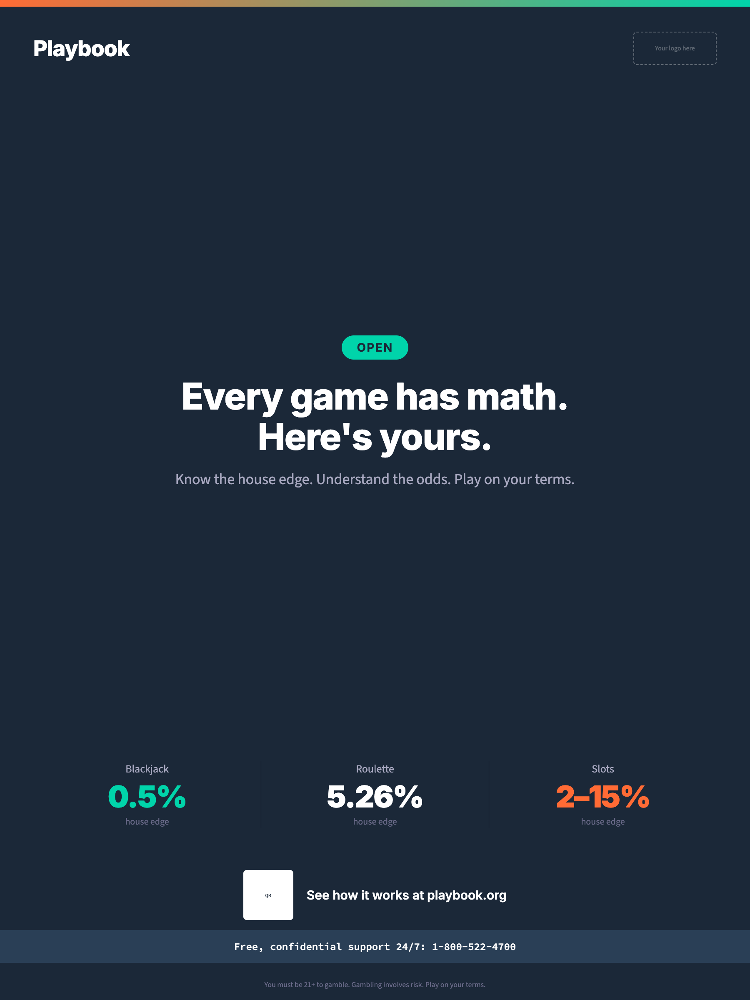
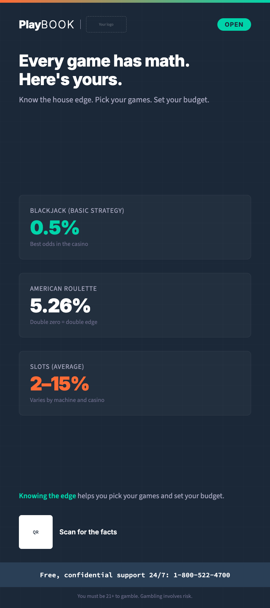
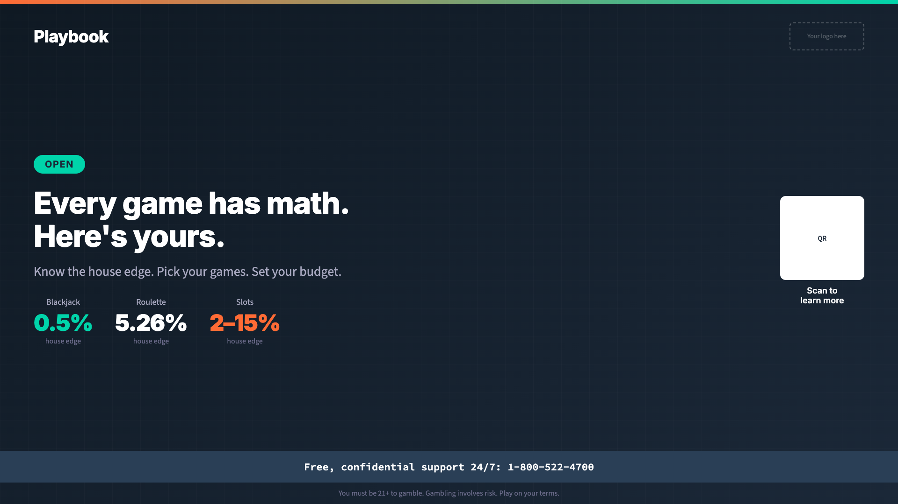
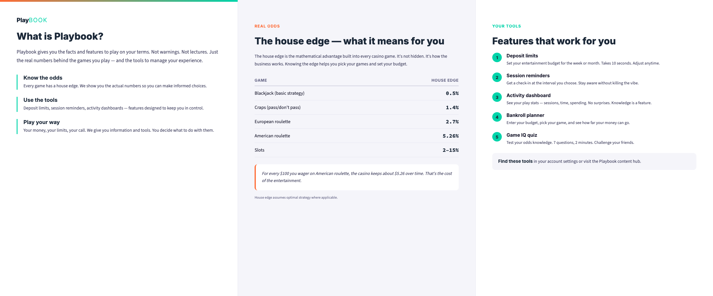

# Playbook

**Open-source brand guidelines for gambling entertainment literacy — CC0-licensed, white-label, built for operators.**

[](https://creativecommons.org/publicdomain/zero/1.0/)
[](_brand.yml)

---

## What is Playbook?

Playbook is a complete, forkable brand system for gambling entertainment literacy. It gives operators everything they need to build player-facing content that's actually worth engaging with: brand foundations, voice and tone, messaging frameworks, visual identity specs, multi-jurisdiction compliance modules, and ready-to-use collateral templates.

Playbook is a **content and media brand** — the educational and awareness layer that helps players understand how gambling actually works. It's anchored in the informed choice model: most people who gamble do so without problems, gambling is entertainment, and players make better decisions when they understand the math, the odds, and the tools available to them.

## Who is this for?

- **Casino operators and iGaming companies** who want player education content their marketing team is proud to co-brand
- **Sports betting platforms** building entertainment literacy programs that retain informed players
- **Gambling regulators** looking for a quality baseline they can recommend to licensees
- **Non-profits and advocacy organizations** creating engaging outreach content
- **Marketing, product, and design teams** who need specs, copy frameworks, and design briefs for player-facing content

## Why operators deploy Playbook

**Player retention.** Informed players play longer and more sustainably. They understand the games, manage their bankrolls, and enjoy the experience more. They churn less.

**Brand differentiation.** In a market where every operator's RG page looks the same, Playbook content stands out. It tells players: "We take you seriously."

**Regulatory compliance.** Jurisdictions require player-facing education and messaging. Playbook makes compliance content that actually works — not just content that checks a box.

## Quick start

1. **Fork this repository** to your own GitHub account
2. **Edit [`_brand.yml`](_brand.yml)** — your program name, colors, fonts, helpline numbers, and taglines. This single file drives the entire system.
3. **Choose your jurisdictions** — keep the modules you operate in (`jurisdictions/united-kingdom/`), delete the rest
4. **Customize messaging** — pick from the tagline system, adapt tone examples, write your own
5. **Build collateral** — use the HTML templates in `collateral/render/` and markdown specs across all channels

## Preview

A selection of the 36 ready-to-use templates in the brand system. Each template is available as HTML source and PNG render in `collateral/render/`.

| | | |
|---|---|---|
|  |  |  |
| Social card — myth-buster | Email — welcome series | Poster — Know Your Game |
|  |  |  |
| Print — rack card | Digital display — landscape | Venue sign — entrance |
|  |  |  |
| Tier 2 — support page | Tier 2 — helpline poster | Print — brochure inside |

---

## Repository structure

```
Playbook/
├── _brand.yml                        # White-label configuration engine
├── README.md                         # You are here
├── LICENSE                           # CC0 1.0 Universal
├── TERMS.md                         # Terms of use, indemnification, disclaimers
├── CONTRIBUTING.md                   # How to contribute
├── CHANGELOG.md                      # Version history
│
├── brand-book/                       # Core brand guidelines (10 chapters)
│   ├── 00-introduction.md            # Purpose, the engagement gap, two-tier system
│   ├── 01-brand-foundation.md        # Mission, vision, pillars (Open/Social/Sharp)
│   ├── 02-brand-personality.md       # The Sharp & Good Friend archetypes, humor guidelines
│   ├── 03-visual-identity.md         # Logo, color, typography, icons, photography
│   ├── 04-voice-and-tone.md          # The confident myth-buster voice
│   ├── 05-messaging-framework.md     # Tagline system, CTAs, interactive content briefs
│   ├── 06-accessibility.md           # WCAG 2.1 AA, inclusive design
│   ├── 07-application-guidelines.md  # Cross-channel rules, co-branding, integration
│   ├── 08-governance.md              # Stewardship, versioning, measuring adoption
│   └── glossary.md                   # Gambling terms for marketing teams
│
├── visual-identity/                  # Production-ready design assets
│   ├── design-tokens.css             # CSS custom properties for the full system
│   ├── logo/                         # 15 SVGs: primary, secondary, favicon, helpline badge
│   │   ├── primary/                  # Full-color and on-light (horizontal + stacked)
│   │   ├── secondary/                # Reversed, mono-white, mono-dark (horizontal + stacked)
│   │   ├── favicon/                  # 3 favicon variants
│   │   └── helpline-badge/           # Dark and light helpline badges
│   ├── color/                        # Palette and accessibility contrast matrix
│   ├── typography/                   # Type specimen, CSS, self-hosted font files (woff2)
│   ├── iconography/                  # 31 SVG icons, style guide, interactive preview
│   ├── photography/                  # Photo direction and mood board
│   └── illustration/                 # Illustration style guide
│
├── messaging/                        # Messaging content library
│   ├── core-messages.md              # 74 tagged messages by touchpoint
│   ├── tagline-system.md             # Tagline hierarchy and rotation
│   ├── calls-to-action.md            # CTA library by function
│   ├── myth-busting.md               # Common gambling myths, debunked
│   ├── campaigns.md                  # Campaign frameworks
│   ├── stigma-free-language.md       # Language guide
│   ├── tone-examples.md              # Voice in action across scenarios
│   └── player-segments/              # 6 audience-specific profiles
│       ├── general-players.md
│       ├── young-adults.md
│       ├── sports-bettors.md
│       ├── at-risk-players.md
│       ├── friends-and-family.md
│       └── help-seekers.md
│
├── collateral/                       # Templates for every touchpoint
│   ├── digital/                      # Website, mobile app, email, social media specs
│   ├── print/                        # Brochure, rack card, table tent, helpline card specs
│   ├── environmental/                # Venue signage and digital display specs
│   ├── video-audio/                  # TV, radio, pre-roll, and hold message scripts
│   ├── customer-service/             # Conversation scripts and staff FAQ
│   ├── interactive/                   # Quiz framework
│   └── render/                       # 36 HTML templates + PNG renders + build pipeline
│       ├── render-cards.mjs          # Puppeteer manifest (HTML → PNG)
│       ├── build-logos.mjs           # Logo SVG generator
│       ├── build-icons.mjs           # Icon SVG generator
│       ├── build-deck.mjs            # PPTX brand deck builder
│       ├── card-*.html/.png          # 6 social cards (1080×1080)
│       ├── story-*.html/.png         # 3 stories (1080×1920)
│       ├── poster-*.html/.png        # 3 posters (1800×2400)
│       ├── email-*.html/.png         # 4 email templates (600px wide)
│       ├── brochure-*.html/.png      # 2 brochure panels (2400×1000)
│       ├── sign-*.html/.png          # 5 venue signs (various sizes)
│       ├── display-*.html/.png       # 2 digital displays (landscape + portrait)
│       ├── rack-card-5a.html/.png    # Print: rack card (800×1800)
│       ├── table-tent-5b.html/.png   # Print: table tent (800×1200)
│       ├── helpline-card-5c.html/.png # Print: helpline business card (700×400)
│       └── *-10*.html/.png           # 8 Tier 2 support/crisis templates
│
├── jurisdictions/                    # Regulatory compliance modules
│   ├── README.md                    # How jurisdiction modules work
│   ├── _template/                   # Templates for new jurisdictions
│   │   ├── jurisdiction-overview.md # Country-level scaffold
│   │   ├── compliance-module.md     # Sub-jurisdiction scaffold
│   │   └── collateral-adaptation.md # Collateral localization scaffold
│   ├── canada/                      # Canada (provincial model)
│   │   ├── README.md                # Federal framework, provincial table
│   │   ├── _brand-canada.yml        # Provincial config overrides
│   │   └── british-columbia/        # BC compliance module
│   │       ├── README.md            # Full compliance module
│   │       └── advertising-rules.md # Advertising deep-dive
│   └── united-states/               # United States (state-by-state model)
│       ├── README.md                # Federal framework, state table
│       ├── _brand-us.yml            # State config overrides
│       └── nevada/                  # Nevada compliance module
│           ├── README.md            # Full compliance module
│           └── advertising-rules.md # Advertising deep-dive
│
└── implementation/                   # 🔜 Operator adoption guides (planned)
```

## What's built

| Area | Status | Contents |
|------|--------|----------|
| **Brand book** | Complete | 10 chapters covering foundations through governance |
| **Visual identity** | Complete | 15 logo SVGs, 31 icon SVGs, design tokens CSS, typography system with self-hosted fonts, photography and illustration guides |
| **Messaging** | Complete | 74 core messages, tagline system, CTA library, myth-busting, stigma-free language guide, tone examples, 6 player-segment profiles |
| **Collateral specs** | Complete | 14 markdown specs across digital, print, environmental, video-audio, and customer service |
| **Collateral renders** | Complete | 36 HTML/PNG template pairs: social cards, stories, posters, emails, brochures, venue signs, digital displays, print collateral, and 8 Tier 2 support/crisis templates |
| **White-label config** | Complete | `_brand.yml` with placeholder tokens throughout |
| **Jurisdictions** | In progress | Template system, Canada/BC compliance module, US/Nevada compliance module, advertising rules |

## What's planned

| Area | Description |
|------|-------------|
| **Jurisdictions** | Additional regulatory compliance modules: UK (UKGC, ASA/CAP), remaining US states, Australia (ACMA), remaining Canadian provinces, and EU (CEN 16259). The template system, Canada/BC module, and US/Nevada module are complete — see `jurisdictions/`. |
| **Implementation guides** | Operator adoption resources: 30-minute quick-start guide, Figma design briefs, launch checklist, and measurement framework for tracking content engagement and adoption metrics. |
| **Examples** | Worked brand application with a fictional operator showing how to fork, configure `_brand.yml`, and deploy the full system. |

## How the white-label system works

The [`_brand.yml`](_brand.yml) file is the engine. It holds every customizable value: your program name, color palette, typography, helpline numbers, tagline system, and tone configuration. Throughout the repository, content files use `{{PLACEHOLDER}}` tokens that reference values in this config.

Fork the repo. Edit `_brand.yml`. Your brand identity cascades everywhere.

**The adaptive identity model.** Playbook is *recognizable but adaptive*. The structural patterns (message hierarchy, content architecture, layout principles) stay consistent across operators. The visual surface (colors, fonts, logo) adapts to each operator's brand. A player who encounters Playbook-based content at one platform will intuitively recognize the content structure at another — even though they look different.

## Rendering collateral

The `collateral/render/` directory contains a Puppeteer-based pipeline that renders HTML templates to PNG:

```bash
cd collateral/render
npm install
node render-cards.mjs              # Render all 36 templates
node render-cards.mjs poster       # Render only poster templates
node render-cards.mjs card-1a      # Render a specific template
```

Other build scripts:
- `node build-logos.mjs` — Generate logo SVGs from brand config
- `node build-icons.mjs` — Generate icon SVGs
- `node build-deck.mjs` — Generate the PPTX brand deck

## Two-tier architecture

Playbook uses a two-tier system:

- **Tier 1 (this repository, 95% of content):** Entertainment literacy. How games work, informed play habits, myth-busting, interactive quizzes, bankroll tips. Confident, witty, engaging — content players seek out. This is what operators co-brand with.

- **Tier 2 (5%):** Support and crisis touchpoints. Self-exclusion flows, helpline referrals, cooldown screens, session summaries. Warm, direct, appropriately serious. See `visual-identity/tier-2/tier-2-visual-guide.md` for the full visual specification and 8 template renders.

## License

[CC0 1.0 Universal](LICENSE) — public domain. Copy, modify, distribute, and use this work for any purpose, including commercial, without permission or attribution.

**Why CC0?** Player education is too important for licensing friction. Every operator should be able to deploy quality content without legal barriers. CC0 means the entire industry can collaborate on one shared standard.

## Disclaimer

This material is for informational and educational purposes only and does not constitute legal, medical, or professional advice. Gambling regulations vary by jurisdiction and change frequently. Operators should verify all compliance requirements with qualified legal counsel. While we strive for accuracy, we cannot guarantee that jurisdiction-specific information is current or complete.

This is not a clinical resource. Playbook does not diagnose, treat, or counsel. It is not anti-gambling. It is not a substitute for regulatory compliance.

## Contributing

See [CONTRIBUTING.md](CONTRIBUTING.md) for guidelines on contributing jurisdiction modules, messaging content, translations, or improvements to the brand system.
