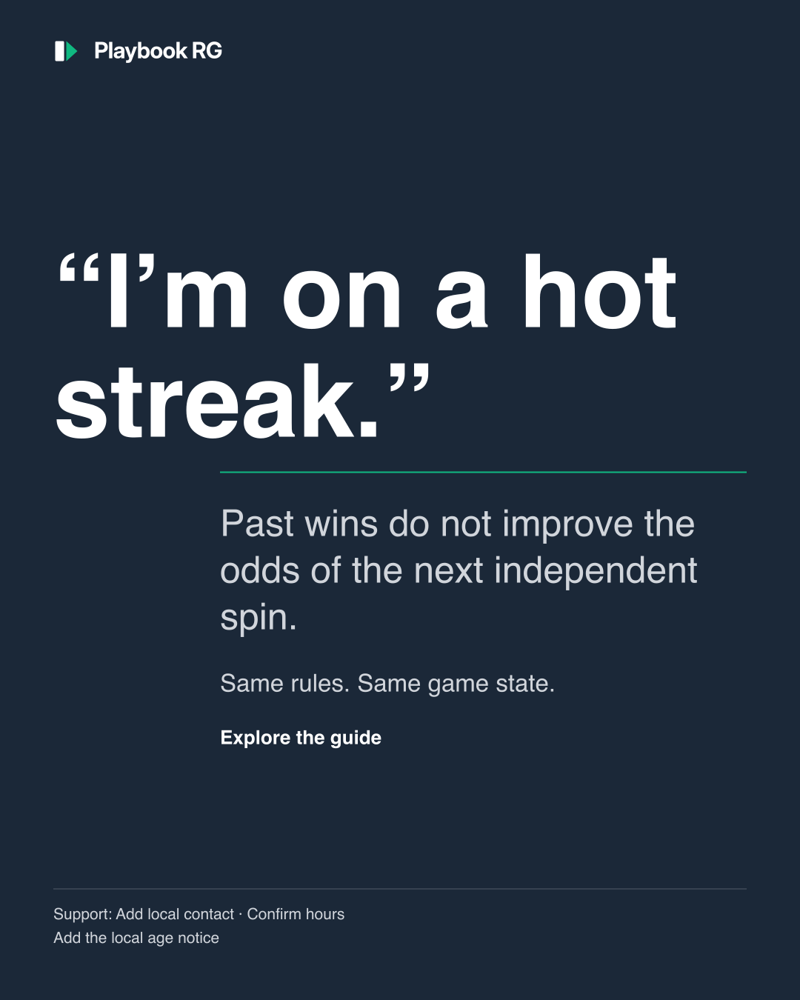
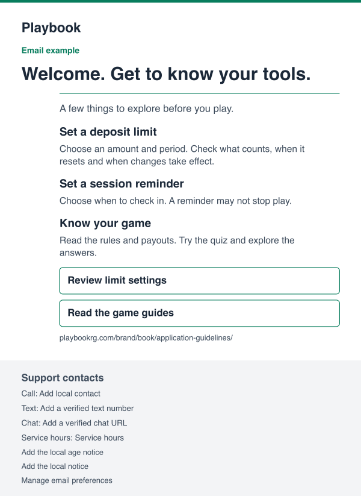
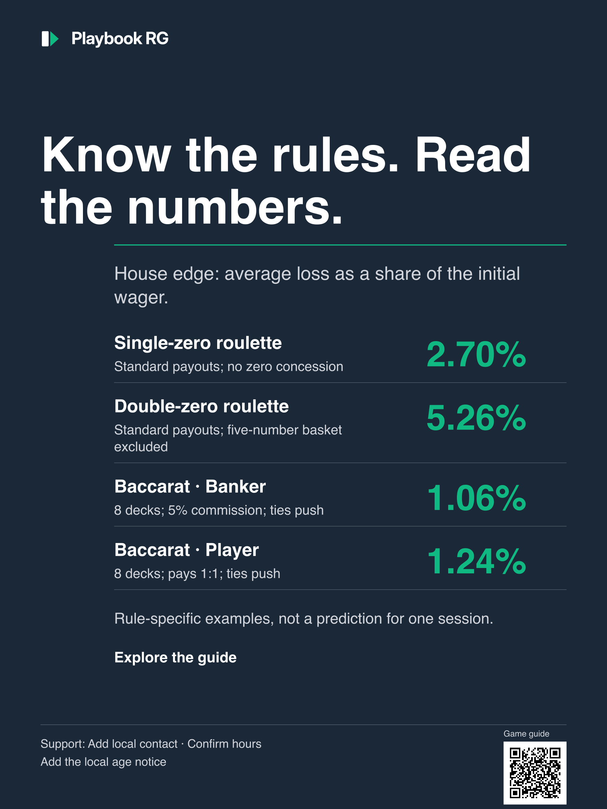
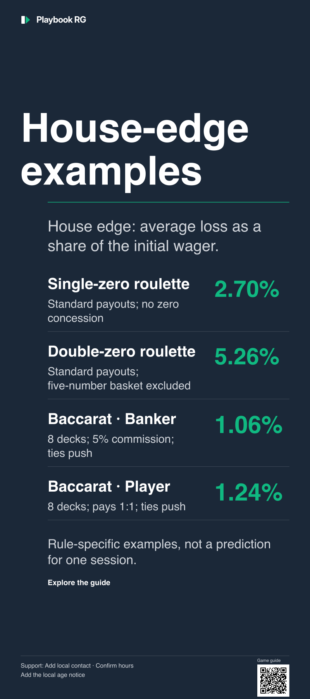
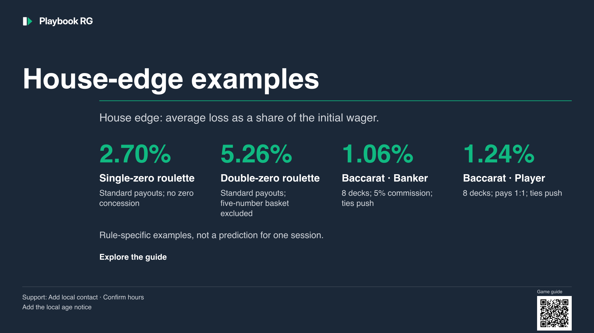
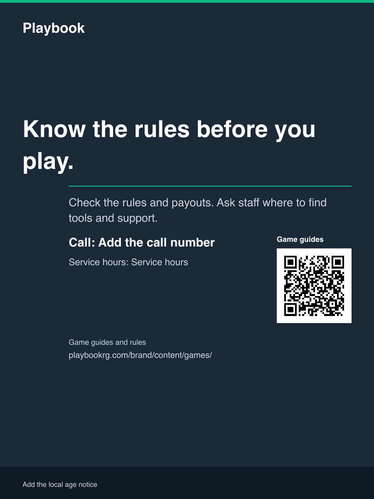
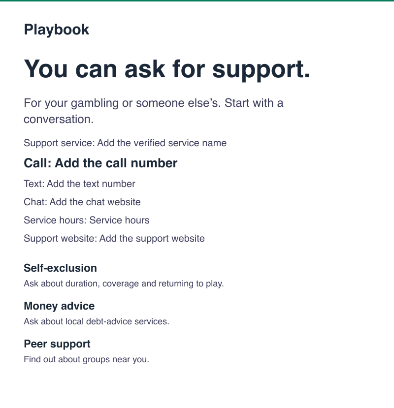
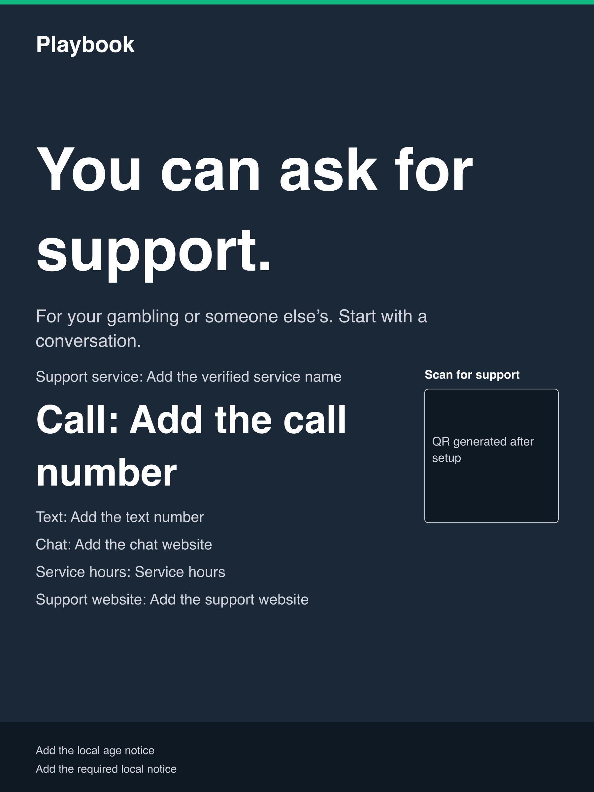
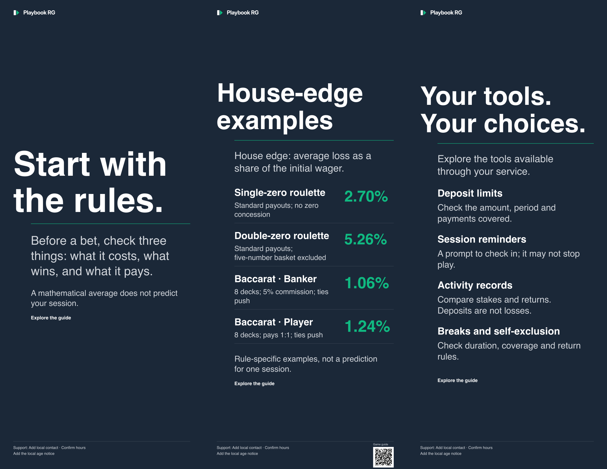

# Playbook RG

**Current English edition:** [Review the 85 revised collateral pieces](collateral/editorial/index.html), with shorter copy, cleaner layouts and centered photography. [Editable files and handoff notes](collateral/editorial/README.md).

**Open-source brand guidelines for gambling entertainment literacy. CC0-licensed, white-label, built for operators.** Formally *Playbook RG*; "Playbook" works as shorthand.

[](https://creativecommons.org/publicdomain/zero/1.0/)
[](_brand.yml)

## Use Playbook with your AI

Give your assistant this repository URL and the task you want to complete. Start with the [reading guide](docs/ai-guide.md) for direct links to a poster, campaign, game explanation, and website options. The [collection catalog](ai/catalog.json) provides machine-readable paths and edition labels; [llms.txt](llms.txt) is the short orientation.

Everything needed to discover and read the library is available through GitHub and raw file URLs. No installation, account, or MCP connection is required. Use the revised English editorial collection for the pieces it covers; keep older localized editions and website editions explicit. Reading these files does not authorize installation, account access, or publication.

---

## What is Playbook?

Playbook is a complete, forkable brand system for gambling entertainment literacy. It gives operators everything they need to build player-facing content that's actually worth engaging with: brand foundations, voice and tone, messaging frameworks, visual identity specs, multi-jurisdiction compliance modules, and ready-to-use collateral templates.

Playbook is a **content and media brand**: the educational and awareness layer that helps players understand how gambling actually works. It's anchored in the informed choice model: most people who gamble do so without problems, gambling is entertainment, and players make better decisions when they understand the math, the odds, and the tools available to them.

## The How and Why of the Playbook Design

Playbook is built on an auditable theory of change. The core mechanism is **belief recalibration**: cognitive distortions are causally implicated in gambling-related harm (Philander & Gainsbury, 2020, 2022), and positively-framed, segmented literacy content shifts attitudes and subjective norms via the Theory of Reasoned Action pathway (Gainsbury, Philander, & Grattan, 2020). The intended outcome measure is the **Positive Play Scale** (Wood et al., 2017; Tabri, Wood, Philander, & Wohl, 2020): four sub-constructs (Personal Responsibility, Gambling Literacy, Honesty and Control, Pre-commitment) that anchor every character, scenario, and content prompt in the system. The design rationale for character-driven, segmented messaging traces to Gainsbury, Abarbanel, Philander, & Butler (2018), and the operator-culture layer that determines whether deployment actually moves player outcomes traces to Philander (2020, 2023).

Research, however, only goes so far. RG is a management practice as much as a research domain, and experience fills in the operational detail that the literature necessarily obscures: which training cadence is sustainable, which compliance translation works across jurisdictions, when a literacy module belongs at registration vs. mid-session vs. cool-down, what makes an internal RG culture stick beyond an accreditation cycle. Playbook integrates both layers. The cited theory of change is the auditable scaffolding; the practitioner record behind the design choices is the load-bearing complement.

The full theory (every claim, every cite, every open question about what isn't yet empirically tested) is in **[Chapter 00b: Theoretical Foundations](brand-book/00b-theoretical-foundations.md)**. Read that chapter before deciding whether the rest of this repository is serious work.

## Created by

Playbook is the design product of a 20-year research and consulting practice. Lead author: [Kahlil Simeon-Rose, Ph.D.](https://kahlil.co) (publishing as Philander on the work cited above), tenured Associate Professor at Washington State University's Carson College of Business.

The practitioner record behind the framework: two decades of consulting and research across five continents, with **150+ consulting engagements and 50+ peer-reviewed publications (2004–2024)**. Direct engagements span **North America, Europe, the Middle East, Australasia, and Asia-Pacific**, with a client mix that includes integrated-resort operators in Las Vegas and Asia-Pacific, tier-1 European online sportsbook and casino operators, US tribal gaming operators, provincial Canadian Crown lottery and gaming corporations, US state gambling commissions, and gaming regulators in Europe, the Middle East, and Australasia.

**Programs and instruments:** co-developer of GameSense while serving as Director of Social Responsibility at the British Columbia Lottery Corporation (since licensed by multiple jurisdictions and private operators); co-developer of the **Positive Play Scale** (the player-side outcome measure proposed for evaluating Playbook itself); co-developer of RG Check for iGaming at the Responsible Gambling Council, and consultant on later updates to the RG Check frameworks. **Recognition and active advisory roles:** two NCPG Annual Research Awards (2015, 2021); current advisory positions include the Scientific Advisory Board of the [Deutsche Stiftung Glücksspielforschung](https://deutsche-stiftung-gluecksspielforschung.de/foundation/) / German Foundation for Gambling Research, the Responsible Gambling Working Group of the Canadian Gaming Association, and the inaugural Advisory Committee of the Responsible Online Gaming Association (ROGA).

The full provenance, with the inline disclosures attached to each cited paper, is in the [About this work](brand-book/00b-theoretical-foundations.md#about-this-work) footer of the Foundations chapter.

## Who is this for?

- **Casino operators and iGaming companies** who want player education content their marketing team is proud to co-brand
- **Sports betting platforms** building entertainment literacy programs that retain informed players
- **Gambling regulators** looking for a quality baseline they can recommend to licensees
- **Non-profits and advocacy organizations** creating engaging outreach content
- **Marketing, product, and design teams** who need specs, copy frameworks, and design briefs for player-facing content

## Why operators deploy Playbook

**Player retention.** Informed players play longer and more sustainably. They understand the games, manage their bankrolls, and enjoy the experience more. They churn less.

**Brand differentiation.** In a market where every operator's RG page looks the same, Playbook content stands out. It tells players: "We take you seriously."

**Regulatory compliance.** Jurisdictions require player-facing education and messaging. Playbook makes compliance content that actually works, not just content that checks a box.

## Quick start

### Configure the source

1. **Fork this repository** to your own GitHub account
2. **Edit [`_brand.yml`](_brand.yml)**: your program name, colors, fonts, helpline numbers, and taglines. This single file drives the entire system.
3. **Choose your jurisdictions**: keep the modules you operate in (`jurisdictions/united-kingdom/`), delete the rest
4. **Customize messaging**: pick from the tagline system, adapt tone examples, write your own
5. **Build collateral**: use the current English HTML in `collateral/editorial/artwork/` and the channel specifications

## Preview

A selection of the 85 revised English pieces. [Browse the complete edition](collateral/editorial/index.html) for editable HTML, SVG, PNG and copy. Earlier localized variants and alternate production profiles are available in `collateral/render/`.

| | | |
|---|---|---|
|  |  |  |
| Social card, myth-buster | Email, welcome series | Poster, Know Your Game |
|  |  |  |
| Print, rack card | Digital display, landscape | Venue sign, entrance |
|  |  |  |
| Tier 2, support page | Tier 2, helpline poster | Print, brochure inside |

---

## Repository structure

The [collection catalog](ai/catalog.json) links readable entry files, existing manifests, format examples, and documented edition information. It indexes collections rather than duplicating rendered assets.

| Collection | Start here | Source selection |
|------------|------------|------------------|
| Brand configuration and taxonomy | [_brand.yml](_brand.yml), [_taxonomy.yml](_taxonomy.yml) | Configuration examples and content labels; operator values still need verification |
| Brand foundations and voice | [Brand book](brand-book/README.md) | Voice, visual rules, accessibility, cultural adaptation, and theory of change |
| Visual identity | [Assets and guidance](visual-identity/README.md) | Logos, icons, tokens, typography, photography; retain asset-specific notices |
| Player messaging | [Messaging](messaging/README.md) | Messages, campaign briefs, CTAs, myths, and audience profiles |
| Game education | [How to Play](how-to-play/README.md) | Full guides, quick references, rule assumptions, and references |
| Current English collateral | [Editorial edition](collateral/editorial/README.md) | Preferred for the English IDs listed in its manifest; editable HTML and text |
| Channel specifications | [Collateral](collateral/README.md) | Digital, print, environmental, video/audio, support, and interactive briefs |
| Earlier localized and alternate production files | [Render library](collateral/render/README.md) | Coverage varies; these are not translations of the revised editorial edition |
| Art-direction studies | [Style alternatives](collateral/style-alternatives/README.md) | Experiments, not preferred resources or publication approval |
| Regional references | [Jurisdictions](jurisdictions/README.md) | Scoped reference modules; file presence does not establish current compliance |
| Deployment by business type | [Verticals](verticals/README.md) | Casino, sportsbook, online gaming, and lottery deployment maps |
| Testing and operational documents | [Docs](docs/README.md) | Content measurement and supporting research with their stated limits |
| Generated content and assets | [JSON feeds](api/README.md) | Existing manifests and snapshots; check source conditions and recorded metadata |
| Repository website sources | [Page template](collateral/rg-page.html), [language bundles](collateral/rg-copy/README.md), [brand demos](variants/README.md) | Repository examples, separate from the public website's revised editions |
| Interactive game guides and widgets | [Interactive app](website/README.md), [widgets](widgets/README.md) | Readable implementation sources, separate from the website design gallery |

## What's built

The collections above contain editable copy, specifications, source assets, generated references, and implementation examples. Use each collection's entry file and manifest for its actual coverage and conditions. Inventory counts and a file's presence are not content approval.

## What's planned

| Area | Description |
|------|-------------|
| **Additional implementation guides** | Further adoption walkthroughs, design briefs, and launch checklists. [Content measurement tools](docs/content-scorecard.md) and the configuration/export notes linked above are already available. |
| **End-to-end example** | A single worked operator deployment walkthrough. [Brand and locale demonstrations](variants/README.md) are already available as source examples. |

## How the white-label system works

The [`_brand.yml`](_brand.yml) file is the engine. It holds every customizable value: your program name, color palette, typography, helpline numbers, tagline system, and tone configuration. Throughout the repository, content files use `{{PLACEHOLDER}}` tokens that reference values in this config.

Fork the repo, edit `_brand.yml`, and use the relevant build or export process. Committed artwork remains a reference preview until regenerated; changing configuration alone does not update those files.

**The adaptive identity model.** Playbook is *recognizable but adaptive*. The structural patterns (message hierarchy, content architecture, layout principles) stay consistent across operators. The visual surface (colors, fonts, logo) adapts to each operator's brand. A player who encounters Playbook-based content at one platform will intuitively recognize the content structure at another, even though they look different.

## Rendering collateral

For the preferred English pieces, follow the [editorial editing and export notes](collateral/editorial/README.md). The `collateral/render/` directory retains the earlier localized and alternate-production pipeline:

```bash
cd collateral/render
npm install
node render-cards.mjs              # Render all templates
node render-cards.mjs poster       # Render only poster templates
node render-cards.mjs card-1a      # Render a specific template
```

Other build scripts:
- `node build-logos.mjs`: Generate logo SVGs from brand config
- `node build-icons.mjs`: Generate icon SVGs
- `node build-deck.mjs`: Generate the PPTX brand deck

## Two-tier architecture

Playbook uses a two-tier system:

- **Tier 1:** Entertainment literacy. How games work, informed play habits, myth-busting, interactive quizzes, bankroll tips. Confident, witty, engaging: content players seek out. This is what operators co-brand with.

- **Tier 2:** Support and crisis touchpoints. Self-exclusion flows, helpline referrals, cooldown screens, session summaries. Warm, direct, appropriately serious. See the [Tier 2 visual guide](visual-identity/tier-2/tier-2-visual-guide.md) and the [editorial manifest](collateral/editorial/manifest.json) for support-piece specifications and artwork.

## License

[CC0 1.0 Universal](LICENSE): public domain. Copy, modify, distribute, and use this work for any purpose, including commercial, without permission or attribution.

Bundled fonts and other third-party material may carry separate notices. Retain the applicable licenses; the library license does not cover hosted products or operator-owned assets.

**Why CC0?** Player education is too important for licensing friction. Every operator should be able to deploy quality content without legal barriers. CC0 means the entire industry can collaborate on one shared standard.

## Disclaimer

This material is for informational and educational purposes only and does not constitute legal, medical, or professional advice. Gambling regulations vary by jurisdiction and change frequently. Operators should verify all compliance requirements with qualified legal counsel. While we strive for accuracy, we cannot guarantee that jurisdiction-specific information is current or complete.

This is not a clinical resource. Playbook does not diagnose, treat, or counsel. It is not anti-gambling. It is not a substitute for regulatory compliance.

## Contributing

See [CONTRIBUTING.md](CONTRIBUTING.md) for guidelines on contributing jurisdiction modules, messaging content, translations, or improvements to the brand system.
