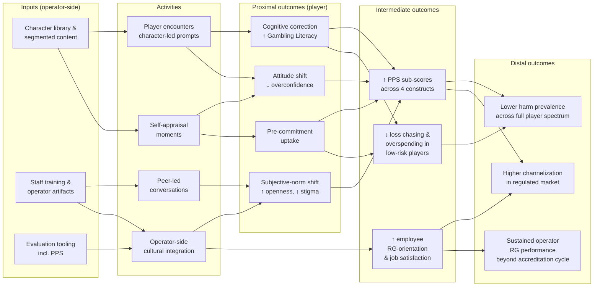

# Theoretical Foundations

> *How* Playbook works, *why* it works, and what it does and does not claim.

---

## Why this chapter exists

This chapter is the auditable theory of change behind Playbook. Every claim the brand system makes traces to a numbered section here; every numbered section traces either to cited research or to an explicit open question. Nothing in the framework is asserted without one of those two.

If you came to Playbook from a marketing background and have been told elsewhere in this brand book that the framework is "evidence-based," this is where that claim is cashed out. If you came from a research or regulator background and want to know whether this is rigorous work or repackaged industry messaging, this is where that question is answered. Read the section that maps to your concern; attack the cite if you disagree.

**A note on practice.** Responsible gambling is a management practice as much as a research domain. The peer-reviewed literature names mechanisms and outcomes; experience names the operational detail that research necessarily obscures: which training cadence is sustainable, which compliance translation works across jurisdictions, when a literacy module belongs in the player journey and when it doesn't, what makes an internal RG culture stick beyond an accreditation cycle. Playbook is built on both layers. The cited theory of change in this chapter is the auditable scaffolding; the design choices that make it work in deployment are anchored in the practitioner record summarized in the [About this work](#about-this-work) footer. Theory plus practice equals provenance, and neither stands without the other.

---

## 1. The problem Playbook addresses

Most responsible gambling (RG) programming never reaches the players it is intended to help. Across multiple jurisdictions, between 1% and 23% of players use the RG tools their operators provide (Wood, Wohl, Tabri, & Philander, 2024). In a recent U.S. casino sample, only 2.38% of players picked up an RG brochure and 0.26% spoke to an RG advisor (Louderback, LaPlante, Abarbanel, Kraus, Bernhard, & Gray, 2022). The dominant industry response (pamphlets, helpline signage, and pop-up warnings) is largely ignored, in part because the term "responsible gambling" itself is perceived as patronizing and because the programming is framed around problem gamblers rather than the full spectrum of players (Parke et al., 2007; Wood et al., 2024).

In management-theoretic terms, this is a product-adoption failure. The Technology Acceptance Model (Davis, 1989), the dominant framework for predicting whether users adopt a system, identifies two near-universal predictors: perceived usefulness and perceived ease of use. Existing RG tools fail on both. They are perceived as useful only to players who self-identify as having a problem, a category most do not embrace, and engagement carries a stigma cost that raises their effective difficulty. Playbook is an attempt to address this engagement gap with a literacy framework that is positive in framing, segmented in design, and embedded in operator practice. The remainder of this document describes the theoretical scaffolding that supports each of those choices.

## 2. Conceptual home: Positive Play

Playbook is, in its underlying logic, a **Positive Play** intervention.

Public-health framing of gambling in academic discourse dates to Korn and Shaffer (1999), who argued for treating gambling-related harm as a population-level concern alongside the individual clinical literature. The Reno Model (Blaszczynski, Ladouceur, & Shaffer, 2004) sits in the same tradition but pivots to operator and regulator practice: it defines RG as the policies and practices the industry implements to prevent harm. The Positive Play approach (Wood & Griffiths, 2015; Wood, Wohl, Tabri, & Philander, 2017; Wood et al., 2024) then re-conceptualizes RG as a *measurable outcome*: the extent to which a player holds beliefs and exhibits behaviors that do not put them at risk for developing gambling problems. The Reno Model and Positive Play are complementary rather than competing: the Reno Model specifies the independent variable (operator practice), while Positive Play specifies the dependent variable (player belief and behavior). Both are needed; the absence of the latter is what currently makes most RG programming evaluable only by inputs, not outcomes (Wood et al., 2024).

The Positive Play Scale (PPS) measures four sub-constructs (Wood et al., 2017; Tabri, Wood, Philander, & Wohl, 2020):

- **Personal Responsibility:** accepting that one's own play is one's own responsibility.
- **Gambling Literacy:** accurate understanding of how gambling outcomes are determined.
- **Honesty and Control:** being open with self and others about play.
- **Pre-commitment:** deciding what is affordable in time and money before play begins.

These four constructs anchor Playbook's content design. Each character, scenario, and learning prompt in Playbook is mapped to one or more of them, and player-base evaluation is intended to use the PPS as the primary outcome measure rather than the prevalence of disordered gambling. This matters because the PPS predicts harm independently of the Problem Gambling Severity Index (PGSI; Ferris & Wynne, 2001), the field's standard problem-gambling screen. Delfabbro, King, and Georgiou (2020, cited in Wood et al., 2024) showed the two instruments capture distinct things, and most gambling-related harm is concentrated among players who do not meet criteria for disordered gambling (Browne et al., 2017).

> *Note: Wood, Wohl, Tabri, & Philander (2017, 2024) and Tabri, Wood, Philander, & Wohl (2020), the three core Positive Play Scale references in this section, were co-authored by the present author of this chapter. The PPS is therefore not borrowed; it is the measurement instrument the author helped build, and the one the framework above proposes Playbook be evaluated against.*

## 3. Proximal mechanism: belief recalibration

Within the Positive Play umbrella, Playbook's most direct mechanism is **cognitive correction**: recalibrating the erroneous beliefs that players hold about how gambling works.

The empirical case for treating cognitive distortions as a causal driver (rather than a correlate) of harm is strong in this corpus. Using instrumental variable estimation on a survey sample (n = 184) and five-year prospective longitudinal data (n = 1,431), Philander and Gainsbury (2022) showed that Gamblers' Belief Questionnaire and Gambling Fallacies Measure scores predict loss chasing, overspending, and gambling problems both contemporaneously and prospectively, with past-fallacy effects roughly half the size of present-fallacy effects. Their findings explicitly support the Pathways Model of Problem and Pathological Gambling (Blaszczynski & Nower, 2002).

Overconfidence in particular matters. Philander and Gainsbury (2020) found, across a U.S. online sample (n = 232) and an Australian laboratory sample (n = 246), that overconfidence in understanding how electronic gaming machines work was associated with more positive attitudes toward those machines, a relationship that disappeared for skill-based machines, where actual and perceived skill could be separated. In other words, players who *think* they understand the product better than they do form more positive attitudes toward it, and those attitudes drive intention to play (consistent with the Theory of Reasoned Action; see §4). Playbook's literacy content is designed to address exactly this cognitive failure mode.

> *Note: Philander & Gainsbury (2020, 2022) — the two studies cited in this section — were co-authored by the present author of this chapter.*

## 4. Behavior pathway: Theory of Reasoned Action

How does belief recalibration translate into changed behavior? Through the **Theory of Reasoned Action** (TRA; Fishbein & Ajzen, 1975) and its successor, the Theory of Planned Behavior (Ajzen, 1991). The TRA holds that behavior is driven by intention, which is in turn driven by attitudes toward the behavior and subjective norms about it.

Gainsbury, Philander, and Grattan (2020) tested this framework empirically in two studies (n = 43 casino patrons; n = 184 online participants). Both samples confirmed that positive attitudes and positively perceived subjective norms predicted intention to play random and skill-based EGMs. Playbook leverages both levers: literacy content shifts attitudes (toward more accurate appraisal of expected value, variance, and the absence of skill in pure-chance products), and peer-led, character-driven design shifts subjective norms (toward an environment in which discussing limits, openness, and pre-commitment is normal rather than stigmatized).

> *Note: Gainsbury, Philander, & Grattan (2020) — the empirical TRA test cited in this section — was co-authored by the present author of this chapter.*

## 5. Design rationale: customized, positively framed, segmented messaging

Playbook's character-driven, segmented design is grounded in Gainsbury, Abarbanel, Philander, and Butler (2018), which found that distinct cohorts — young adults, seniors, frequent gamblers, and skill-game players — responded differently to RG messages. Seniors preferred messages about limit setting; young adults and frequent players responded to messages about their own play and self-expertise; skill-game players were interested in odds and outcomes over time. Critically, *all four cohorts agreed* that positive, non-judgmental language was important.

This finding sits inside a broader public-health-messaging literature consistent with prospect theory (Kahneman & Tversky, 1979): positive (gain-framed) messages outperform loss-framed messages for prevention behavior in multiple domains (Rothman, Bartels, Wlaschin, & Salovey, 2006); self-appraisal messages outperform external information (Kahle et al., cited in Gainsbury et al., 2018); and tailored content outperforms one-size-fits-all approaches (Noar, Benac, & Harris, 2007, cited in Gainsbury et al., 2018). Playbook's wayfinding-themed character system operationalizes all three principles: characters serve as relatable, segment-matched messengers; their narratives prompt self-appraisal rather than externally imposed warning; and the framing is consistently positive.

At a deeper theoretical level, this design rests on **Service-Dominant Logic** (Vargo & Lusch, 2004) — a foundational framework in services management arguing that value is not delivered by the firm but co-created by customers through their use of the firm's resources. In this view, an operator does not "deliver responsible gambling" to a player; the player co-creates their own RG outcome by engaging with the resources, prompts, and narratives the operator provides. This reframing matters because it makes self-appraisal architecturally central to Playbook rather than tactically optional, and because it is consistent with the Positive Play emphasis (§2) on RG as a player-side outcome rather than a firm-side process.

> *Note: Gainsbury, Abarbanel, Philander, & Butler (2018) — the segmentation study cited in this section — was co-authored by the present author of this chapter.*

## 6. Scope of claim

Playbook is not a universal intervention. The Pathways Model identifies three trajectories to gambling harm — behaviorally conditioned, emotionally vulnerable, and antisocial-impulsivist (Blaszczynski & Nower, 2002) — and a literacy-based intervention is most plausibly effective for the first, where erroneous beliefs and conditioning are central; partially effective for the second, where stress-related coping is central; and minimally effective for the third, where impulsivity and antisocial features dominate. Playbook is therefore positioned as **complementary to, not a substitute for, clinical interventions**. The Reno Model's specification of access to efficacious treatment (Blaszczynski et al., 2004) remains essential; Playbook addresses the population-wide literacy and attitude layer that sits upstream of treatment.

## 7. System-level rationale: channelization

Playbook's value to a regulator or operator is not only what it does for an individual player; it is what it does for the licensed market's competitive position.

The **Channelization Model** (Simeon-Rose, 2026) evaluates online gambling regulation against a two-part test: (1) Are meaningful protections in place within the licensed market? and (2) What proportion of total gambling activity occurs within that market? RG interventions that are theoretically rigorous but drive players to the unlicensed offshore market reduce social welfare on net. The empirical relevance of this is acute as financial frictions to offshore play collapse: by 2024, an estimated 74% of U.S. gross gaming revenue was flowing to unlicensed offshore operators, and stablecoin payment rails — now legitimized in the U.S. by the GENIUS Act and in the EU by MiCA — have removed much of the historical friction (Simeon-Rose, 2026). In Ontario, by contrast, channelization rose from approximately 27% in 2022 to 95% by 2025 under an open-market design (Nightingale, 2025, cited in Simeon-Rose, 2026).

Players will pay a premium for regulated platforms — Philander and Wimmer (2025), in a discrete choice experiment with 783 online poker players, estimated that consumers value government regulation at approximately $1.83 per hour of play. Playbook contributes to that premium. It is one of the product features that makes the licensed channel substantively better — not just compliant — and therefore worth choosing.

> *Note: Simeon-Rose (2026) — the channelization working paper cited in this section — is sole-authored by the present author of this chapter (publishing under the post-marriage name). Philander & Wimmer (2025) — the discrete-choice study cited in the same section — was co-authored by the present author. The "regulated-product premium" argument above is therefore drawn directly from the author's own published work on consumer trust in regulated online gambling.*

## 8. Practice layer: operator culture

Playbook is not delivered in a vacuum. Its effectiveness depends on the operator's culture, training infrastructure, and willingness to embed RG into business decisions rather than treating it as a compliance bolt-on.

This is the layer where research yields to management practice. The peer-reviewed literature can establish *that* internal culture predicts service quality and player outcomes, but the lived detail — what a training program actually has to look like for floor staff in a multi-property operator, how an RG team negotiates a marketing review without becoming the "no" function, when a literacy module belongs at registration vs. mid-session vs. cool-down, what a venue change of management does to a previously well-functioning program — comes from running the work. The author's record on that layer (BCLC social responsibility leadership, consulting on later updates to the RG Check frameworks, and the broader consulting and advisory record summarized in the [About this work](#about-this-work) footer) is the load-bearing complement to the cited mechanisms below.

Philander's (2020) New Horizons paper for BCLC argues that the cultural style most conducive to effective RG is what the Spencer Stuart framework calls **Safety-oriented**: forward-looking attention to harm and risk integrated into decision-making across the organization, rather than confined to a compliance function. The paper applies the **Service Profit Chain** (Heskett, Jones, Loveman, Sasser, & Schlesinger, 2008) to gambling: internal RG culture shapes employee orientation, which shapes service quality, which shapes player experience, retention, and ultimately profitability. Multiple studies cited in that paper find that casino employees who perceive their employer as having a well-oriented RG program report higher job satisfaction and stronger organizational commitment.

That argument is reinforced empirically by Philander's (2023) study of RG Check, the Responsible Gambling Council of Canada's accreditation program. Across 75 accredited casinos from 2012 to 2019, scores improved markedly at first reaccreditation (*p* < .001, *d* = 0.92) but failed to improve at second reaccreditation (*p* = .78, *d* = 0.38). Improvements in policies, training, venue features, and access-to-money were significant; the *informed decision making* domain — the player-literacy domain — actually declined (*p* = .010). The interpretation: assurance frameworks generate accountability and one-time gains but plateau without programmatic innovation. Playbook is designed to be that programmatic innovation in the literacy domain specifically, building on the conflict-of-interest-disclosed insider knowledge of how RG Check actually performs in practice.

Why some operators will integrate Playbook effectively while others will not is itself predicted by management theory. **Absorptive capacity** (Cohen & Levinthal, 1990) — among the most-cited constructs in strategic management — holds that a firm's ability to recognize, assimilate, and apply external knowledge depends on its prior related investments. Operators with established RG infrastructure (training routines, evaluation tooling, leadership commitment, prior PPS deployment) will have higher absorptive capacity for Playbook than those treating it as a compliance bolt-on, and the variance in player-level outcomes across deployments is likely to be largely explained by this difference. The implication for both deployment design and evaluation is that operator-level moderators must be measured alongside player-level outcomes — a point that connects directly to the evaluation gaps flagged in §9.

This insight shaped the design of Playbook itself. Because operator absorptive capacity varies so widely — from major operators with full in-house brand and RG teams to small operators, jurisdictionally young operators, and tribal or municipal operators without that infrastructure — Playbook is built in two deployment modes: a fully **white-label** system that operators with their own in-house brand and RG teams can fork, customize, and integrate into their existing brand architecture, and a **turnkey** baseline that operators without that in-house capacity can ship as-is. Same content library, two paths to deployment. The literacy outcomes the framework targets shouldn't require an operator to bring deep in-house expertise to deliver; they should require something to ship, and ship across the operator spectrum. The white-label path serves operators who would otherwise dilute the framework with bespoke programs; the turnkey path serves operators who would otherwise ship nothing meaningful at all.

> *Note: Philander (2020) — the BCLC New Horizons paper — and Philander (2023) — the RG Check accreditation evaluation — were both sole-authored by the present author of this chapter, who co-developed RG Check for iGaming during a prior tenure at the Responsible Gambling Council and worked as a consultant on later updates to the RG Check frameworks. The "insider knowledge" caveat is the author's own conflict-of-interest disclosure, retained here in its original form.*

## 9. Evidentiary status: claims and open questions

Playbook is new. What's claimed, and what's still open:

- **What is well-supported by the cited evidence:** that low engagement is the dominant failure mode of existing RG programming; that positively-framed, segmented messaging outperforms generic warnings on engagement; that cognitive distortions are causally implicated in harm; that attitudes and norms shift behavior via the TRA pathway; that literacy is a domain where existing accreditation-based programs are *not* delivering improvement; and that licensed-market channelization depends on regulated-product attractiveness.
- **What is theoretically motivated but untested for Playbook specifically:** that Playbook itself improves PPS scores in a player base; that it improves the literacy sub-scale specifically; that it reduces loss-chasing and overspending in low-risk players; that operator-culture integration mediates player-level effects.
- **What Playbook does *not* claim:** that it reduces problem-gambling prevalence at a population level; that it substitutes for clinical care; that it works equally well across all three Pathway Model trajectories.
- **What we would need to see to update the claims above:** randomized or quasi-experimental deployment with PPS as the primary outcome; player-base baseline and follow-up data segmented by sub-scale and by Gainsbury et al. (2018) cohort; operator-culture moderators measured alongside player outcomes.

The framework is consistent with the broader trajectory of the responsible-gambling field — from process-only IV measurement toward outcome-based DV measurement (Wood et al., 2024) — and Playbook is intended to be evaluated within that paradigm rather than against historical PSA-style metrics.

---

## Logic model

**How to read this diagram:** the columns map to a standard public-health logic model (inputs → activities → proximal → intermediate → distal outcomes). Each arrow is, where possible, supported by a cited mechanism above: I→A links are operational; A→P links rely on the cognitive-correction and TRA literatures (§3–§4); P→M links rely on the PPS validation and Pathway Model evidence (§2, §6); M→D links rely on the channelization (§7) and operator-culture (§8) evidence. Where evidence is currently theoretical rather than empirical, the gap is named explicitly in §9 rather than glossed over.

---

## About this work

The framework above is the design product of a 20-year research and consulting practice. The author, **Kahlil S. Philander, Ph.D.** (publishing as Simeon-Rose since 2025), is a tenured Associate Professor at Washington State University's Carson College of Business, and the lead author of the Playbook brand system. The practice record relevant to this chapter:

- **Two decades of consulting and research:** 150+ consulting engagements and 50+ peer-reviewed publications across five continents (2004–2024).
- **Five-continent practice footprint.** Direct engagements span North America, Europe, the Middle East, Australasia, and Asia-Pacific. The mix includes integrated-resort operators in Las Vegas and Asia-Pacific, tier-1 European online sportsbook and casino operators, US tribal gaming operators, provincial Canadian Crown lottery and gaming corporations, US state gambling commissions, and gaming regulators in Europe, the Middle East, and Australasia.
- **Instrument and program development.** Co-developer of the **Positive Play Scale** (the player-side outcome measure proposed in §2 above); co-developer of **GameSense** at the British Columbia Lottery Corporation while serving as Director of Social Responsibility (the program has since been licensed by multiple jurisdictions and private operators); co-developer of **RG Check for iGaming** at the Responsible Gambling Council of Canada (the accreditation program critiqued in §8); consultant on later updates to the RG Check frameworks.
- **Recognition and active advisory roles.** Two **NCPG Annual Research Awards** (2015, 2021). Current advisory positions include the **Scientific Advisory Board** of the **Deutsche Stiftung Glücksspielforschung** / German Foundation for Gambling Research, which funds research in support of consumer welfare and harm-prevention objectives under Germany's Interstate Treaty on Gambling (GlüStV 2021); the **Responsible Gambling Working Group** of the **Canadian Gaming Association**; and the inaugural **Advisory Committee** of the **Responsible Online Gaming Association** (ROGA). Editorial board service across the gambling-studies field.

**Where to verify.** Citations in this chapter are open and traceable: every reference resolves to a peer-reviewed publication or a public working paper. The author's full publication record is on Google Scholar. The Positive Play Scale, GameSense, and RG Check are public programs whose authorship can be checked independently.

---

## References

Ajzen, I. (1991). The theory of planned behavior. *Organizational Behavior and Human Decision Processes, 50*(2), 179–211.

Blaszczynski, A., Ladouceur, R., & Shaffer, H. J. (2004). A science-based framework for responsible gambling: The Reno Model. *Journal of Gambling Studies, 20*(3), 301–317.

Blaszczynski, A., & Nower, L. (2002). A pathways model of problem and pathological gambling. *Addiction, 97*(5), 487–499.

Browne, M., Rawat, V., Greer, N., Langham, E., Rockloff, M., & Hanley, C. (2017). What is the harm? Applying a public health methodology to measure the impact of gambling problems and harm on quality of life. *Journal of Gambling Issues, 36*, 28–50.

Cohen, W. M., & Levinthal, D. A. (1990). Absorptive capacity: A new perspective on learning and innovation. *Administrative Science Quarterly, 35*(1), 128–152.

Davis, F. D. (1989). Perceived usefulness, perceived ease of use, and user acceptance of information technology. *MIS Quarterly, 13*(3), 319–340.

Ferris, J., & Wynne, H. (2001). *The Canadian Problem Gambling Index: Final report*. Canadian Centre on Substance Abuse.

Fishbein, M., & Ajzen, I. (1975). *Belief, attitude, intention, and behavior: An introduction to theory and research*. Addison-Wesley.

Gainsbury, S. M., Abarbanel, B. L. L., Philander, K. S., & Butler, J. V. (2018). Strategies to customize responsible gambling messages: A review and focus group study. *BMC Public Health, 18*, 1381.

Gainsbury, S. M., Philander, K. S., & Grattan, G. (2020). Predicting intention to play random and skill-based electronic gambling machines using the theory of reasoned action. *Journal of Gambling Studies, 36*(4), 1267–1282.

Heskett, J. L., Jones, T. O., Loveman, G. W., Sasser, W. E., & Schlesinger, L. A. (2008). Putting the service-profit chain to work. *Harvard Business Review*, July–August.

Kahneman, D., & Tversky, A. (1979). Prospect theory: An analysis of decision under risk. *Econometrica, 47*(2), 263–291.

Korn, D. A., & Shaffer, H. J. (1999). Gambling and the health of the public: Adopting a public health perspective. *Journal of Gambling Studies, 15*(4), 289–365.

Louderback, E. R., LaPlante, D. A., Abarbanel, B., Kraus, S. W., Bernhard, B. J., & Gray, H. M. (2022). Examining responsible gambling program awareness and engagement trends and relationships with gambling beliefs and behaviors: A three-wave study of customers from a major gambling operator. *Journal of Gambling Studies, 39*(1), 401–429. https://doi.org/10.1007/s10899-022-10109-7

Philander, K. S. (2020). *Future-proofing the industry: Organizational culture and responsible gambling*. Prepared for the New Horizons in Responsible Gambling Conference. British Columbia Lottery Corporation.

Philander, K. S. (2023). Third-party responsible gambling accreditation programs are related to short-term improvements at casinos but no ongoing gains: Evidence from RG Check. *UNLV Gaming Research & Review Journal, 27*(1).

Philander, K. S., & Gainsbury, S. M. (2020). Overconfidence in understanding of how electronic gaming machines work is related to positive attitudes. *Frontiers in Psychology, 11*, 609731.

Philander, K. S., & Gainsbury, S. M. (2022). An empirical study of the Pathway Model link between cognitive distortions and gambling problems. *Journal of Gambling Studies*. Advance online publication.

Philander, K. S., & Wimmer, B. (2025). Playing by the rules: Government regulation and consumer trust in the online poker industry. *Computers in Human Behavior Reports, 17*, 100599.

Rothman, A. J., Bartels, R. D., Wlaschin, J., & Salovey, P. (2006). The strategic use of gain- and loss-framed messages to promote healthy behavior: How theory can inform practice. *Journal of Communication, 56*(suppl_1), S202–S220.

Simeon-Rose, K. (2026). *The case for the channelization model as the predominant framework in online gambling regulation* [Working paper]. Carson College of Business, Washington State University.

Tabri, N., Wood, R. T., Philander, K., & Wohl, M. J. A. (2020). An examination of the validity and reliability of the Positive Play Scale: Findings from a Canadian national study. *International Gambling Studies, 20*(2), 282–295.

Vargo, S. L., & Lusch, R. F. (2004). Evolving to a new dominant logic for marketing. *Journal of Marketing, 68*(1), 1–17.

Wood, R. T. A., & Griffiths, M. D. (2015). Understanding Positive Play: An exploration of playing experiences and responsible gambling practices. *Journal of Gambling Studies, 31*(4), 1715–1734.

Wood, R. T. A., Wohl, M. J. A., Tabri, N., & Philander, K. (2017). Measuring responsible gambling amongst players: Development of the Positive Play Scale. *Frontiers in Psychology, 8*, 227.

Wood, R. T. A., Wohl, M. J. A., Tabri, N., & Philander, K. P. (2024). Responsible gambling as an evolving concept and the benefits of a Positive Play approach: A reply to Shaffer et al. *Journal of Gambling Studies, 40*, 1779–1786.

---

*Previous: [Chapter 0 — Introduction](00-introduction.md) · Next: [Chapter 1 — Brand Foundation](01-brand-foundation.md)*
