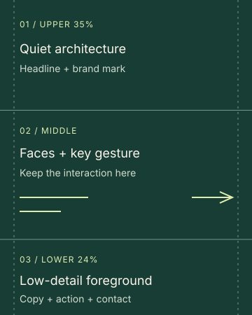

# “Leave room for the rest.” — Photography brief

The composition is supported by the user's latest feedback. The next image
should make **the rest of the evening** more specific: a shared plan that
continues beyond play. Treat the current terrace photograph as a reference
for full-bleed framing, warmth and usable space. Its two people looking in
the same direction leave the action ambiguous; a more visible interaction
would give the next photograph a stronger story.

This brief extends the main [brand photography direction](../../../brand-book/03-visual-identity.md#5-photography)
and [photography reference](../../../visual-identity/photography/photography.md):
confident, social, candid and warm, with well-exposed people and a clear focal
point. It applies to commissioned, licensed and AI-generated photographs.

## The moment to direct

**First choice: joining friends for dinner.** One friend arrives at a terrace
table as another turns to greet them. A chair being pulled out or a small
welcoming gesture makes the next plan visible. Capture the moment before
everyone settles. Keep eyes and the essential gesture clear of the copy.

Two alternatives use the same narrative:

- **Before the show:** friends meet in a contemporary foyer and turn toward
  the auditorium. Architecture suggests the destination; expressions carry
  the anticipation.
- **Heading out together:** adult friends walk toward a late-night restaurant,
  talking to each other. A warm doorway establishes where they are going.
  Keep their faces and hands sharp even if the background has some movement.

The photograph illustrates making room for another plan. It does not need
to prove that anyone has just gambled or stopped a session. Avoid introducing
cash, wins, equipment or an invented app screen to explain the backstory.

## Casting, wardrobe and setting

Cast two or three clearly adult friends with believable rapport. The current
40–55-year-old casting is one suitable execution, not the only audience for
the platform. Reflect the operator's adult audience through age, ethnicity,
gender, ability, personal style and local setting. Keep each person distinct.

Use relaxed clothes with texture and restrained color. Forest, rust, navy
and cream can echo Playbook without dressing everyone as a matching palette.
Premium hospitality should come through in the light, materials and service
setting. Keep the body language conversational and individual.

For Social Club, favor a restaurant terrace or show foyer, timber, stone,
linen and warm practical light. For Circuit, use adult friends heading out
for food, contemporary architecture and a restrained colored light in the
background. Faces retain natural color. These are sourcing options; the
existing CSS skins still work with the same photograph.

## Framing and light

Shoot a full-bleed **4:5 portrait**, with extra room around the action for
crop adjustment. For this existing 1080 × 1350 composition:

| Area | Direction |
|---|---|
| Upper 35% | Quiet architecture or a naturally darker background behind the mark and headline. Keep faces, bright sky strips and strong edges out of the text area. |
| Middle 35–76% | Place faces roughly 40–60% down the frame. Keep the gesture that tells the story within this middle area, with room around heads and hands. |
| Lower 24% | Low-detail foreground, shadow or simple clothing behind the copy, action and contact. Keep essential hands, faces, bright crockery and busy furniture edges elsewhere. |

These are composition guides, not bands to paint into the image. The photo
must stay continuous at every edge. Use the template's existing soft shadow
for legibility; choose another frame if the shot only works with heavy black
fades or a visible box behind the message. Other aspect ratios need their
own crop and composition review.

Use a warm directional key with enough fill to show eyes and skin texture.
Keep detail in dark architecture and fabric. Aim for the perspective of a
40–65 mm full-frame lens and enough depth of field for both people to be
sharp; approximately f/4–f/5.6 is a useful starting point, adjusted for the
actual camera distance and scene. Avoid motion blur, artificial haze,
plastic skin, crushed blacks and extreme background blur.

## Select and hand off

Choose a frame where the shared plan reads before the headline is added.
Check eye lines, gestures, expressions, hands and anatomy at full size.
Reject posed shared smiles toward an unseen photographer, generic lobby
portraits, alcohol, cash displays, game-equipment filler and youthful styling.

Supply a clean image with native detail for at least **3240 × 4050 pixels
after the 4:5 crop**. A “4K” label alone does not establish that: both source
dimensions and the crop matter. Inspect the final PNG at full size and the
creative at its intended feed size. Keep text, logo, icons and support details
in HTML/SVG. Do not bake them or the composition guide into the photo.

For commissioned or licensed imagery, retain the source and usage records.
For AI imagery, retain the exact prompt, settings and generation record.
The current [generation prompt](round-4-request.json) remains an unchanged
historical record; this brief directs the next selection.

## Prompt starting point for a future generation

> A crisp vertical 4:5 editorial photograph of two clearly adult friends at
> a contemporary restaurant terrace at dusk. One has just arrived; the other
> turns from the table with a small welcoming gesture. Believable rapport,
> eye contact between them, an unfinished moment before they sit down. Relaxed
> individual clothes, tactile architecture, warm directional light on both
> faces, natural skin and fabric detail. Quiet dark architecture in the upper
> 35%; faces and the key gesture in the middle; low-detail foreground in the
> lower 24%. Continuous photograph to every edge. Both people sharply resolved,
> natural perspective, sufficient depth of field. No camera-facing pose,
> alcohol, cash, game equipment, readable signs, text, logo, frame, artificial
> vignette, blur or smoothing. Deliver a native high-resolution image with
> sufficient detail for a 3240 × 4050 crop.

Adapt the people and place for the adult audience while preserving the
moment, composition and light. Review the actual result against the brief;
a prompt does not guarantee that the generated image follows it.
