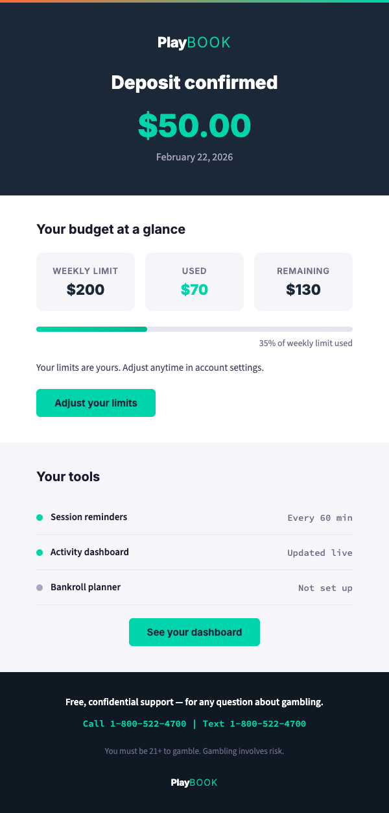
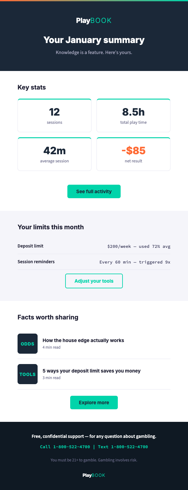

# Email Templates

Production-ready copy for 4 transactional email templates in the {{PROGRAM_NAME}} lifecycle. Each template includes subject line, preview text, full body copy, and layout specs.

> **Operator note**: Replace all `{{PLACEHOLDER}}` tokens with values from `_brand.yml`. Helpline number must appear in every email footer. Never unsubscribe players from {{PROGRAM_NAME}} communications. See [application guidelines](../../brand-book/07-application-guidelines.md#email) for integration rules.

---

## Quick-scan index

| Template | Trigger | Primary goal |
|---|---|---|
| [Welcome series](#1-welcome-series) | Account creation | Introduce tools + first quiz |
| [Deposit confirmation](#2-deposit-confirmation) | Deposit processed | Confirm + surface limits |
| [Monthly activity summary](#3-monthly-activity-summary) | 1st of each month | Inform + engage |
| [Reactivation](#4-reactivation) | 30+ days inactive | Re-engage with sensitivity |

---

## Email layout specs (all templates)

| Property | Value |
|---|---|
| **Max width** | 600px |
| **Layout method** | Table-based (email client compatibility) |
| **CSS** | Inline only — no `<style>` block |
| **Background** | White `#FFFFFF` body, navy `#1B2838` hero |
| **Text on light** | `#1A1A2E` body, `#3D3D5C` secondary |
| **Text on dark** | `#FFFFFF` headline, `#A8A8C0` subtext |
| **Headings** | Inter (fallback: Arial, Helvetica, sans-serif) |
| **Body text** | Source Sans 3 (fallback: Georgia, serif) |
| **Link color** | Teal `#00D4AA` |
| **CTA buttons** | Teal `#00D4AA` bg, navy `#1B2838` text, 16px padding, rounded 6px |
| **Accent bar** | 4px gradient `#FF6B35` → `#00D4AA` (top of email, use image) |

---

## 1. Welcome series

**Trigger**: Sent immediately after account creation.

### Subject line

| Variant | Subject | Preview text |
|---|---|---|
| **A (primary)** | Welcome to {{PROGRAM_NAME}} — 3 tools, 60 seconds | Set your budget, set your pace, test your game IQ. |
| **B (quiz hook)** | Think you know the odds? Most people get question 3 wrong | Welcome to {{PROGRAM_NAME}}. Take the quiz. |
| **C (direct)** | Your tools are ready | Deposit limits, session reminders, and your game IQ quiz — all set up in 60 seconds. |

### Email body

**Hero section** (navy `#1B2838` background):

| Element | Content |
|---|---|
| **Logo** | {{PROGRAM_NAME}} wordmark, horizontal (B2) layout, reversed variant (white Play + teal BOOK on navy bg). Min height 24px. Maintain 1x logo-height clear space on all sides. Co-branding: if operator logo is present, use vertical divider (neutral_300 `#A8A8C0`, 1px) between logos; {{PROGRAM_NAME}} logo no smaller than 60% of operator logo height. See [logo system](../../brand-book/03-visual-identity.md#1-logo-system) |
| **Headline** | Welcome. A few things worth knowing. |
| **Subheadline** | {{PROGRAM_NAME}} gives you the facts, the tools, and the real numbers behind the games you play. No fine print. |

**Body section 1 — Tools intro** (white background):

| Element | Content |
|---|---|
| **Section headline** | Three things. 60 seconds. |
| **Item 1** | **Set your budget** — Pick your deposit limit. Weekly, monthly, whatever works. Takes 10 seconds. |
| **Item 2** | **Set your pace** — Session reminders keep you aware. No buzzkill. Just a check-in. |
| **Item 3** | **Know your game** — Take the odds quiz. 7 questions, 2 minutes. Challenge your friends after. |
| **CTA** | `Get started →` |

**Body section 2 — Quick fact** (light gray `#F5F5FA` background):

| Element | Content |
|---|---|
| **Stat** | 0.5% to 15% |
| **Context** | That's the range of house edge across casino games. Knowing the edge helps you pick your games and set your budget. |
| **CTA** | `See the real odds →` |

**Footer** (navy `#0F1923` background):

| Element | Content |
|---|---|
| **Helpline** | Free, confidential support — for any question about gambling. |
| **Channels** | Call {{HELPLINE_NUMBER}} &#124; Text {{TEXT_NUMBER}} &#124; Chat at {{CHAT_URL}} |
| **Legal** | You must be {{MIN_AGE}}+ to gamble. Gambling involves risk. |
| **Logo** | {{PROGRAM_NAME}} logomark, reversed variant (white Play + teal BOOK on navy `#0F1923` footer bg). Min height 24px. Below 24px, use logomark only (no wordmark). Maintain 1x logo-height clear space. See [logo system](../../brand-book/03-visual-identity.md#1-logo-system) |
| **Unsubscribe** | Manage your preferences (note: {{PROGRAM_NAME}} emails cannot be fully unsubscribed per policy) |

---

## 2. Deposit confirmation

**Trigger**: Sent after each deposit is processed.

### Subject line

| Variant | Subject | Preview text |
|---|---|---|
| **A (primary)** | Deposit confirmed — your limits are active | {{AMOUNT}} deposited. Your budget tools are working. |
| **B (tool nudge)** | {{AMOUNT}} deposited. Here's where your tools stand. | Your deposit limit, session reminders, and activity dashboard — all up to date. |

### Email body

**Hero section** (navy background):

| Element | Content |
|---|---|
| **Headline** | Deposit confirmed |
| **Amount** | {{AMOUNT}} |
| **Date** | {{DATE}} |

**Body section 1 — Limit status** (white background):

| Element | Content |
|---|---|
| **Section headline** | Your budget at a glance |
| **Deposit limit** | {{LIMIT_AMOUNT}} per {{PERIOD}} |
| **Used so far** | {{USED_AMOUNT}} ({{PERCENT}}%) |
| **Remaining** | {{REMAINING_AMOUNT}} |
| **CTA** | `Adjust your limits →` |
| **Note** | Your limits are yours. Adjust anytime in account settings. |

**Body section 2 — Tool reminder** (light gray background):

| Element | Content |
|---|---|
| **Body** | Your session reminders are {{REMINDER_STATUS}}. Your activity dashboard updates in real time. |
| **CTA** | `See your dashboard →` |

**Footer**: Same as welcome series template.

---

## 3. Monthly activity summary

**Trigger**: Sent on the 1st of each month.

### Subject line

| Variant | Subject | Preview text |
|---|---|---|
| **A (primary)** | Your {{MONTH}} activity summary is ready | {{TOTAL_SESSIONS}} sessions, {{TOTAL_TIME}} total play time. Here's the full picture. |
| **B (casual)** | Here's your month in review | Your play stats for {{MONTH}} — take a look. |
| **C (data)** | {{TOTAL_SESSIONS}} sessions in {{MONTH}} — your stats are in | Your activity dashboard has the full breakdown. |

### Email body

**Hero section** (navy background):

| Element | Content |
|---|---|
| **Headline** | Your {{MONTH}} summary |
| **Subheadline** | Knowledge is a feature. Here's yours. |

**Body section 1 — Key stats** (white background):

| Element | Content |
|---|---|
| **Stat 1** | {{TOTAL_SESSIONS}} sessions |
| **Stat 2** | {{TOTAL_TIME}} total play time |
| **Stat 3** | {{AVG_SESSION}} average session |
| **Stat 4** | {{NET_RESULT}} net result |
| **CTA** | `See full activity →` |
| **Layout** | 2x2 grid, each stat in a card with teal accent top border |

**Body section 2 — Limits recap** (light gray background):

| Element | Content |
|---|---|
| **Headline** | Your limits this month |
| **Deposit limit** | {{LIMIT_AMOUNT}} per {{PERIOD}} — used {{PERCENT}}% on average |
| **Session reminders** | {{REMINDER_STATUS}} (triggered {{REMINDER_COUNT}} times) |
| **CTA** | `Adjust your tools →` |

**Body section 3 — Content hook** (white background):

| Element | Content |
|---|---|
| **Headline** | Facts worth sharing |
| **Article 1** | {{ARTICLE_TITLE_1}} — {{READ_TIME_1}} |
| **Article 2** | {{ARTICLE_TITLE_2}} — {{READ_TIME_2}} |
| **CTA** | `Explore more →` |

**Footer**: Same as welcome series template.

> Ref: Messages [AD-2](../../messaging/core-messages.md#activity-dashboard), [AD-3](../../messaging/core-messages.md#activity-dashboard), [AD-4](../../messaging/core-messages.md#activity-dashboard)

---

## 4. Reactivation

**Trigger**: Sent when a player hasn't logged in for 30+ days.

> **Tone note**: This email must be warm and low-pressure. No guilt, no "we miss you" language, no promotional offers tied to reactivation. Lead with tools and support, not with enticement to play.

### Subject line

| Variant | Subject | Preview text |
|---|---|---|
| **A (primary)** | Your tools are still here | Your limits, your dashboard, your quiz score — all where you left them. |
| **B (quiz hook)** | New quiz questions just dropped | We added new questions to the game IQ quiz. Think you can beat your score? |
| **C (check-in)** | Quick check-in from {{PROGRAM_NAME}} | Everything's where you left it. Your tools are ready when you are. |

### Email body

**Hero section** (navy background):

| Element | Content |
|---|---|
| **Headline** | Your tools are right where you left them |
| **Subheadline** | No pressure. Just a quick update on what's available. |

**Body section 1 — Tool status** (white background):

| Element | Content |
|---|---|
| **Section headline** | Still set up and ready |
| **Deposit limit** | Your limit is set to {{LIMIT_AMOUNT}} per {{PERIOD}} |
| **Session reminders** | {{REMINDER_STATUS}} |
| **Quiz** | Best score: {{SCORE}}/10 — new questions available |
| **CTA** | `Check your settings →` |

**Body section 2 — Support access** (light gray background):

| Element | Content |
|---|---|
| **Headline** | Need to talk? |
| **Body** | Free, confidential support is available 24/7 — for any question about gambling. No judgment. Ever. |
| **CTA** | `Find support →` |

**Body section 3 — Content hook** (white background):

| Element | Content |
|---|---|
| **Headline** | While you were away |
| **Article** | {{ARTICLE_TITLE}} — {{READ_TIME}} |
| **CTA** | `Read it →` |

**Footer**: Same as welcome series template. Includes helpline prominently.

> Ref: Messages [H-2](../../messaging/core-messages.md#help--support-without-barriers), [H-4](../../messaging/core-messages.md#help--support-without-barriers)

---

## Rendered previews

Click the template name to view the full HTML source.

| Template | Description | Preview |
|---|---|---|
| [Welcome series](../render/email-welcome-7a.html) | Account creation welcome with tools intro, odds fact, and helpline |  |
| [Deposit confirmation](../render/email-deposit-7b.html) | Deposit processed with budget-at-a-glance and tool reminder |  |
| [Monthly activity summary](../render/email-monthly-7c.html) | Monthly stats, limits recap, and content hook |  |
| [Reactivation](../render/email-reactivation-7d.html) | Warm re-engagement after 30+ days inactive |  |
| [Support email (Tier 2)](../render/email-support-10h.html) | Warm outreach with help resources — Tier 2 visual treatment |  |

---

*Cross-references: [Application Guidelines — Email](../../brand-book/07-application-guidelines.md#email) | [Core Messages](../../messaging/core-messages.md) | [Voice and Tone](../../brand-book/04-voice-and-tone.md)*
