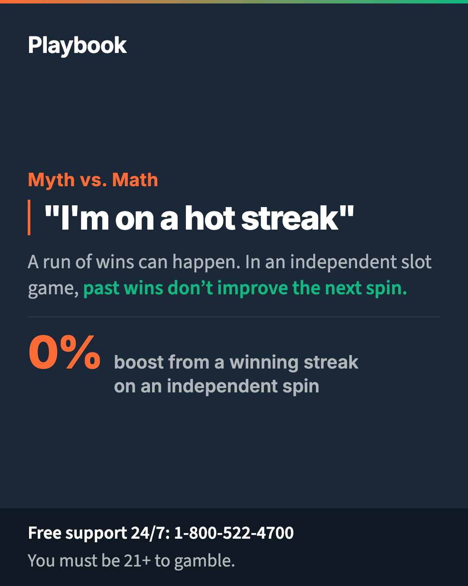
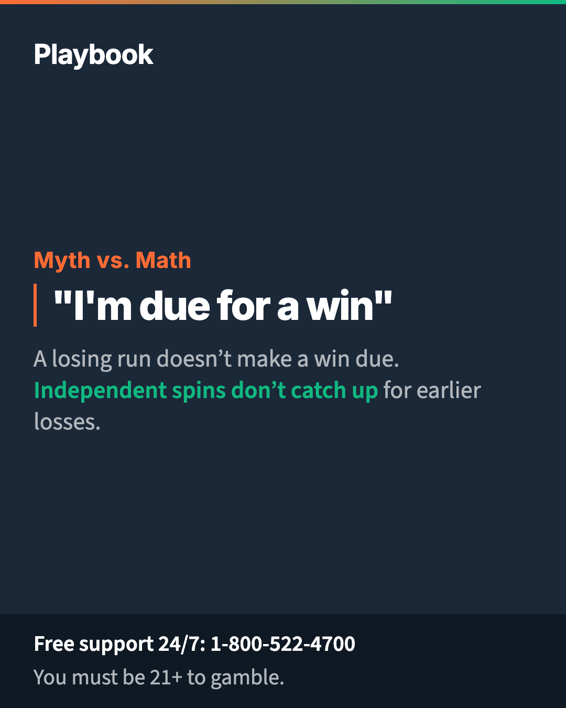
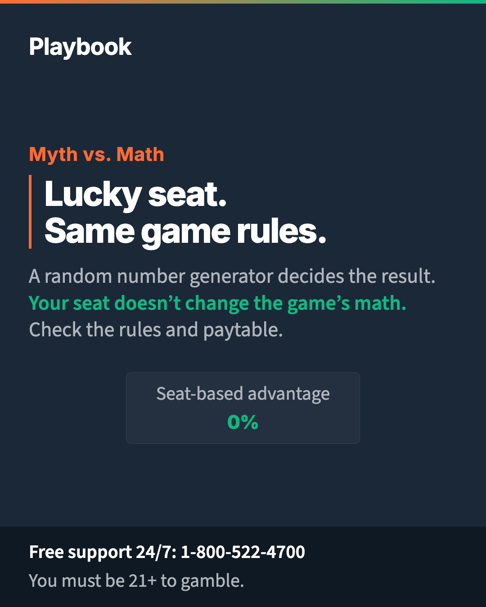
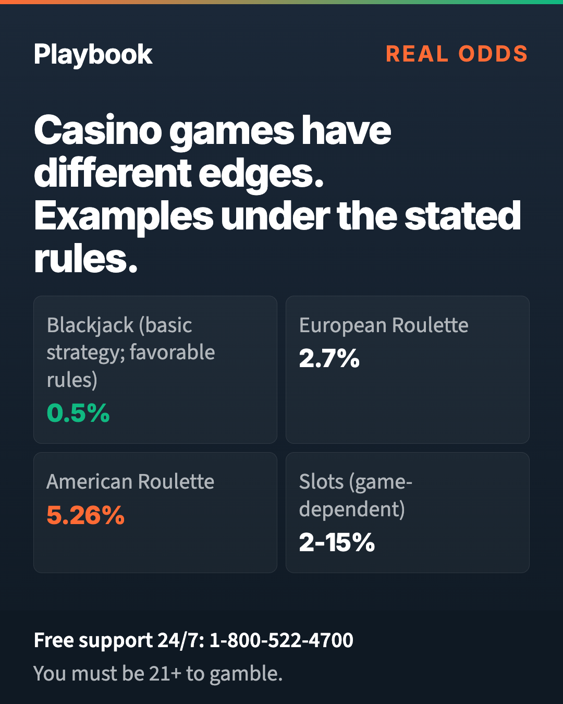
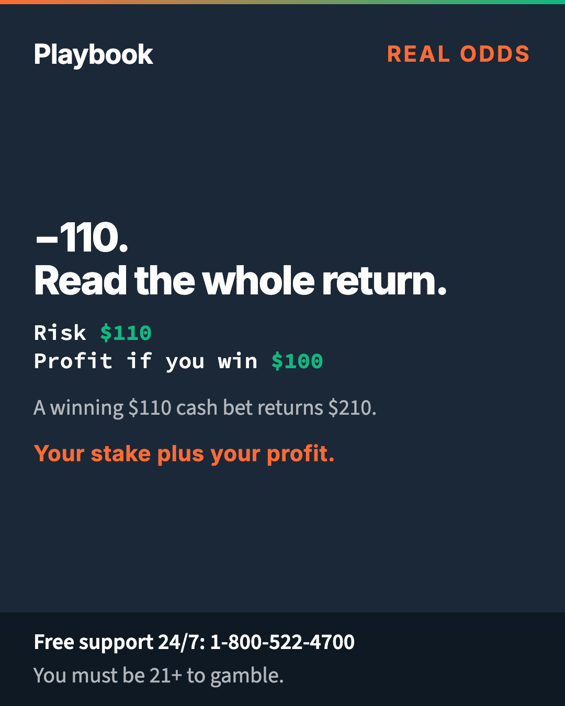
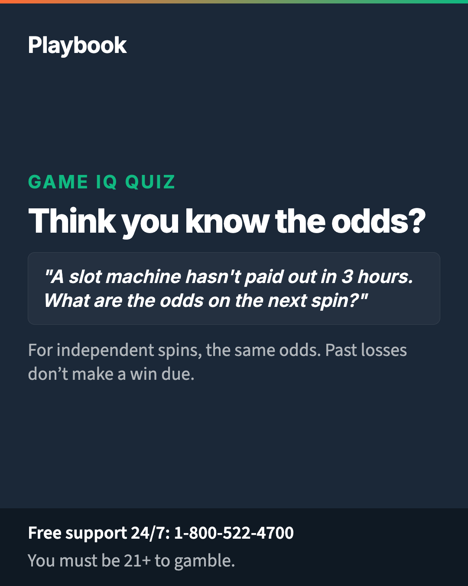
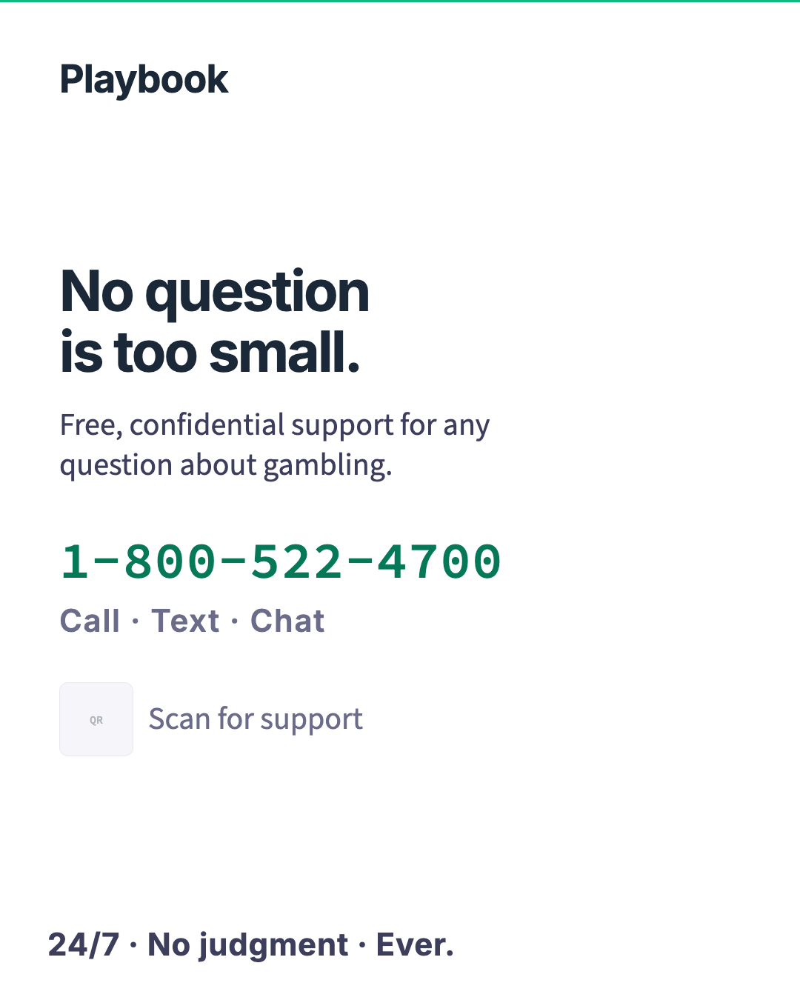
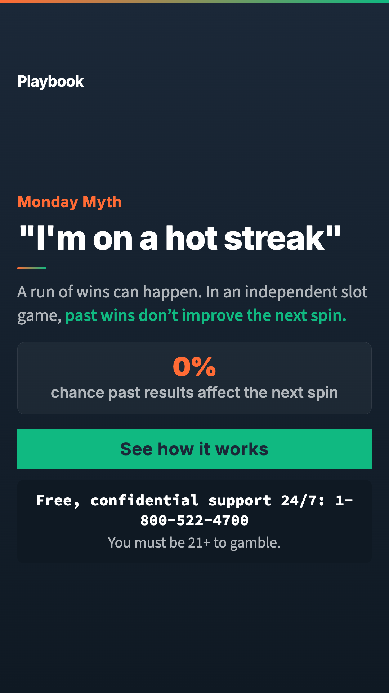
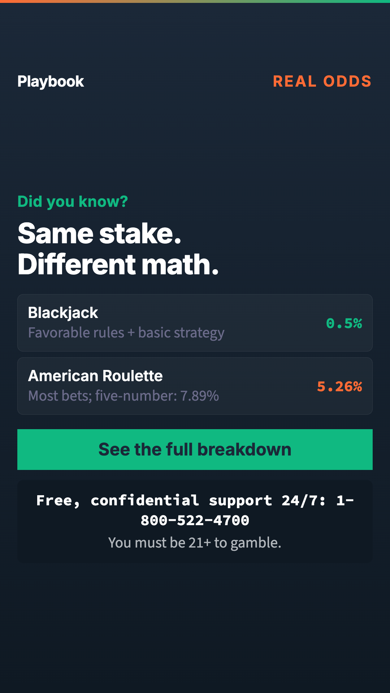
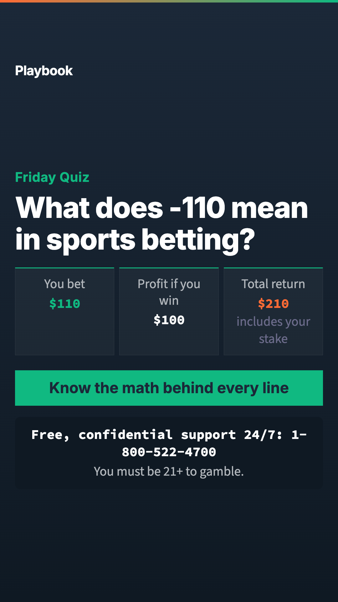

# Social Media Toolkit

Platform-specific content guide for {{PROGRAM_NAME}} social media presence. Content designed to earn engagement — not check a compliance box.

> **Operator note**: Replace all `{{PLACEHOLDER}}` tokens with values from `_brand.yml`. Every profile bio must include helpline or support link. See [application guidelines](../../brand-book/07-application-guidelines.md#social-media) for channel rules.

---

## Quick-scan index

| Section | Content |
|---|---|
| [Instagram / TikTok](#instagram--tiktok) | Reels, carousels, stories, bio |
| [X (Twitter)](#x-twitter) | Threads, one-liners, polls |
| [Facebook](#facebook) | Long-form posts, event tie-ins |
| [YouTube](#youtube) | Video descriptions, end-screen copy |
| [LinkedIn](#linkedin) | Industry-facing, thought leadership |
| [Hashtag strategy](#hashtag-strategy) | Tags by category |
| [Posting cadence](#posting-cadence) | Frequency by platform |
| [Engagement responses](#engagement-responses) | Reply templates |

---

## Instagram / TikTok

### Asset sizes

| Placement | Size | Renderer profile | Notes |
|---|---:|---|---|
| Portrait feed | 1080 x 1350 | `social-feed` | Primary master: more phone-screen area and enough room for reference content |
| Square feed / carousel | 1080 x 1080 | `social-square` | Compatibility export for square-only placements; reduce density rather than crop |
| Story / Reel | 1080 x 1920 | `story` | Essential copy and support text stay clear of platform UI zones |

Do not stretch or crop between aspect ratios. The renderer recomposes the header, body, and footer for the selected placement.

### Bio copy

> {{PROGRAM_SHORT_NAME}} | Real odds. Real tools. No fine print.
> Know your game. Challenge your friends.
> Support: {{HELPLINE_NUMBER}}
> {{CONTENT_HUB_URL}}

### Reel scripts (15–30 seconds)

#### Reel 1 — "Your Lucky Machine" (Myth-buster)

| Timing | Visual | Voiceover / Text overlay |
|---|---|---|
| 0–3s | Close-up of slot machine spinning | Text: "Your 'lucky machine'..." |
| 3–8s | Cut to person looking confident | "...has the emotional range of a toaster." |
| 8–15s | Animated RNG visualization | "Every spin is calculated by a random number generator. It doesn't know you. It doesn't care. It doesn't remember your last spin." |
| 15–22s | Quick stat cards flying in | "House edge on slots: 2–15%. Now you know." |
| 22–30s | End card: {{PROGRAM_NAME}} logo (horizontal B2, reversed variant — white wordmark on navy bg, min 24px height, 1x clear space) + CTA | "Know your game. Link in bio." |

#### Reel 2 — "The -110 Explained" (Sports betting math)

| Timing | Visual | Voiceover / Text overlay |
|---|---|---|
| 0–3s | Sports betting app UI | Text: "What does -110 mean?" |
| 3–10s | Animated money breakdown | "You bet $110. You win $100. That $10 difference? That's the sportsbook's cut." |
| 10–18s | Calculator visual | "On every. Single. Bet. It's how the business works." |
| 18–25s | Comparison: -110 vs -150 vs +200 | "Different prices change the potential return." |
| 25–30s | End card: {{PROGRAM_NAME}} logo (horizontal B2, reversed variant — white wordmark on navy bg, min 24px height, 1x clear space) | "Straight talk. Real numbers. Link in bio." |

#### Reel 3 — "The Quiz Challenge" (Engagement driver)

| Timing | Visual | Voiceover / Text overlay |
|---|---|---|
| 0–3s | Person looking smug | "Think you know the odds?" |
| 3–8s | Quiz question on screen | "In an independent slot game, does a losing run make a win more likely?" |
| 8–12s | Dramatic pause | "If you said 'higher'... wrong." |
| 12–20s | Answer reveal with animation | "For independent spins, the same odds. Earlier losses don’t make a win due." |
| 20–25s | Score reveal | "What did you pick? Here’s why the answer works." |
| 25–30s | End card with QR code: {{PROGRAM_NAME}} logo (horizontal B2, reversed variant — white wordmark on navy bg, min 24px height, 1x clear space) | "Take the full quiz. Challenge a friend. Link in bio." |

### Carousel layouts (10 slides)

#### Carousel 1 — "5 Myths the Math Doesn't Support"

| Slide | Content |
|---|---|
| 1 (Cover) | "5 gambling myths the math doesn't support" — bold headline, {{PROGRAM_NAME}} logo (stacked B1 or horizontal B2, reversed variant on dark bg / full-color on light bg; min 24px height, 1x clear space) |
| 2 | Myth: "I'm due for a win" → Fact: On independent slot spins, past losses do not make a win due. |
| 3 | Myth: "Hot and cold machines" → Fact: RNG doesn't have moods. Every spin is independent. |
| 4 | Myth: "Betting systems beat the house" → Fact: No strategy changes the house edge. |
| 5 | Myth: "I can tell when a machine is about to pay" → Fact: You can't. It's a random number generator. |
| 6 | Myth: "The casino owes me" → Fact: Earlier losses do not create a repayment obligation. |
| 7 | "So what CAN you control?" |
| 8 | Your budget. Your limits. Your session time. Your game choice. |
| 9 | "Knowledge is a feature." — tools overview with icons |
| 10 | CTA: "Take the quiz. Challenge your friends." + {{PROGRAM_NAME}} logo (reversed variant on navy bg or full-color on white bg; min 24px height, 1x clear space) + helpline |

#### Carousel 2 — "House Edge by Game"

| Slide | Content |
|---|---|
| 1 (Cover) | "Every game has a house edge. Here's yours." |
| 2 | Blackjack: ≈0.5% — "Basic strategy; favorable rules" |
| 3 | Craps: 1.4% — "Simple bet, low edge" |
| 4 | European Roulette: 2.7% — "Single zero wheel" |
| 5 | American Roulette: 5.26% — "Double-zero wheel; most bets" |
| 6 | Slots: 2–15% — "Varies by machine and casino" |
| 7 | Sports betting: −110 — "$110 stake, $100 profit if the cash bet wins" |
| 8 | "The house edge is how the business works. Knowing the edge helps you pick your games." |
| 9 | "Set your budget before you play." — tool CTA |
| 10 | CTA + {{PROGRAM_NAME}} logo (reversed variant on navy bg or full-color on white bg; min 24px height, 1x clear space) + helpline |

### Story templates

Refer to existing rendered story templates for visual format:
- [`render/story-3a-hot-streak.html`](../render/story-3a-hot-streak.html) — Myth-buster format
- [`render/story-3b-house-edge.html`](../render/story-3b-house-edge.html) — Stats format
- [`render/story-3c-sports-betting.html`](../render/story-3c-sports-betting.html) — Explainer format

**Story content rotation** (weekly):

| Day | Theme | Copy hook |
|---|---|---|
| Monday | Myth-buster | "Monday myth: [myth]. The math: [fact]." |
| Wednesday | Odds fact | "Did you know? [game] has a [X]% house edge." |
| Friday | Quiz question | "Friday quiz: [question]. Swipe up for the answer." |

---

## X (Twitter)

### Bio copy

> {{PROGRAM_SHORT_NAME}} | Real odds. Real tools. No fine print.
> Know your game →  {{CONTENT_HUB_URL}}
> Support: {{HELPLINE_NUMBER}}

### Thread format — "The Real Math Behind [Game]"

**Thread 1: Slot Machines**

| Tweet | Content |
|---|---|
| 1 (Hook) | Your "lucky machine" has the emotional range of a toaster. Here's how slot machines actually work. A thread. |
| 2 | Every modern slot machine uses a random number generator (RNG). It picks a number the instant you press spin. Everything else — the spinning reels, the sounds — is just presentation. |
| 3 | For independent slot spins, neither a near miss nor a losing run makes a win due. Systems can record activity without changing that result. |
| 4 | The house edge on slots ranges from 2% to 15%. That's the math built into every machine. Over time, the casino keeps that percentage. That's how the business works. |
| 5 | What can you control? Your budget. Your session time. Your game choice. Set a deposit limit before you play. Choose your amount and time frame. |
| 6 | Facts worth knowing. Tools worth using. More at {{CONTENT_HUB_URL}} |

### One-liner templates

| Theme | Tweet |
|---|---|
| Odds fact | The house edge on American roulette is 5.26%. European roulette: 2.7%. Check the wheel and the bet rules. |
| Myth-buster | A losing run isn’t a countdown. Past losses don’t make the next independent slot spin more likely to win. |
| Tool promo | Choose a deposit amount and a time frame. Check when the limit resets. |
| Quiz hook | How well do you really know the odds? See what you know, then explore the answers. Take the quiz → {{QUIZ_URL}} |
| Shareable fact | A -110 line means you bet $110 to win $100. If the cash bet wins, the total return is $210: $110 stake plus $100 profit. |

### Poll formats

| Poll question | Options |
|---|---|
| "In an independent slot game, does a losing run make a win more likely?" | No / Yes / Only after an hour / Only after a near miss |
| "About what is blackjack’s house edge with basic strategy under favorable rules?" | 0.5% / 2% / 5% / 10% |
| "What percentage of your entertainment budget do you set aside for gambling?" | 0–10% / 10–25% / 25–50% / I don't budget for it |

---

## Facebook

### Long-form post templates

#### Template 1 — Odds education

> **Every game has a house edge. Here's what that means for you.**
>
> The house edge is the mathematical advantage built into every casino game. It's how the business works — and it's not a secret.
>
> Here's the quick breakdown:
> - Blackjack (basic strategy; favorable rules): ≈0.5%
> - European roulette: 2.7%
> - American roulette: 5.26%
> - Slots: 2–15% (varies by machine)
>
> What does this mean in practice? Over time, for every $100 you wager on American roulette, the casino keeps about $5.26. That's the cost of the entertainment.
>
> Knowing the edge doesn't change it — but it helps you pick your games and set your budget. That's the point.
>
> Learn more: {{CONTENT_HUB_URL}}
> Free, confidential support: {{HELPLINE_NUMBER}}

#### Template 2 — Event tie-in (Super Bowl / major sports)

> **Big game this weekend? Here's what's worth knowing before you place a bet.**
>
> A -110 line means you bet $110 to win $100. If it wins, a cash bet returns $210: the $110 stake plus $100 profit.
>
> A few things worth knowing:
> - Prop bets are fun, but the house edge is higher than straight bets
> - Parlays are exciting, but the math favors the book on every leg
> - Set your entertainment budget before the game starts — and stick to it
>
> The best way to enjoy the game? Know the math before you bet. And set your budget before you start.
>
> Take the quiz: {{QUIZ_URL}}
> Free, confidential support: {{HELPLINE_NUMBER}}

---

## YouTube

### Video description template

```
{{VIDEO_TITLE}}

{{PROGRAM_SHORT_NAME}} — Real odds. Real tools. No fine print.

{{VIDEO_DESCRIPTION_PARAGRAPH}}

Key takeaways:
- {{TAKEAWAY_1}}
- {{TAKEAWAY_2}}
- {{TAKEAWAY_3}}

Take the game IQ quiz: {{QUIZ_URL}}
Set your deposit limit: {{TOOLS_URL}}
More facts: {{CONTENT_HUB_URL}}

Free, confidential support — for any question about gambling:
Call {{HELPLINE_NUMBER}} | Chat {{CHAT_URL}}

#KnowYourGame #{{PROGRAM_SHORT_NAME}}
```

### End-screen copy (last 20 seconds)

| Element | Content |
|---|---|
| **Headline** | Know your game |
| **CTA 1** | Take the quiz → [linked video/page] |
| **CTA 2** | Subscribe for more facts |
| **Helpline** | Free, confidential support: {{HELPLINE_NUMBER}} |

---

## LinkedIn

### Industry-facing post templates

#### Template 1 — Thought leadership

> **Player education doesn't have to look like a compliance checkbox.**
>
> Most gambling operators treat responsible gambling content as a regulatory afterthought — minimum-size helpline text buried in footers, generic "Gamble Responsibly" slogans that nobody reads, and clinical language that players actively avoid.
>
> What if player education content got the same design investment as commercial marketing?
>
> {{PROGRAM_NAME}} is built on a simple premise: players who understand how games work make better decisions. Not because we tell them to — because they want to.
>
> The approach: entertainment-grade production quality, specific actionable content, and a voice that treats players like adults.
>
> The result: content that earns engagement instead of meeting minimums.
>
> {{CONTENT_HUB_URL}}

#### Template 2 — Program results

> **What happens when you treat player education like a product, not a policy?**
>
> Early results from operators using the {{PROGRAM_NAME}} framework:
>
> - {{METRIC_1}}
> - {{METRIC_2}}
> - {{METRIC_3}}
>
> The framework is open-source. The brand system is white-label. The content library is deploy-ready.
>
> If you're building player education content, let's talk.
>
> {{CONTENT_HUB_URL}}

---

## Hashtag strategy

### Primary tags (every post)

| Tag | Purpose |
|---|---|
| `#KnowYourGame` | Primary brand hashtag |
| `#{{PROGRAM_SHORT_NAME}}` | Brand name (operator-specific) |

### Category tags (use 2–3 per post)

| Category | Tags |
|---|---|
| Odds education | `#HouseEdge` `#RealOdds` `#GameMath` |
| Myth-busting | `#MythVsMath` `#GamblingFacts` |
| Tools | `#PlayYourWay` `#SetYourLimits` |
| Quiz / engagement | `#GameIQ` `#QuizTime` `#ChallengeYourFriends` |
| Sports betting | `#BettingMath` `#StraightTalk` |

### Tags to avoid

- `#ResponsibleGambling` — too generic, doesn't drive action
- `#GambleResponsibly` — retire this phrase entirely
- `#ProblemGambling` — clinical; not for Tier 1 content
- `#Addiction` — Tier 2 only; never in social content

---

## Posting cadence

| Platform | Frequency | Best times |
|---|---|---|
| Instagram feed | 3–4x/week | Tue/Thu/Sat 11am–1pm, Sun 6–8pm |
| Instagram stories | Daily | During peak gambling hours (evenings, weekends) |
| TikTok | 3–5x/week | Wed/Fri/Sun 7–9pm |
| X (Twitter) | 5–7x/week | Daily 12pm and 6pm |
| Facebook | 2–3x/week | Tue/Thu 10am, Sun 5pm |
| YouTube | 1–2x/month | Tuesday 12pm |
| LinkedIn | 1–2x/week | Tue/Wed 9am |

### Content mix

| Type | Percentage |
|---|---|
| Odds education / myth-busting | 40% |
| Quiz / engagement | 25% |
| Tool promotion | 20% |
| Event / seasonal | 10% |
| Support access | 5% (always present in bios, subtle) |

---

## Engagement responses

Templates for responding to common comments and messages.

### Positive engagement

| Trigger | Response |
|---|---|
| "I didn't know that!" | "Here’s the full breakdown if you want to explore it → {{URL}}" |
| "Sharing this" | "Facts worth sharing. Thanks for spreading the word." |
| Quiz score share | "Nice score. Think your friends can beat it? Challenge them → {{QUIZ_URL}}" |

### Questions

| Trigger | Response |
|---|---|
| "Is this really how it works?" | "Straight from the math. Every game has a house edge — it's how the business works. Here's the full explainer → {{URL}}" |
| "How do I set limits?" | "Choose an amount and a period in your account settings. Here’s how → {{TOOLS_URL}}" |
| "What about [specific game]?" | "Good question. Here's the breakdown for [game] → {{URL}}" |

### Support-related

| Trigger | Response |
|---|---|
| Someone expressing concern | "Free, confidential support is available 24/7. Call {{HELPLINE_NUMBER}}, text {{TEXT_NUMBER}}, or chat at {{CHAT_URL}}. No judgment." |
| Negative / hostile | Do not engage publicly. Flag for moderation. If genuine distress: DM with helpline information. |

> **Escalation rule**: Any comment suggesting a player is in distress gets a DM with helpline info within 30 minutes. Never argue publicly about gambling behavior.

---

## Rendered previews

### Social cards (1080 x 1350 primary; 1080 x 1080 compatibility export)

| Template | Theme | Preview |
|---|---|---|
| [Hot streak myth](../render/card-1a-hot-streak.html) | Myth-buster — gambler's fallacy |  |
| [Due for a win](../render/card-1b-due-for-win.html) | Myth-buster — due-for-a-win fallacy |  |
| [Lucky machine](../render/card-1c-lucky-machine.html) | Myth-buster — machine memory myth |  |
| [House edge](../render/card-2a-house-edge.html) | Odds education — house edge explained |  |
| [Sports betting](../render/card-2b-sports-betting.html) | Odds education — the -110 line |  |
| [Bonus wagering](../render/card-2c-bonus-wagering.html) | Odds education — wagering requirements |  |
| [Support card (Tier 2)](../render/card-tier2-10f.html) | Support-focused social card — Tier 2 visual treatment |  |

### Stories (1080 x 1920)

| Template | Theme | Preview |
|---|---|---|
| [Hot streak story](../render/story-3a-hot-streak.html) | Myth-buster format |  |
| [House edge story](../render/story-3b-house-edge.html) | Stats format |  |
| [Sports betting story](../render/story-3c-sports-betting.html) | Explainer format |  |

---

*Cross-references: [Application Guidelines — Social](../../brand-book/07-application-guidelines.md#social-media) | [Core Messages](../../messaging/core-messages.md) | [Voice and Tone](../../brand-book/04-voice-and-tone.md)*

## Creative decisions — September 2026

Use the refreshed [creative review](../creative-review/README.md) and rendered masters when adapting this material. Keep the game variant and example assumptions beside a statistic. House edge describes expected loss over time; a budget is a chosen limit. Match feature timing and support availability to the configured operator.
