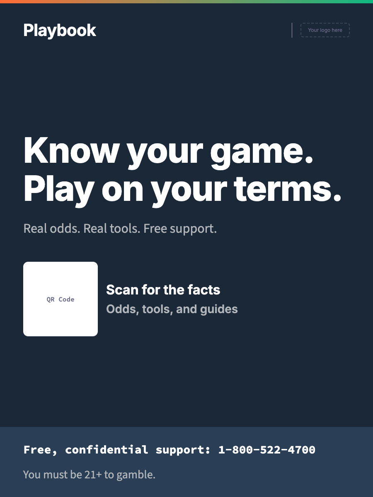
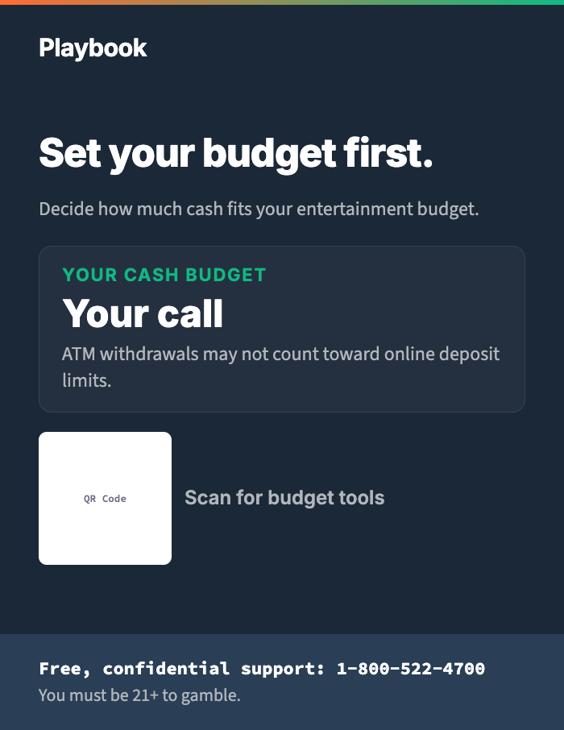
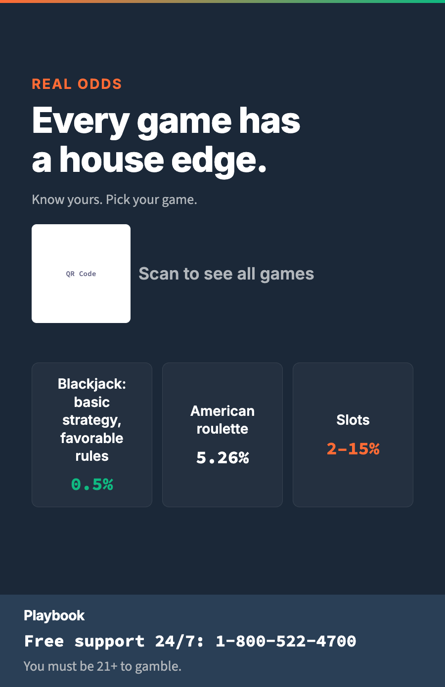
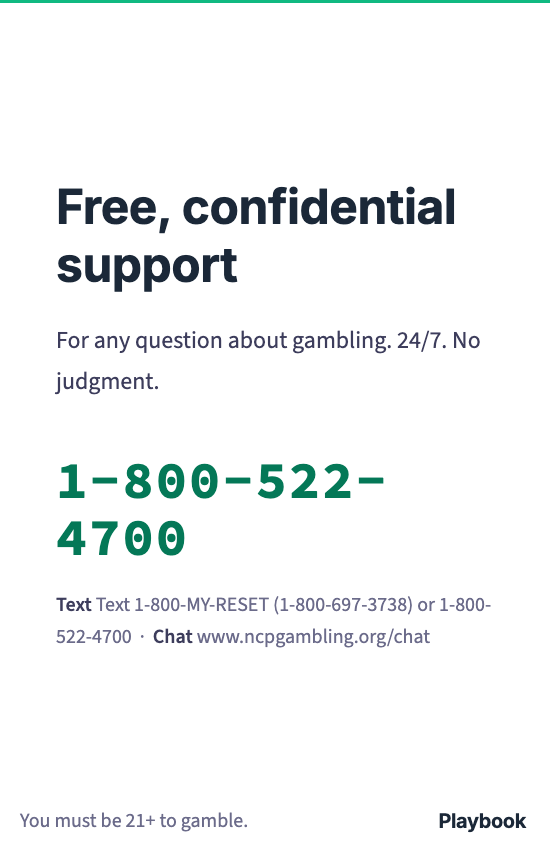
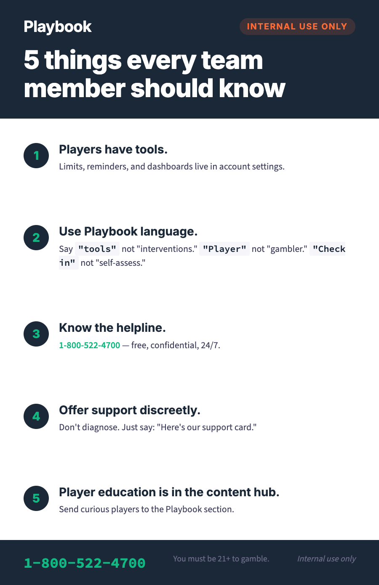

# Venue Signage Guide

Complete placement guide for {{PROGRAM_NAME}} signage across land-based venues. Covers 5 locations with format specs, copy, and placement rules.

> **Operator note**: Replace all `{{PLACEHOLDER}}` tokens with values from `_brand.yml`. All signage must be readable from 3 meters for public areas. Privacy-sensitive placement for helpline information near restrooms. See [application guidelines](../../brand-book/07-application-guidelines.md#environmental-applications) for environmental design principles.

---

## Quick-scan index

| Location | Format | Content priority |
|---|---|---|
| [Entrance / exit](#1-entrance--exit) | Wall-mounted or digital display | Brand awareness + helpline |
| [Near ATMs / cashiers](#2-near-atms--cashiers) | Small sign or poster | Budget reminder + helpline |
| [Gaming floor](#3-gaming-floor) | Portrait poster or custom column wrap | Quiz QR, odds facts |
| [Restrooms](#4-restrooms) | Separate mirror cling and stall-card artboards | Discreet helpline access |
| [Staff break rooms](#5-staff-break-rooms) | Poster | Training reminders, referral info |

---

## General signage specs

| Property | Value |
|---|---|
| **Readability distance** | 3 meters minimum for public signage; arm's length for ATM, restroom, and staff placements |
| **Minimum headline** | 48pt on public distance-read signage |
| **Minimum body** | 24pt on A2/18×24 posters; 20pt on A3/11×17 floor signs; 18pt at ATM/cashier; 14pt on private/internal close-read signs |
| **Minimum support/legal** | Never smaller than the format's body minimum; use weight, color, and position—not smaller type—to subordinate it |
| **Color system** | Navy `#1B2838` background, white text, emerald `#10B981` accents, orange `#FF6B35` highlights |
| **Accent bar** | Gradient strip `#FF6B35` → `#10B981` on all signs |
| **Materials** | See per-location specs |
| **QR codes** | Minimum 2" x 2" (50mm) for scanning from 1m+ |

---

If the required copy does not fit at these sizes, reduce or sequence the
message and move detail to the linked surface. Do not create a fine-print tier.
Validate the narrowest artboard and longest supported locale before release.

---

## 1. Entrance / exit

**Purpose**: First and last impression. Brand awareness and helpline visibility.

### Format specs

| Property | Value |
|---|---|
| **Dimensions** | A2 (420 x 594mm) or 18 x 24" poster, or digital display 1920x1080 |
| **Material** | Aluminum composite panel, direct print, or digital display |
| **Mounting** | Wall-mounted at eye level (1.5m center height) |
| **Placement** | Adjacent to main entrance/exit doors, visible before entry |

### Copy

| Element | Content |
|---|---|
| **Logo** | {{PROGRAM_NAME}} wordmark, horizontal (B2) layout, reversed variant (white wordmark on navy bg). Min height 0.25" (print) or 24px (digital display). Maintain 1x logo-height clear space on all sides. See [logo system](../../brand-book/03-visual-identity.md#1-logo-system) |
| **Operator logo** | `[Your logo here]` placeholder. Co-branding: {{PROGRAM_NAME}} logo no smaller than 60% of operator logo height; vertical divider (neutral_300 `#A8A8C0`, 1px) between logos |
| **Headline** | Know your game. Play on your terms. |
| **Subheadline** | Real odds, real tools, and free support — available anytime. |
| **QR code** | Links to content hub |
| **QR label** | Scan for the facts |
| **Helpline strip** | Free, confidential support 24/7: {{HELPLINE_NUMBER}} |
| **Legal** | You must be {{MIN_AGE}}+ to gamble. Gambling involves risk. |

### Exit variant (replace headline/subheadline)

| Element | Content |
|---|---|
| **Headline** | Thanks for playing. |
| **Subheadline** | Your tools are always here. Set your limits, review your activity, or get support anytime. |

---

## 2. Near ATMs / cashiers

**Purpose**: Budget reminder at the moment of financial decision.

### Format specs

| Property | Value |
|---|---|
| **Dimensions** | A4 (210 x 297mm) or 8.5 x 11" |
| **Material** | Acrylic sign holder (counter-top) or wall-mounted poster frame |
| **Mounting** | Within line of sight from ATM/cashier, not blocking the machine |
| **Placement** | Adjacent to ATMs, cashier windows, cage areas |

### Copy

| Element | Content |
|---|---|
| **Headline** | Set your budget before you start. |
| **Body** | Decide how much cash fits your entertainment budget. ATM withdrawals may not count toward online deposit limits. |
| **CTA** | Visit {{CONTENT_HUB_URL}} for tools |
| **Helpline** | Need to talk? Free, confidential support: {{HELPLINE_NUMBER}} |
| **QR code** | Links to deposit limit settings |
| **Legal** | You must be {{MIN_AGE}}+ to gamble. |

---

## 3. Gaming floor

**Purpose**: Odds education and quiz engagement at point of play.

### Format specs

| Property | Value |
|---|---|
| **Dimensions** | A3 (297 x 420mm) or 11 x 17" portrait poster |
| **Material** | Foam board in acrylic frame, or column-mounted vinyl |
| **Mounting** | Overhead (ceiling-hung), column-mounted, or freestanding. Column wraps require a site-specific dieline; do not stretch the poster art. |
| **Placement** | Central gaming floor areas, near high-traffic table games, slot sections |

### Copy — Variant A: Odds fact

| Element | Content |
|---|---|
| **Label** | REAL ODDS (orange) |
| **Headline** | Every game has a house edge. |
| **Stats** | Blackjack: ≈0.5% with basic strategy and favorable rules &#124; American roulette: 5.26% on most bets &#124; Slots: illustrative 2–15%, game-dependent |
| **Body** | The house edge is how casinos work. Knowing the edge helps you pick your games and set your budget. |
| **QR code** | Links to odds explorer |
| **QR label** | Scan to see all games |

### Copy — Variant B: Quiz hook

| Element | Content |
|---|---|
| **Label** | GAME IQ (emerald) |
| **Headline** | Think you know the odds? |
| **Body** | Take the 2-minute quiz. Challenge your friends. See what you know, then explore the answers. |
| **QR code** | Links to quiz |
| **QR label** | Scan to take the quiz |

### Copy — Variant C: Tool promo

| Element | Content |
|---|---|
| **Headline** | Your tools. Your limits. Your call. |
| **Body** | Set your deposit limit, session reminders, and activity alerts in your account settings. |
| **QR code** | Links to account settings |

---

## 4. Restrooms

**Purpose**: Discreet helpline access in a private setting with extended dwell time.

> **Privacy note**: Restroom signage should prioritize discretion. Players may not want to be seen reading helpline information on the gaming floor. Restroom placement provides a private moment to take note of support resources.

### Format specs

| Property | Value |
|---|---|
| **Format A** | Mirror cling (vinyl sticker on mirror surface) |
| **Format B** | Stall card (small sign inside stall door, at seated eye level) |
| **Stall-card dimensions** | A5 (148 x 210mm) or 5.5 x 8.5" portrait |
| **Mirror-cling dimensions** | 7 x 5" landscape default; confirm the available mirror area before production |
| **Material** | Waterproof vinyl (mirror cling) or laminated card (stall) |
| **Mounting** | Mirror cling: applied to mirror surface. Stall card: screwed or adhesive-mounted inside stall door |
| **Output profiles** | `print-us` / `print-iso` for stall cards; `restroom-mirror-print` for mirror clings |

### Copy — Mirror cling

| Element | Content |
|---|---|
| **Headline** | Need to talk? |
| **Body** | Free, confidential support — for any question about gambling. |
| **Helpline** | {{HELPLINE_NUMBER}} |
| **Number specs** | Large, bold, Source Code Pro — easily readable from arm's length |
| **Additional** | Text {{TEXT_NUMBER}} &#124; Chat {{CHAT_URL}} |
| **Availability** | 24/7. No judgment. |
| **Logo** | {{PROGRAM_NAME}} wordmark, reversed on dark backgrounds or primary on light. Use the symbol mark only where the current logo system explicitly calls for an icon-sized placement. Maintain 1x logo-height clear space. See [logo system](../../brand-book/03-visual-identity.md#1-logo-system) |

### Copy — Stall card

| Element | Content |
|---|---|
| **Headline** | Support is available. |
| **Body** | Free, confidential, 24/7. For any question about gambling. |
| **Helpline** | {{HELPLINE_NUMBER}} |
| **Text** | {{TEXT_NUMBER}} |
| **Chat** | {{CHAT_URL}} |
| **QR code** | Links to support page (small, 1" x 1") |
| **Note** | No operator branding on stall cards — helpline and the {{PROGRAM_NAME}} wordmark only (reversed on dark backgrounds or primary on light). Do not substitute the favicon/symbol for the collateral wordmark. |

---

## 5. Staff break rooms

**Purpose**: Training reinforcement and player referral guidance for staff.

### Format specs

| Property | Value |
|---|---|
| **Dimensions** | A3 (297 x 420mm) or 11 x 17" |
| **Material** | Mounted poster in frame |
| **Placement** | Staff break room, locker room, back-of-house corridors |

### Copy

| Element | Content |
|---|---|
| **Headline** | 5 things every team member should know |
| **Format** | Numbered list, large readable type |

### The 5 things

| # | Statement |
|---|---|
| 1 | **Every player has access to tools.** Deposit limits, session reminders, and activity dashboards are in account settings. Know where to direct players. |
| 2 | **Use Playbook language.** Say "tools" not "interventions." Say "player" not "gambler." Say "check in" not "self-assess." See the full language guide at {{TRAINING_URL}}. |
| 3 | **Know the helpline.** {{HELPLINE_NUMBER}} — free, confidential, 24/7. For any question about gambling. |
| 4 | **If a player seems distressed**, offer the helpline card discreetly. Don't diagnose. Don't lecture. Just say: "Here's our support card if you ever need it." |
| 5 | **Player education content is in the {{PROGRAM_NAME}} content hub.** Direct curious players to {{CONTENT_HUB_URL}} for quizzes, odds info, and tools. |

| Element | Content |
|---|---|
| **Footer** | Questions? Contact {{TRAINING_CONTACT}} |
| **Legal** | Internal use only |

---

## Digital vs. static signage decision guide

| Factor | Static signage | Digital signage |
|---|---|---|
| **Cost** | Lower upfront, replacement cost for updates | Higher upfront, easy content updates |
| **Content freshness** | Fixed — requires reprinting for changes | Dynamic — update remotely, schedule rotations |
| **Best for** | Restrooms, stall cards, break rooms | Entrance displays, gaming floor, high-traffic areas |
| **Power** | None required | Requires power + network |
| **Dwell time match** | Long-dwell locations (restrooms, tables) | Short-dwell locations (corridors, entrances) |
| **Multilingual** | Requires separate prints per language | Rotate languages on schedule |
| **Maintenance** | Replace when worn (monthly) | Screen cleaning, software updates |
| **Recommendation** | Use for fixed-message locations | Use for high-traffic, rotating-content locations |

---

## Multilingual notes

- In venues serving diverse communities, provide signage in the top 2–3 languages spoken locally
- For static signage: produce separate versions per language (do not mix languages on one sign)
- For digital signage: rotate languages on a timed schedule (minimum 15 seconds per language)
- Helpline numbers may differ by language — verify with local support providers
- QR codes should link to language-specific landing pages where available

---

## Rendered previews

The default restroom preview is the portrait stall card. Render `restroom-mirror` for the separate landscape cling. See the [production size matrix](../production-size-matrix.md) for every finished size.

Click the template name to view the full HTML source.

| Template | Location | Preview |
|---|---|---|
| [Entrance sign](../render/sign-entrance-9a.html) | Main entrance / exit doors |  |
| [ATM sign](../render/sign-atm-9b.html) | Near ATMs and cashier windows |  |
| [Gaming floor sign](../render/sign-floor-9c.html) | Overhead or column-mounted on gaming floor |  |
| [Restroom sign](../render/sign-restroom-9d.html) | Mirror cling or stall card |  |
| [Staff break room sign](../render/sign-staff-9e.html) | Staff break room poster |  |

---

*Cross-references: [Application Guidelines — Environmental](../../brand-book/07-application-guidelines.md#environmental-applications) | [Core Messages](../../messaging/core-messages.md) | [Stigma-Free Language](../../brand-book/04-voice-and-tone.md#language-guide)*

## Creative decisions — September 2026

Use the refreshed [creative review](../creative-review/README.md) and rendered masters when adapting this material. Keep the game variant and example assumptions beside a statistic. House edge describes expected loss over time; a budget is a chosen limit. Match feature timing and support availability to the configured operator.
