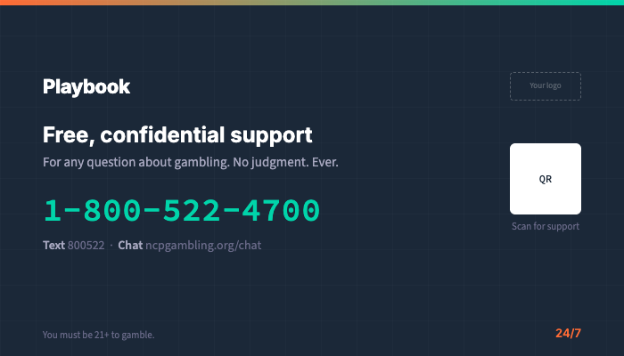

# Helpline Card — Business Card Format

Standard business card spec for {{PROGRAM_NAME}} helpline distribution. Designed to be given by staff, left at info centers, and available at support desks.

> **Operator note**: Replace all `{{PLACEHOLDER}}` tokens with values from `_brand.yml`. Helpline number must be the most prominent element on both sides. See [application guidelines](../../brand-book/07-application-guidelines.md#print-applications) for print design rules.

---

## Quick-scan index

| Side | Content |
|---|---|
| [Front](#front) | Branding + "Free, confidential support" + helpline |
| [Back](#back) | Multiple contact channels + QR code |

---

## Print specs

| Property | Value |
|---|---|
| **Size** | 3.5 x 2 inches (89 x 51mm) — standard business card |
| **Render dimensions** | 700 x 400px (2x for screen rendering) |
| **Bleed** | 0.125" (3mm) on all sides |
| **Safe zone** | 0.125" (3mm) inside trim |
| **Color mode** | CMYK |
| **Resolution** | 300 DPI minimum |
| **Paper** | 16pt matte card stock |
| **Corners** | Rounded (0.125" radius) |

> **Visual reference**: See [`render/helpline-card-5c.html`](../render/helpline-card-5c.html) for the HTML template render.

---

## Front

| Element | Content |
|---|---|
| **Background** | Navy `#1B2838` |
| **Accent bar** | 3px gradient strip at top: orange `#FF6B35` → teal `#00D4AA` |
| **Logo** | {{PROGRAM_NAME}} wordmark, horizontal (B2) layout, reversed variant (white Play + teal BOOK on navy bg), top-left. Min height 0.25" (print). Below 0.25", use logomark only (no wordmark). Maintain 1x logo-height clear space. At business-card scale, the helpline badge lockup format ([Logomark] &#124; Free help 24/7: {{HELPLINE_NUMBER}}) may be used. See [logo system](../../brand-book/03-visual-identity.md#1-logo-system) |
| **Operator logo** | `[Your logo here]` placeholder, top-right, small. Co-branding: {{PROGRAM_NAME}} logo no smaller than 60% of operator logo height; vertical divider (neutral_300 `#A8A8C0`, 1px) between logos |

### Primary content

| Element | Content |
|---|---|
| **Headline** | Free, confidential support |
| **Headline specs** | Inter 700, white, 11pt |
| **Subheadline** | For any question about gambling. No judgment. Ever. |
| **Subheadline specs** | Source Sans 3, `#A8A8C0`, 8pt |
| **Helpline number** | {{HELPLINE_NUMBER}} |
| **Number specs** | Source Code Pro 700, teal `#00D4AA`, 16pt — largest element on the card |
| **Availability** | 24/7 |

---

## Back

| Element | Content |
|---|---|
| **Background** | White |
| **Accent bar** | 3px gradient strip at top: orange → teal |

### Contact channels

| Channel | Display | Details |
|---|---|---|
| **Call** | Call | {{HELPLINE_NUMBER}} |
| **Text** | Text | {{TEXT_NUMBER}} |
| **Chat** | Chat | {{CHAT_URL}} |
| **Web** | More info | {{CONTENT_HUB_URL}} |

| Element | Content |
|---|---|
| **Layout** | Vertical list, left-aligned, generous spacing |
| **Icons** | Use icon system equivalents for each channel (phone, message, globe, link) |
| **Typography** | Source Sans 3 for labels, Source Code Pro for numbers/URLs |
| **Text color** | Navy `#1B2838` |

### QR code

| Element | Content |
|---|---|
| **QR code** | Links to {{SUPPORT_URL}} |
| **QR size** | 0.6" x 0.6" (minimum) |
| **Position** | Bottom-right corner |
| **Label** | Scan for support |
| **Label specs** | Source Sans 3, 6pt, `#6B6B8A` |

### Footer

| Element | Content |
|---|---|
| **Legal** | You must be {{MIN_AGE}}+ to gamble. |
| **Legal specs** | Source Sans 3, 6pt, `#6B6B8A` |

---

## Distribution guide

### Who gives these out

| Person | When |
|---|---|
| **Player services staff** | Any player interaction involving limits, tools, or support |
| **Host desk / reception** | On request, or proactively with new member packs |
| **Security / floor staff** | When a player shows signs of distress (trained to offer discreetly) |
| **Helpline counselors** | Provided during outreach events |

### Where to stock

| Location | Quantity |
|---|---|
| Player services desk | 50+ |
| Reception / host desk | 25+ |
| Info center / brochure rack | 25+ |
| Restrooms (discreet holder) | 10 per restroom |
| Staff break room | 10 (for staff awareness) |

### Handling guidelines

- Cards are free — never charge for them
- Offer without requiring explanation ("Here's our support card")
- Do not press a player to take one if they decline
- Restock daily during operating hours
- Discreet restroom placement: small acrylic holder mounted inside stall or near mirror

---

## Wallet-size variant

A narrower version designed to fit in a wallet or phone case.

| Property | Standard | Wallet-size |
|---|---|---|
| **Size** | 3.5 x 2" (89 x 51mm) | 3.375 x 2.125" (86 x 54mm) — credit card size |
| **Corners** | Rounded (0.125") | Rounded (0.125") |
| **Content** | Full helpline + 4 contact channels | Helpline + phone + text only (reduced channels) |
| **QR code** | 0.6" | 0.5" (slightly smaller) |
| **Paper** | 16pt matte | 16pt matte or plastic (more durable for wallet carry) |

**Design adjustment**: At wallet size, the back reduces to two contact channels (call + text) and the QR code. Chat URL is omitted due to space constraints. All text sizes maintain minimums (helpline still 16pt).

---

## Multi-language layout

For jurisdictions requiring multiple languages on the same card.

### Dual-language card (e.g., English/Spanish)

| Side | Language | Content |
|---|---|---|
| Front | English | Standard front layout |
| Back | Spanish | Translated contact channels + QR |

**Design rules for dual-language**:
- Each language gets a full side — don't mix languages on the same side
- Both sides maintain the same visual hierarchy
- Helpline number is universal (same on both sides)
- QR code on both sides (can link to language-specific support page)

### Tri-language card (e.g., English/Spanish/Chinese)

For venues serving diverse communities, use a tri-fold card (slightly wider, scored for Z-fold):

| Property | Value |
|---|---|
| **Size** | 7 x 2" (178 x 51mm), scored at 2.33" intervals |
| **Panels** | 3 equal panels, one language per panel |
| **Fold** | Z-fold to standard business card size |

---

## Tier 2 design treatment

The default helpline card already uses a support-focused tone. For enhanced Tier 2 alignment:

| Element | Default | Enhanced Tier 2 |
|---|---|---|
| **Front background** | Navy (#1B2838) | White — calmer, less enclosing |
| **Text color** | White on navy | Navy (#1B2838) on white |
| **Accent** | Teal helpline number | Teal CTA button style |
| **Gradient bar** | Orange → teal | Omit — Tier 2 avoids the playful gradient |
| **Tone** | "Free, confidential support" | "You're not alone. Help is here." |

See `visual-identity/tier-2/tier-2-visual-guide.md` for the full Tier 2 visual specification.

---

*Cross-references: [Application Guidelines — Print](../../brand-book/07-application-guidelines.md#print-applications) | [Core Messages — Help](../../messaging/core-messages.md#help--support-without-barriers) | [HTML template](../render/helpline-card-5c.html)*
