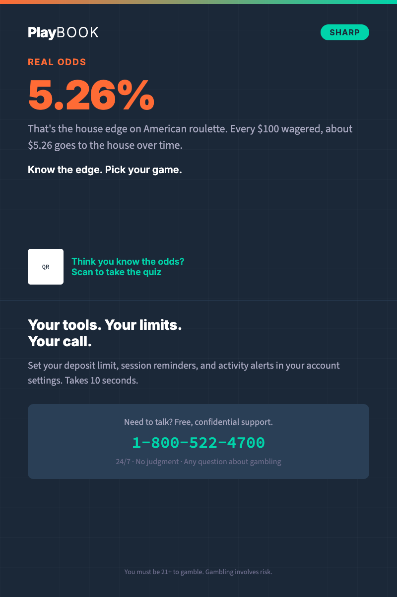

# Table Tent — 4x6" Point-of-Play Card

Two-sided table tent spec for {{PROGRAM_NAME}}. Placed at gaming tables, bars, and restaurant tables within land-based venues.

> **Operator note**: Replace all `{{PLACEHOLDER}}` tokens with values from `_brand.yml`. Content must be readable at arm's length (approximately 0.5m). See [application guidelines](../../brand-book/07-application-guidelines.md#print-applications) for print design rules.

---

## Quick-scan index

| Side | Content |
|---|---|
| [Side A](#side-a--odds-fact--quiz-hook) | Odds fact + QR to quiz |
| [Side B](#side-b--helpline--tool-cta) | Helpline + tool CTA |
| [Placement guide](#placement-guide) | Where and how to position |

---

## Print specs

| Property | Value |
|---|---|
| **Flat size** | 4 x 6 inches (102 x 152mm) per side |
| **Render dimensions** | 800 x 1200px (2x for screen rendering) |
| **Bleed** | 0.125" (3mm) on all sides |
| **Safe zone** | 0.25" (6mm) inside trim |
| **Color mode** | CMYK |
| **Resolution** | 300 DPI minimum |
| **Paper** | 16pt card stock, double-sided, scored for tent fold |
| **Finish** | Matte laminate both sides (fingerprint resistant) |
| **Construction** | Scored at midpoint, tented with adhesive tab or built-in stand |

> **Visual reference**: See [`render/table-tent-5b.html`](../render/table-tent-5b.html) for the HTML template render.

---

## Side A — Odds fact + quiz hook

| Element | Content |
|---|---|
| **Background** | Navy `#1B2838` |
| **Accent bar** | 4px gradient strip at top: orange `#FF6B35` → teal `#00D4AA` |
| **Logo** | {{PROGRAM_NAME}} wordmark, horizontal (B2) layout, reversed variant (white Play + teal BOOK on navy bg), top-left, small. Min height 0.25" (print). Below 0.25", use logomark only (no wordmark). Maintain 1x logo-height clear space. See [logo system](../../brand-book/03-visual-identity.md#1-logo-system) |
| **Pillar badge** | `SHARP` (teal pill), top-right |

### Odds fact

| Element | Content |
|---|---|
| **Label** | REAL ODDS (orange, uppercase) |
| **Stat** | 5.26% |
| **Stat display** | Inter 900, large (48pt+), orange `#FF6B35` |
| **Context** | That's the house edge on American roulette. Every $100 wagered, about $5.26 goes to the house over time. |
| **Callout** | Know the edge. Pick your game. |

### Quiz hook

| Element | Content |
|---|---|
| **Headline** | Think you know the odds? |
| **Body** | Scan to take the 2-minute quiz |
| **QR code** | Links to quiz page |
| **QR size** | Minimum 0.75" x 0.75" |
| **QR label** | Scan to play |

---

## Side B — Helpline + tool CTA

| Element | Content |
|---|---|
| **Background** | Navy `#1B2838` |
| **Accent bar** | 4px gradient strip at top: orange → teal |

### Tool promotion

| Element | Content |
|---|---|
| **Headline** | Your tools. Your limits. Your call. |
| **Body** | Set your deposit limit, session reminders, and activity alerts — all in your account settings. Takes 10 seconds. |
| **CTA** | Visit {{CONTENT_HUB_URL}} |

### Helpline

| Element | Content |
|---|---|
| **Headline** | Need to talk? |
| **Body** | Free, confidential support — for any question about gambling. |
| **Helpline number** | {{HELPLINE_NUMBER}} |
| **Number display** | Source Code Pro, bold, white, minimum 18pt |
| **Additional channels** | Text {{TEXT_NUMBER}} &#124; Chat {{CHAT_URL}} |
| **Availability** | 24/7 |

### Footer

| Element | Content |
|---|---|
| **Legal** | You must be {{MIN_AGE}}+ to gamble. |
| **Operator logo** | `[Your logo here]` placeholder. Co-branding: {{PROGRAM_NAME}} logo no smaller than 60% of operator logo height; vertical divider (neutral_300 `#A8A8C0`, 1px) between logos if side by side. Both logos min 0.25" height for print |

---

## Placement guide

### Primary locations

| Location | Rationale | Quantity estimate |
|---|---|---|
| **Gaming tables** | Point-of-play — highest dwell time, most engaged players | 1 per table |
| **Bar counters** | Social setting, natural conversation starter | 1 per 6 seats |
| **Restaurant tables** | Extended dwell time, relaxed attention | 1 per table |
| **Waiting areas** | High boredom, good read time | 2–3 per area |

### Placement rules

- Position upright, both sides visible
- Do not place directly in front of a seat — slightly to the side or center of table
- Replace when visibly worn (monthly rotation recommended)
- Ensure QR code is not obstructed by table items
- Pair with other {{PROGRAM_NAME}} signage in the venue (posters, digital displays)

### Do not place

- On active gaming machines (obstructs play)
- In staff-only areas (use staff-specific materials instead)
- Near exits only (should be throughout the venue, not just as players leave)

---

## Venue-specific variants

The default table tent uses an American roulette odds fact. These variants adapt content for specific placement contexts.

### Gaming floor variant (default)

Uses the default Side A content (roulette house edge). Best for table game areas.

### Bar / restaurant variant

| Element | Content change from default |
|---|---|
| **Side A label** | DID YOU KNOW? (orange, uppercase) |
| **Side A stat** | 45 min |
| **Side A context** | That's the average casino session. Time moves differently when you're playing. Set a session reminder. |
| **Side A callout** | Your time. Your awareness. |
| **QR link** | Links to session reminder setup page |

### Sports bar variant

| Element | Content change from default |
|---|---|
| **Side A label** | PARLAY MATH (orange, uppercase) |
| **Side A stat** | 6.25% |
| **Side A context** | That's the hit rate on a 4-leg parlay at -110. The payout looks big because the odds are tiny. |
| **Side A callout** | Know the math. Bet on your terms. |
| **QR link** | Links to parlay odds calculator |

### Helpline variant (Tier 2)

| Element | Content change from default |
|---|---|
| **Side A background** | White (not navy — Tier 2 visual treatment) |
| **Side A content** | "Need to talk?" with helpline number as primary focus |
| **Side B** | Multiple contact channels + QR to support page |
| **Visual treatment** | See `visual-identity/tier-2/tier-2-visual-guide.md` |

---

## QR code placement rules

| Rule | Rationale |
|---|---|
| Minimum 0.75" x 0.75" | Smaller QR codes fail to scan from arm's length |
| White quiet zone (4 modules minimum) | Scanner needs clear boundary to detect the code |
| Test on 3+ phone models before print | QR rendering varies; test with older phones too |
| Use a URL shortener or redirect | Long URLs create dense QR patterns that are harder to scan |
| Include a text URL fallback | Some players won't scan — print the URL in small text below |
| Link to mobile-optimized page | The QR destination must work on a phone screen |

---

*Cross-references: [Application Guidelines — Print](../../brand-book/07-application-guidelines.md#print-applications) | [Core Messages](../../messaging/core-messages.md) | [HTML template](../render/table-tent-5b.html)*
