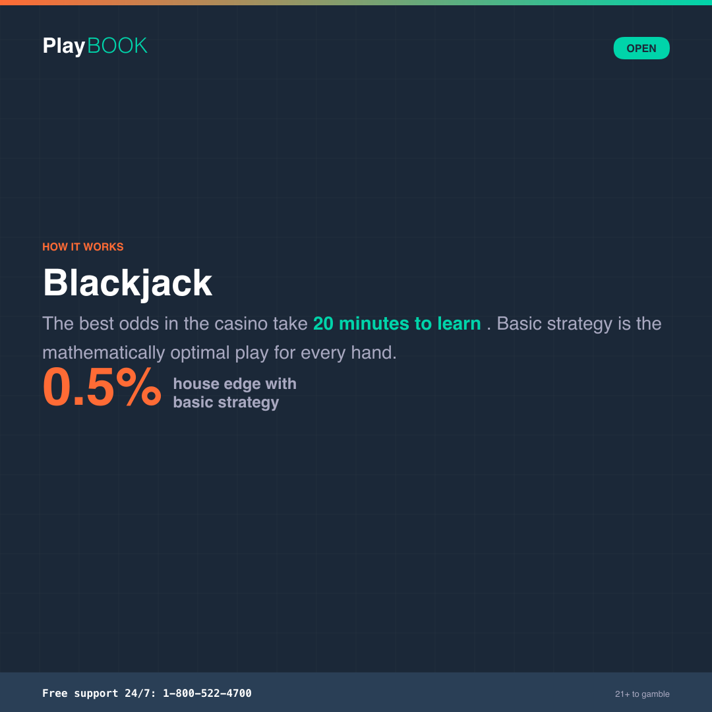
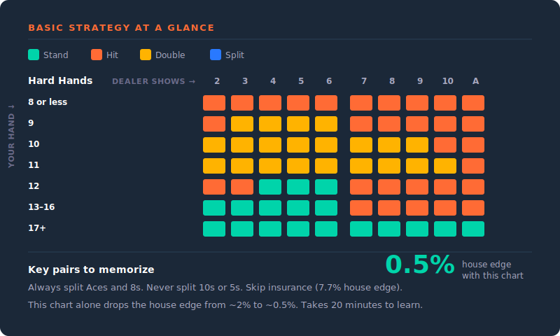

# How to Play: Blackjack

Everything you need to know about blackjack — the rules, the decisions, and why basic strategy is the difference between the best odds in the casino and average ones. No fine print.

> **Operator note**: Rules vary by table, casino, and jurisdiction (number of decks, dealer stand rules, doubling restrictions, surrender availability). Verify specific rules and house edge calculations for your products before deploying. All copy follows {{PROGRAM_NAME}} Tier 1 voice (The Sharp).

**Pillar:** Open | **Reading level:** Grade 6–8 | **Tone:** Confident / Informative

---

---

## Quick-scan index

| Section | What it covers |
|---------|---------------|
| [The 30-second version](#the-30-second-version) | TL;DR for the impatient |
| [How the game works](#how-the-game-works) | Card values, game flow, and the dealer's rules |
| [Bet types](#bet-types) | Base bets, side bets, and when you can double or split |
| [The math](#the-math) | House edge with and without basic strategy |
| [Basic strategy](#basic-strategy) | The mathematically optimal decision for every hand |
| [Key terms](#key-terms) | Blackjack vocabulary in plain language |
| [Tips for informed play](#tips-for-informed-play) | What actually moves the needle |
| [Common myths](#common-myths) | Three myths that cost players money |
| [Quiz questions](#quiz-questions) | Ready-to-use quiz content |
| [Social snippets](#social-snippets) | Shareable one-liners for social cards |

---

## The 30-second version

> Blackjack is a card game where you try to get closer to `21` than the dealer without going over. You make decisions — hit, stand, double, split — that genuinely affect the outcome. With basic strategy, the house edge drops to about `0.5%`, making it the best odds in the casino. Without it, the edge climbs to `2%` or more.

---

## How the game works

### Card values

- **Number cards (2–10):** Face value
- **Face cards (J, Q, K):** `10`
- **Ace:** `1` or `11` — whichever helps your hand more

A hand with an ace counted as `11` is called a "soft" hand (e.g., Ace + 6 = soft 17). It's soft because you can't bust on the next card — the ace can switch to `1`.

### Playing a hand

1. **Place your bet.** Set your wager before any cards are dealt.
2. **Receive two cards.** You get two cards face up. The dealer gets one card face up (the "upcard") and one face down (the "hole card").
3. **Check for blackjack.** If your first two cards total `21` (an ace plus a 10-value card), that's a blackjack — you win automatically at `3:2` payout (unless the dealer also has blackjack, which is a push).
4. **Make your decisions.** Based on your hand and the dealer's upcard, you choose from the available actions (see below).
5. **Dealer plays.** After all players finish, the dealer reveals the hole card and follows mandatory rules — typically hitting until reaching `17` or higher.
6. **Compare totals.** Closer to `21` wins. Going over `21` (busting) is an automatic loss. Ties (pushes) return your bet.

### Your decisions

| Action | What it means | When it's available |
|--------|--------------|-------------------|
| **Hit** | Take another card | Anytime your hand is below `21` |
| **Stand** | Keep your current hand — no more cards | Anytime |
| **Double down** | Double your bet and receive exactly one more card | Usually on your first two cards only |
| **Split** | If you have two cards of the same value, split them into two separate hands, each with its own bet | When your first two cards match |
| **Surrender** | Give up half your bet and fold the hand | Some tables, on first two cards only |
| **Insurance** | A side bet that the dealer has blackjack (pays `2:1`) | When the dealer's upcard is an ace |

### Dealer rules

The dealer has no choices. The dealer follows a fixed script:

- **Dealer hits on 16 or below.** Always.
- **Dealer stands on 17 or above.** At most tables. (Some tables require the dealer to hit on "soft 17" — this slightly increases the house edge.)

The dealer can't double down, can't split, can't surrender. The dealer just follows the rules. That's it.

---

## Bet types

| Bet | What it means | Payout | House edge |
|-----|--------------|--------|-----------|
| **Base bet** | Your main wager on the hand | `1:1` (even money) | `0.5%` (basic strategy) to `2%+` |
| **Blackjack** | Natural 21 on first two cards | `3:2` (or `6:5` at some tables) | — |
| **Insurance** | Side bet that dealer has blackjack | `2:1` | `~7.7%` |
| **Side bets** (Perfect Pairs, 21+3, etc.) | Bets on specific card combinations | Varies (`5:1` to `100:1+`) | `2–11%+` |

**Key point:** Insurance and most side bets carry a much higher house edge than the base game. Insurance in particular is almost always a bad deal mathematically. Basic strategy says: skip it.

<!-- ADAPT: currency -->
**6:5 vs. 3:2 blackjack:** Some tables pay `6:5` on a natural blackjack instead of `3:2`. On a `$10` bet, that's `$12` instead of `$15`. This single rule change increases the house edge by about `1.4%`. Check the table sign before you sit down.
<!-- /ADAPT -->

---

## The math

### House edge

| Scenario | House edge |
|----------|-----------|
| Basic strategy, favorable rules (`3:2`, stand on soft 17, 6 decks) | `~0.5%` |
| Basic strategy, standard rules | `~0.6–0.8%` |
| Average player (no basic strategy) | `~2–2.5%` |
| `6:5` payout table (even with basic strategy) | `~1.5–2%` |

### What this means for your wallet

<!-- ADAPT: currency -->
With basic strategy at a standard table, the house edge is about `0.5%`. For every `$100` you bet over time, you'd lose about `50 cents` on average. Without basic strategy, that climbs to about `$2–$2.50` per `$100`.
<!-- /ADAPT -->

The difference between knowing basic strategy and not knowing it is the difference between the best odds in the casino and average ones. The strategy itself takes about 20 minutes to learn.

**Compared to other games:** See [Odds at a Glance](odds-at-a-glance.md).

---

## Basic strategy

Basic strategy is the mathematically optimal decision for every possible hand combination. It was figured out by running millions of simulated hands through computers. It's not a "system" or a "trick" — it's just the math.

The strategy depends on your hand total and the dealer's upcard. Here's a simplified reference:

### Hard hands (no ace, or ace counted as 1)

| Your hand | Dealer shows 2–6 | Dealer shows 7–A |
|-----------|-------------------|-------------------|
| `8` or less | Hit | Hit |
| `9` | Double (or hit) | Hit |
| `10` | Double (or hit) | Hit if dealer shows 10 or A |
| `11` | Double | Double (or hit vs. A) |
| `12` | Stand (hit vs. 2 or 3) | Hit |
| `13–16` | Stand | Hit |
| `17+` | Stand | Stand |

### Soft hands (ace counted as 11)

| Your hand | Dealer shows 2–6 | Dealer shows 7–A |
|-----------|-------------------|-------------------|
| Soft `13–15` | Hit (double vs. 5–6) | Hit |
| Soft `16–18` | Double (or stand vs. 7–8) | Hit (stand on soft 18 vs. 7–8) |
| Soft `19+` | Stand | Stand |

### Pairs

| Your pair | Dealer shows 2–6 | Dealer shows 7–A |
|-----------|-------------------|-------------------|
| `A, A` | Always split | Always split |
| `8, 8` | Always split | Always split |
| `10, 10` | Never split | Never split |
| `5, 5` | Never split — treat as `10` | Never split — treat as `10` |
| `4, 4` | Hit | Hit |
| Other pairs | Split | Hit |

> **Note:** This is a simplified version. Exact strategy varies slightly with the number of decks and specific table rules. Full strategy charts for every rule variation are widely available online.

---

## Key terms

| Term | Definition |
|------|-----------|
| **Blackjack** | A hand totaling `21` with exactly two cards (an ace + a 10-value card). Pays `3:2` at standard tables. |
| **Bust** | Going over `21`. Automatic loss, regardless of what the dealer has. |
| **Hit** | Request an additional card. |
| **Stand** | Keep your current hand. No more cards. |
| **Double down** | Double your bet and receive exactly one more card. A commitment — you can't hit again after. |
| **Split** | Divide a pair into two separate hands, each with its own bet. |
| **Push** | A tie. Your hand and the dealer's hand have the same total. Your bet is returned. |
| **Shoe** | The dealing device that holds multiple decks of cards. Most casino blackjack uses 6 or 8 decks. |
| **Insurance** | A side bet offered when the dealer's upcard is an ace. Pays `2:1` if the dealer has blackjack. House edge: `~7.7%`. See [glossary](../brand-book/glossary.md#insurance). |
| **Surrender** | Forfeit half your bet and fold. Available at some tables on your first two cards. Used in specific situations where the math favors cutting losses. |
| **Soft hand** | A hand containing an ace counted as `11` (e.g., A-6 = soft `17`). Can't bust on the next hit. |
| **Hard hand** | A hand with no ace, or where the ace must count as `1` to stay under `21`. |

---

## Tips for informed play

1. **Learn basic strategy.** It takes about 20 minutes and cuts the house edge in half. It's the single most impactful thing you can do at a blackjack table. Free charts are available everywhere.
2. **Check the table rules before you sit down.** Look for `3:2` blackjack payout (not `6:5`), and check whether the dealer stands or hits on soft 17. These details change the math significantly.
3. **Skip insurance.** The math doesn't support it at a `7.7%` house edge. Basic strategy says decline it every time.
<!-- ADAPT: currency, framing -->
4. **Set your budget before you play.** Decide on a session bankroll and a bet size. A common guideline: your bet should be about `1–2%` of your session budget, giving you enough hands to let the strategy work.
<!-- /ADAPT -->
5. **Don't worry about other players.** The person next to you making a "bad" play doesn't affect your odds. Each hand plays out against the dealer independently.

---

## Common myths

| Myth | One-liner | Full entry |
|------|-----------|-----------|
| Betting Systems Beat the House | Martingale = delayed ruin | [Myth 7](../messaging/myth-busting.md#myth-7-betting-systems-beat-the-house) |
| The Dealer Is Hot or Cold | Dealers follow a script | [Myth 8](../messaging/myth-busting.md#myth-8-the-dealer-is-hot-or-cold) |
| Card Counting Is Easy Money | Real but tiny edge, huge effort | [Myth 9](../messaging/myth-busting.md#myth-9-card-counting-is-easy-money) |

---

## Quiz questions

### Question 1

**Stem:** What is the house edge on blackjack when you use basic strategy?

| Option | Text |
|--------|------|
| A | About 5% |
| B | About 0.5% |
| C | About 10% |
| D | 0% — basic strategy eliminates the house edge |

**Correct:** B

**Explanation:** With basic strategy and standard rules, the house edge on blackjack is about 0.5% — the lowest of any table game. That's for every $100 wagered, you'd lose about 50 cents on average over time. Basic strategy doesn't eliminate the house edge entirely, but it gets you as close to even as any casino game allows. Without basic strategy, the edge jumps to about 2%.

**Source:** Standard blackjack probability analysis; verified across multiple game theory sources.

---

### Question 2

**Stem:** The dealer's upcard is an ace and you're offered insurance. What does basic strategy say?

| Option | Text |
|--------|------|
| A | Always take insurance — it protects your bet |
| B | Only take insurance if you have a good hand |
| C | Decline insurance — the house edge on the insurance bet is about 7.7% |
| D | Take insurance only if you're on a losing streak |

**Correct:** C

**Explanation:** Insurance is a side bet that the dealer has blackjack. It pays 2:1, but the odds of the dealer having a 10-value hole card are less than 1 in 3. The house edge on insurance is about 7.7% — far worse than the base game. Basic strategy says decline it regardless of what your hand looks like. Your streak (good or bad) doesn't change the math.

**Source:** Insurance probability based on a standard 6-deck shoe with ~30.8% ten-value cards.

---

### Question 3

**Stem:** A table pays 6:5 on a natural blackjack instead of 3:2. On a $10 bet, how much less do you win?

| Option | Text |
|--------|------|
| A | $1 less |
| B | $3 less |
| C | $5 less |
| D | No difference — 6:5 and 3:2 are the same |

**Correct:** B

**Explanation:** At 3:2, a $10 blackjack pays $15. At 6:5, the same blackjack pays $12. That's $3 less per natural blackjack. Over time, this single rule change increases the house edge by about 1.4%. Always check the payout posted at the table before sitting down. It's one of the most important numbers in the game.

**Source:** Difference calculated from standard blackjack payout ratios.

---

## Social snippets

### Snippet 1

**Pillar:** Open | **Template:** `collateral/render/htp-card-blackjack.html`

> **HOOK:** The best odds in the casino take 20 minutes to learn.
> **FACT:** Basic strategy is the mathematically optimal play for every blackjack hand. It cuts the house edge to about 0.5% — the lowest of any table game.
> **STAT:** `0.5%` house edge with basic strategy. `2%+` without.

### Snippet 2

**Pillar:** Open | **Template:** `collateral/render/htp-card-blackjack.html`

<!-- ADAPT: currency -->
> **HOOK:** 6:5 vs. 3:2. Three characters that cost you real money.
> **FACT:** A table that pays 6:5 on blackjack instead of 3:2 increases the house edge by about 1.4%. Check the sign before you sit down.
> **STAT:** On a `$10` bet: `$15` at 3:2 vs. `$12` at 6:5. That `$3` adds up.
<!-- /ADAPT -->

### Snippet 3

**Pillar:** Open | **Template:** `collateral/render/htp-card-blackjack.html`

> **HOOK:** The dealer has no choices. None.
> **FACT:** The dealer follows a script: hit below 17, stand at 17 or above. No doubling, no splitting, no strategy. You're the only one making decisions at the table.
> **STAT:** Dealer busts about `28%` of the time. That's the math, not a mood.
