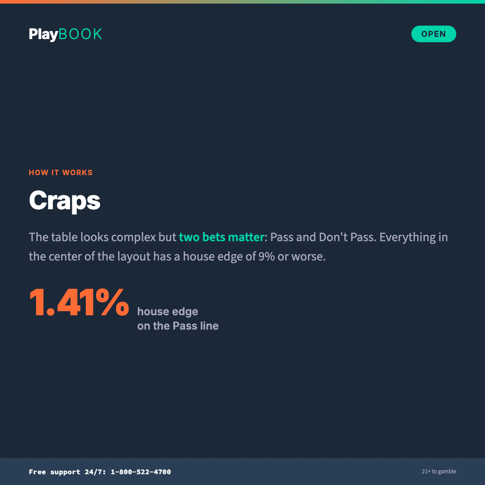

# How to Play: Craps

Everything you need to know about craps — the rolls, the bets, and why the odds bet is the only fair wager in the casino. No fine print.

> **Operator note**: Table rules, odds multiples, and bet availability vary by casino and jurisdiction. Verify specific rules and house edge calculations for your products before deploying. All copy follows {{PROGRAM_NAME}} Tier 1 voice (default Playbook voice).

**Pillar:** Open | **Reading level:** Grade 6–8 | **Tone:** Confident / Informative

---

---

## Quick-scan index

| Section | What it covers |
|---------|---------------|
| [The 30-second version](#the-30-second-version) | TL;DR for the impatient |
| [How the game works](#how-the-game-works) | The come-out roll, the point, and how rounds play out |
| [Bet types](#bet-types) | Pass, don't pass, odds, place bets, and proposition bets |
| [The math](#the-math) | House edge for every bet and why odds bets are unique |
| [Key terms](#key-terms) | Craps vocabulary in plain language |
| [Tips for informed play](#tips-for-informed-play) | What actually matters at the table |
| [Common myths](#common-myths) | Dice control and hot shooter fantasies |
| [Quiz questions](#quiz-questions) | Ready-to-use quiz content |
| [Social snippets](#social-snippets) | Shareable one-liners for social cards |

---

## The 30-second version

> Craps is a dice game where one player (the shooter) rolls two dice. The core bet — the pass line — has a `1.41%` house edge, one of the lowest in the casino. After a point is set, you can place an "odds bet" behind your pass line bet. The odds bet pays true odds with `0%` house edge — the only bet in the casino with no built-in margin. Stick to pass line plus odds, and skip the proposition bets in the center of the table (`9–16%+` house edge).

---

## How the game works

### The basics

Craps is played with two dice. One player — the "shooter" — throws the dice. Everyone at the table bets on the outcome. The game moves in rounds with two phases: the come-out roll and the point phase.

### The come-out roll

The first roll of a new round is called the come-out roll. Three things can happen:

| Result | Numbers | What happens |
|--------|---------|-------------|
| **Natural** | `7` or `11` | Pass line wins. Round over. |
| **Craps** | `2`, `3`, or `12` | Pass line loses. Round over. |
| **Point** | `4`, `5`, `6`, `8`, `9`, or `10` | That number becomes "the point." The round continues. |

### The point phase

Once a point is established, the shooter keeps rolling until one of two things happens:

- **Hit the point:** The shooter rolls the point number again. Pass line wins. The round ends and a new come-out roll begins.
- **Seven out:** The shooter rolls a `7`. Pass line loses. The dice pass to the next shooter.

That's the entire structure. Come-out roll → point set → roll until point or 7 → repeat.

### Dice combinations

Two dice produce `36` possible outcomes. The probability of each total:

| Total | Ways to roll it | Probability |
|-------|----------------|------------|
| `2` | 1 | `2.78%` |
| `3` | 2 | `5.56%` |
| `4` | 3 | `8.33%` |
| `5` | 4 | `11.11%` |
| `6` | 5 | `13.89%` |
| `7` | 6 | `16.67%` |
| `8` | 5 | `13.89%` |
| `9` | 4 | `11.11%` |
| `10` | 3 | `8.33%` |
| `11` | 2 | `5.56%` |
| `12` | 1 | `2.78%` |

**Key fact:** `7` is the most common roll. There are 6 ways to make it out of 36 possible combinations. This is why the seven-out ends the round — it's the most likely number.

---

## Bet types

### Pass line / Don't pass

The foundation of craps. Most players start (and stay) here.

| Bet | What it means | House edge |
|-----|--------------|-----------|
| **Pass line** | Bet with the shooter. Win on come-out 7/11. Lose on 2/3/12. After a point, win if point hits before 7. | `1.41%` |
| **Don't pass** | Bet against the shooter. Win on come-out 2/3. Push on 12. Lose on 7/11. After a point, win if 7 comes before the point. | `1.36%` |

Don't pass has a slightly lower house edge. Socially, it's "betting against the table" — some players avoid it for that reason. Mathematically, it's the better bet.

### Odds bets (free odds)

The most important bet in craps — and the best bet in the entire casino.

After a point is established, you can place an additional bet behind your pass or don't pass bet. This is the odds bet. It pays at **true mathematical odds** with **zero house edge**.

| Point | True odds (pass) | True odds (don't pass) |
|-------|------------------|----------------------|
| `4` or `10` | `2:1` | `1:2` |
| `5` or `9` | `3:2` | `2:3` |
| `6` or `8` | `6:5` | `5:6` |

**How much can you bet?** Casinos cap odds bets at a multiple of your pass line bet — typically `3x`, `4x`, `5x`, or sometimes `10x` or `100x`. The higher the multiple you're allowed, the lower your effective house edge becomes.

### Come / Don't come

Identical to pass/don't pass, but placed after a point is already established. The next roll becomes your personal "come-out roll," and if a point is set, you track your own separate point.

| Bet | House edge |
|-----|-----------|
| **Come** | `1.41%` |
| **Don't come** | `1.36%` |

You can also place odds behind come and don't come bets.

### Place bets

Bet that a specific number (`4`, `5`, `6`, `8`, `9`, or `10`) will be rolled before a `7`.

| Number | Payout | House edge |
|--------|--------|-----------|
| `6` or `8` | `7:6` | `1.52%` |
| `5` or `9` | `7:5` | `4.00%` |
| `4` or `10` | `9:5` | `6.67%` |

Place `6` and `8` are reasonable bets at `1.52%`. Place `4` and `10` are expensive.

### Proposition bets (the center of the table)

The flashy bets in the middle of the layout. High payouts, massive house edges.

| Bet | Payout | House edge |
|-----|--------|-----------|
| **Any 7** | `4:1` | `16.67%` |
| **Any craps** (2, 3, or 12) | `7:1` | `11.11%` |
| **Hard 6 / Hard 8** | `9:1` | `9.09%` |
| **Hard 4 / Hard 10** | `7:1` | `11.11%` |
| **Yo (11)** | `15:1` | `11.11%` |
| **Snake eyes (2) / Boxcars (12)** | `30:1` | `13.89%` |

**Bottom line:** The center of the table is where the casino makes its money on craps. The house edges range from `9%` to nearly `17%`. These bets are entertainment, not strategy.

---

## The math

### House edge comparison

| Bet | House edge | Verdict |
|-----|-----------|---------|
| Odds bet (behind pass/don't pass) | `0%` | The only fair bet in the casino |
| Don't pass / Don't come | `1.36%` | Best base bet |
| Pass / Come | `1.41%` | Standard starting bet |
| Place 6/8 | `1.52%` | Reasonable |
| Place 5/9 | `4.00%` | Elevated |
| Place 4/10 | `6.67%` | Expensive |
| Hard 6/8 | `9.09%` | Skip it |
| Any craps | `11.11%` | Skip it |
| Any 7 | `16.67%` | The worst bet on the table |

### Why odds bets matter

The odds bet is unique: it pays true mathematical odds with no house margin. When you combine a pass line bet with odds, you dilute the house edge.

<!-- ADAPT: currency -->
| Pass line bet | Odds multiple | Effective house edge |
|--------------|--------------|---------------------|
| `$5` | No odds | `1.41%` |
| `$5` + `$5` odds (1x) | 1x | `0.85%` |
| `$5` + `$10` odds (2x) | 2x | `0.61%` |
| `$5` + `$25` odds (5x) | 5x | `0.33%` |
| `$5` + `$50` odds (10x) | 10x | `0.18%` |
<!-- /ADAPT -->

The more you bet in odds (relative to your pass line bet), the closer your effective edge approaches zero. This is why craps with high odds multiples offers some of the best expected value in the casino.

### What this means for your wallet

<!-- ADAPT: currency -->
With a pass line bet only, for every `$100` you wager, you'd lose about `$1.41` on average. Add maximum odds at a `5x` table, and that drops to about `$0.33` per `$100`. Compare that to American roulette at `$5.26` per `$100` or slots at `$5–$15+` per `$100`.
<!-- /ADAPT -->

**Compared to other games:** See [Odds at a Glance](odds-at-a-glance.md).

---

## Key terms

| Term | Definition |
|------|-----------|
| **Shooter** | The player who rolls the dice. Rotates around the table. |
| **Come-out roll** | The first roll of a new round. Determines whether a point is set. |
| **Point** | A number (`4`, `5`, `6`, `8`, `9`, or `10`) established on the come-out roll. The shooter tries to hit it again before rolling `7`. |
| **Seven out** | Rolling a `7` after a point is established. Pass line loses. Dice pass to the next shooter. |
| **Pass line** | The most common bet. Win on come-out `7`/`11`. Lose on `2`/`3`/`12`. After a point, win if point comes before `7`. House edge: `1.41%`. |
| **Don't pass** | The opposite of pass. Win on come-out `2`/`3`. Push on `12`. After a point, win if `7` comes before the point. House edge: `1.36%`. |
| **Odds bet** | A bet placed behind pass/don't pass after a point is set. Pays true odds with `0%` house edge. The only fair bet in the casino. |
| **Proposition bet** | High-payout, high-edge bets in the center of the table (any 7, hardways, etc.). House edge: `9–17%`. |
| **Hardway** | Betting that a number will be rolled as a double (e.g., hard 8 = two 4s) before a 7 or the "easy" way. |
| **Natural** | Rolling `7` or `11` on the come-out roll. Pass line wins immediately. |
| **Craps** | Rolling `2`, `3`, or `12` on the come-out roll. Pass line loses immediately. Also the name of the game itself. |

---

## Tips for informed play

1. **Start with pass line + odds.** This is the bread and butter of craps strategy. The pass line at `1.41%` plus odds at `0%` gives you the best combined edge available.
2. **Put more of your wager in odds (within your budget).** The more of your total wager you put in odds (vs. the pass line), the lower your effective house edge. If the table allows `5x` or `10x` odds and your budget supports it, shifting more to odds reduces the edge.
3. **Skip the center of the table.** Proposition bets are where the casino makes its money. Edges of `9–17%` mean you're paying a massive premium for a one-roll thrill.
4. **Place 6 and 8 if you want more action.** At `1.52%`, they're reasonable additions to pass + odds. Avoid place 4/10 at `6.67%`.
<!-- ADAPT: currency, framing -->
5. **Set your budget before you play.** Craps is social and fast-paced. The energy at the table can drive overcommitment. Decide on a session amount and bet size before your first roll.
<!-- /ADAPT -->

---

## Common myths

| Myth | One-liner | Full entry |
|------|-----------|-----------|
| Dice Control Works | The bumpy rubber walls say otherwise | [Myth 15](../messaging/myth-busting.md#myth-15-dice-control-works) |
| The Shooter Is Hot | Each roll is 36 independent combinations | [Myth 16](../messaging/myth-busting.md#myth-16-the-shooter-is-hot) |
| Certain Numbers Are Due | 36 combinations, every single roll | [Myth 17](../messaging/myth-busting.md#myth-17-certain-numbers-are-due) |

---

## Quiz questions

### Question 1

**Stem:** What is the house edge on the odds bet in craps?

| Option | Text |
|--------|------|
| A | About 1.41% |
| B | About 5% |
| C | 0% — it pays true mathematical odds |
| D | About 0.5% |

**Correct:** C

**Explanation:** The odds bet is the only bet in the casino with a 0% house edge. It pays at true mathematical odds — no built-in margin for the house. That's why maximizing your odds bet (relative to your pass line bet) is the single most important strategy in craps. The catch: you can only place it after a point is set, and the casino caps the multiple.

**Source:** Standard craps probability analysis; true odds payouts verified against dice combinations.

---

### Question 2

**Stem:** On the come-out roll, what happens if the shooter rolls a 7?

| Option | Text |
|--------|------|
| A | The pass line loses — 7 is always bad in craps |
| B | The pass line wins — it's a natural |
| C | The game is paused and the dice are passed |
| D | 7 sets the point |

**Correct:** B

**Explanation:** On the come-out roll, 7 (and 11) are naturals — the pass line wins immediately. It's only after a point is established that 7 becomes the enemy of pass line bettors ("seven out"). This is one of the most common points of confusion in craps: 7 is your best friend on the come-out and your worst enemy during the point phase.

**Source:** Standard craps rules; come-out roll outcomes.

---

### Question 3

**Stem:** Why should you avoid proposition bets (the center of the table)?

| Option | Text |
|--------|------|
| A | They're only available to experienced players |
| B | The house edge ranges from 9% to nearly 17% — far higher than pass line or odds bets |
| C | They take too long to resolve |
| D | The payouts are too low |

**Correct:** B

**Explanation:** Proposition bets like Any 7 (16.67% house edge), hardways (9–11%), and Any Craps (11.11%) carry house edges that are 6 to 12 times higher than the pass line bet (1.41%). The high payouts advertised in the center of the table are calibrated so the casino keeps a massive percentage. The flashiest bets on the table are the most expensive ones.

**Source:** House edge calculations based on standard craps payout tables and dice probabilities.

---

## Social snippets

### Snippet 1

**Pillar:** Open | **Template:** `collateral/render/htp-card-craps.html`

> **HOOK:** The only bet in the casino with 0% house edge.
> **FACT:** The craps odds bet pays true mathematical odds — no built-in margin for the house. It's the only bet in any casino game where the math is perfectly fair.
> **STAT:** `0%` house edge on odds bets. `1.41%` on pass line. Combine them for the best deal in the casino.

### Snippet 2

**Pillar:** Open | **Template:** `collateral/render/htp-card-craps.html`

> **HOOK:** Skip the center of the table.
> **FACT:** Proposition bets in craps carry house edges of 9–17%. The pass line is 1.41%. The odds bet is 0%. The flashy bets are the expensive ones.
> **STAT:** Any 7: `16.67%` house edge. Pass + odds: as low as `0.33%` effective.

### Snippet 3

**Pillar:** Open | **Template:** `collateral/render/htp-card-craps.html`

> **HOOK:** 7 is the most common roll. That's the whole game.
> **FACT:** Two dice produce 36 possible combinations. Six of them make 7 — more than any other number. That's why 7 wins on the come-out and ends the round during the point phase.
> **STAT:** `6 out of 36` — the probability of rolling a 7. That's `16.67%`, every single roll.
