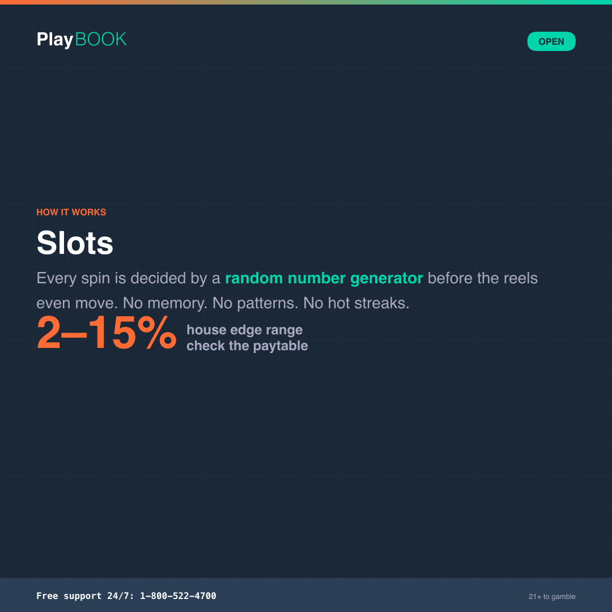
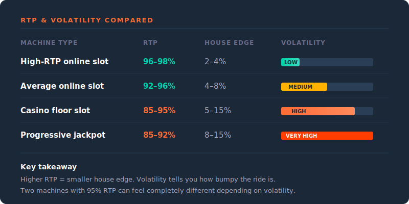

# How to Play: Slots

Everything you need to know about slot machines — how they work, what the numbers mean, and why no strategy changes the math. No fine print.

> **Operator note**: RTP percentages, paytable structures, and bonus mechanics vary by machine, software provider, and jurisdiction. Verify specific numbers for your products before deploying. All copy follows {{PROGRAM_NAME}} Tier 1 voice (The Sharp).

**Pillar:** Open | **Reading level:** Grade 6–8 | **Tone:** Confident / Informative

---

## Quick-scan index

| Section | What it covers |
|---------|---------------|
| [The 30-second version](#the-30-second-version) | TL;DR for the impatient |
| [How the game works](#how-the-game-works) | RNG, paylines, and what actually happens when you press spin |
| [Bet types](#bet-types) | What you're paying for with each spin |
| [The math](#the-math) | RTP, house edge, and volatility — the real numbers |
| [Key terms](#key-terms) | Slots vocabulary in plain language |
| [Tips for informed play](#tips-for-informed-play) | What you can actually control |
| [Common myths](#common-myths) | The six most common slot misconceptions |
| [Quiz questions](#quiz-questions) | Ready-to-use quiz content |
| [Social snippets](#social-snippets) | Shareable one-liners for social cards |

---

---

## The 30-second version

> Slots are pure chance. You press a button, a random number generator picks the outcome, and the reels display the result. There's no strategy that changes the math. The house edge ranges from `2%` to `15%` depending on the machine. Check the paytable before you play — it takes 30 seconds and tells you everything the machine won't.

---

## How the game works

### The basics

Every modern slot machine — whether it's a physical cabinet in a casino or a game on your phone — runs on a **random number generator (RNG)**. The RNG produces a random result the instant you hit spin. The spinning reels are just the show.

### Playing a spin

1. **Choose your bet.** You set two things: how many paylines to activate (some machines let you choose; others fix all lines) and how much to bet per line. Your total bet = lines × bet per line.
2. **Press spin.** The RNG generates a random number. That number maps to a specific combination of symbols on the reels.
3. **Reels display the result.** The animation plays out, but the outcome was already decided before the reels started moving.
4. **Wins are paid automatically.** If the symbols on an active payline match a winning combination listed in the paytable, you get paid. If not, the bet is lost.

### Bonus features

Many modern slots include bonus mechanics that trigger under specific conditions:

- **Free spins** — land a certain number of scatter symbols and you get extra spins at no cost. The game still uses the same RNG.
- **Bonus rounds** — a separate screen with a pick-a-prize or wheel-spin mechanic. Still RNG. Still random.
- **Progressive jackpots** — a small percentage of every bet goes into a shared prize pool. The jackpot grows until someone wins it. The odds of hitting a progressive are typically between `1 in 1 million` and `1 in 50 million`.

---

## Bet types

Slots don't have bet types the way table games do. What you control is the **size** of your bet.

| Setting | What it means | What it affects |
|---------|--------------|----------------|
| **Bet per line** | The amount wagered on each active payline | Win size — payouts are multiplied by your bet per line |
| **Number of lines** | How many paylines are active this spin | Win frequency — more lines means more chances to match, but higher total bet |
| **Max bet** | Activates all paylines at maximum bet per line | Required for some progressive jackpots — check the paytable |
<!-- ADAPT: currency -->
| **Coin denomination** | The base value of each credit (e.g., $0.01, $0.25, $1.00) | Sets the scale of everything — bets, wins, and losses |
<!-- /ADAPT -->

<!-- ADAPT: currency -->
**Key point:** Betting more per spin does not improve your odds. The house edge is a percentage — it applies equally whether you bet `$0.25` or `$25`. Bigger bets mean bigger potential wins *and* bigger potential losses at the same rate.
<!-- /ADAPT -->

---

## The math

### House edge and RTP

Every slot machine has a programmed **return to player (RTP)** — the percentage of all money wagered that the machine pays back to players over its lifetime. The **house edge** is what's left over.

| Metric | Typical range | What it means |
|--------|--------------|---------------|
<!-- ADAPT: currency -->
| **RTP** | `85–98%` | For every `$100` wagered in total, the machine pays back `$85` to `$98` |
| **House edge** | `2–15%` | The casino's cut — what the machine keeps |
<!-- /ADAPT -->

Most online slots sit in the `92–97%` RTP range. Physical casino machines tend to run `85–95%`. These numbers are set in the game software and regulated by gaming authorities.

### What this means for your wallet

<!-- ADAPT: currency -->
A slot with `95%` RTP has a `5%` house edge. For every `$100` you bet over time, you'd lose about `$5` on average. That's the long-run math — any single session can swing wildly in either direction.
<!-- /ADAPT -->

### Volatility

RTP tells you the long-run average. **Volatility** tells you what the ride feels like.

| Volatility | What it means | Example |
|-----------|---------------|---------|
| **Low** | Frequent small wins, fewer dry spells | Steady — your balance changes slowly |
| **Medium** | Mix of small and medium wins | Balanced — some swings, some stability |
| **High** | Rare but larger wins, longer losing streaks | Roller coaster — long droughts punctuated by big hits |

Two machines can have the same `95%` RTP but play completely differently. A low-volatility machine pays out often in small amounts. A high-volatility machine might eat your budget for 50 spins and then pay a large win. Same math, different experience.

**Compared to other games:** See [Odds at a Glance](odds-at-a-glance.md).

---

## Key terms

| Term | Definition |
|------|-----------|
| **RNG** (random number generator) | The software that produces a random outcome for every spin. It runs continuously, even when nobody is playing. See [glossary](../brand-book/glossary.md#rng). |
| **RTP** (return to player) | The percentage of total money wagered that a machine pays back over its lifetime. `95%` RTP means a `5%` house edge. See [glossary](../brand-book/glossary.md#rtp). |
| **Payline** | A line across the reels where matching symbols must land to count as a win. Modern slots can have `1` to `1,000+` paylines. |
| **Paytable** | The chart that shows every winning combination and its payout. Usually accessible via an info button on the machine. |
| **Scatter** | A special symbol that triggers a bonus (usually free spins) regardless of its position on the reels — it doesn't need to land on a payline. |
| **Wild** | A symbol that substitutes for other symbols to complete winning combinations. Works like a joker in cards. |
| **Volatility** | How a slot's payouts are distributed. Low volatility = frequent small wins. High volatility = rare big wins. Also called variance. See [glossary](../brand-book/glossary.md#volatility). |
| **Progressive jackpot** | A prize pool that grows with every bet placed across linked machines. Resets to a base amount after someone wins. |
| **Free spins** | Extra spins awarded during play, usually triggered by landing scatter symbols. You don't pay for these spins, but the game's RNG still determines results. |
| **Multiplier** | A feature that multiplies your win by a set factor (e.g., 2x, 5x, 10x). Appears in base games and bonus rounds. |

---

## Tips for informed play

1. **Check the paytable before you play.** It takes 30 seconds. You'll see the RTP, payline structure, and what triggers bonuses. If a machine doesn't show its RTP, that's worth knowing too.
2. **Understand what "max bet required" means.** Some progressive jackpots only pay if you're betting the maximum. If you're not going to max bet, you may want a non-progressive machine where every bet has the same proportional chance.
3. **Pick your volatility, not your theme.** Two machines with cartoon themes can play completely differently. Low volatility stretches your session. High volatility creates bigger swings. Neither is better — they're different experiences.
<!-- ADAPT: currency, framing -->
4. **Set your budget before you press spin.** Decide what you're willing to spend for the session and stick to it. Slots move fast — a `$0.50` bet every 3 seconds adds up to `$600` per hour.
<!-- /ADAPT -->
5. **Know that every spin is independent.** What happened on the last spin — or the last 1,000 spins — has zero effect on the next one. The RNG doesn't keep score.

---

## Common myths

| Myth | One-liner | Full entry |
|------|-----------|-----------|
| The Hot Streak | Streaks are noise, not signal | [Myth 1](../messaging/myth-busting.md#myth-1-the-hot-streak) |
| Due for a Win | Machines don't keep score | [Myth 2](../messaging/myth-busting.md#myth-2-due-for-a-win) |
| The Lucky Machine | Confirmation bias, not loyalty | [Myth 3](../messaging/myth-busting.md#myth-3-the-lucky-machine) |
| Near Misses Mean You're Close | A loss is a loss | [Myth 4](../messaging/myth-busting.md#myth-4-near-misses-mean-youre-close) |
| Time of Day Matters | RTP is set in software | [Myth 5](../messaging/myth-busting.md#myth-5-time-of-day-matters) |
| Higher Bets Improve Odds | House edge is a percentage | [Myth 6](../messaging/myth-busting.md#myth-6-higher-bets-improve-your-odds) |

---

## Quiz questions

### Question 1

**Stem:** What determines the outcome of a slot machine spin?

| Option | Text |
|--------|------|
| A | The number of previous losses since the last win |
| B | A random number generator (RNG) that produces a result the instant you press spin |
| C | The time of day you're playing |
| D | How much you bet on that spin |

**Correct:** B

**Explanation:** Every spin is determined by a random number generator. The RNG produces a result the instant you press the button — before the reels even start moving. Previous results, time of day, and bet size have no effect on the outcome. The reels are just an animation displaying a decision that was already made.

**Source:** Gaming regulators require certified RNG software in all licensed slot machines.

---

### Question 2

**Stem:** A slot machine has a 95% RTP (return to player). What does that mean?

| Option | Text |
|--------|------|
| A | You'll win 95% of your spins |
| B | The machine pays back 95% of all money wagered over its lifetime |
| C | You'll walk away with 95% of your starting money |
| D | 95% of players who use this machine will win |

**Correct:** B

**Explanation:** RTP is a long-run average across all players and all bets on that machine. A 95% RTP means the machine keeps about 5% (the house edge) and pays back 95% — but that's across millions of spins. In a single session, you could win big, lose everything, or land anywhere in between. RTP doesn't predict what will happen to you today.

**Source:** RTP is programmed into the game software and verified by independent testing labs.

---

### Question 3

**Stem:** You've been playing a slot machine for 30 minutes without a win. What are the odds of winning on the next spin?

| Option | Text |
|--------|------|
| A | Higher than when you started — the machine is "due" |
| B | Lower than when you started — the machine is in a cold phase |
| C | Exactly the same as every other spin |
| D | It depends on how much you bet |

**Correct:** C

**Explanation:** Every spin is independent. The RNG doesn't track how long you've been playing or how much you've lost. A machine that hasn't paid out in 30 minutes has exactly the same odds on the next spin as a machine that just hit a jackpot. The concept of being "due" for a win is the gambler's fallacy — one of the most common misconceptions in gambling.

**Source:** See [Myth 2: Due for a Win](../messaging/myth-busting.md#myth-2-due-for-a-win).

---

## Social snippets

### Snippet 1

**Pillar:** Open | **Template:** `collateral/render/htp-card-slots.html`

<!-- ADAPT: humor -->
> **HOOK:** Your slot machine has the emotional range of a toaster.
> **FACT:** Every spin is decided by a random number generator before the reels even move. No memory. No patterns. No hot streaks.
> **STAT:** The result is determined in under `1 millisecond`.
<!-- /ADAPT -->

### Snippet 2

**Pillar:** Open | **Template:** `collateral/render/htp-card-slots.html`

> **HOOK:** The paytable is the most useful button on the machine.
> **FACT:** It shows the RTP, paylines, and bonus triggers — everything the flashy animation doesn't tell you. Takes 30 seconds to read.
> **STAT:** House edge on slots ranges from `2%` to `15%`. The paytable tells you which end you're on.

### Snippet 3

**Pillar:** Open | **Template:** `collateral/render/htp-card-slots.html`

<!-- ADAPT: currency -->
> **HOOK:** A $0.50 bet every 3 seconds.
> **FACT:** That's how fast modern slots play. At that pace, you're wagering about $600 per hour — even on a "penny" machine.
> **STAT:** `$600/hour` at $0.50 per spin, one spin every 3 seconds.
<!-- /ADAPT -->
