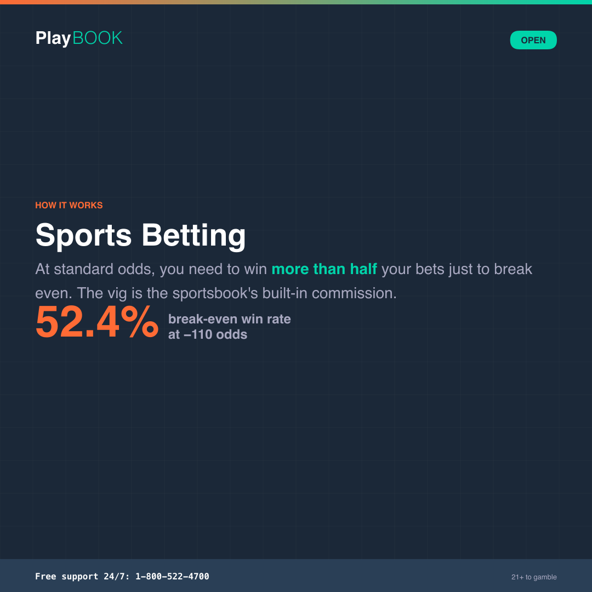
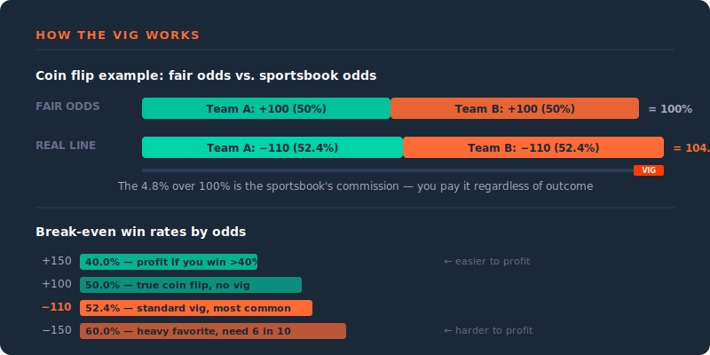

# How to Play: Sports Betting

Everything you need to know about sports betting — how odds work, what the different bet types mean, and where the sportsbook makes its money. No fine print.

> **Operator note**: Odds formats, bet type availability, and regulatory requirements vary by jurisdiction and platform. Verify specific product offerings before deploying. All copy follows {{PROGRAM_NAME}} Tier 1 voice (The Sharp).

**Pillar:** Open | **Reading level:** Grade 6–8 | **Tone:** Confident / Informative

---

---

## Quick-scan index

| Section | What it covers |
|---------|---------------|
| [The 30-second version](#the-30-second-version) | TL;DR for the impatient |
| [How it works](#how-it-works) | Odds, the vig, and how sportsbooks make money |
| [Reading the odds](#reading-the-odds) | American, decimal, and fractional formats decoded |
| [Bet types](#bet-types) | Moneyline, spread, totals, parlays, props, futures, in-play |
| [The math](#the-math) | The vig, implied probability, and break-even rates |
| [Key terms](#key-terms) | Sports betting vocabulary in plain language |
| [Tips for informed play](#tips-for-informed-play) | What the numbers are really telling you |
| [Common myths](#common-myths) | Why knowing the sport doesn't mean you'll profit |
| [Quiz questions](#quiz-questions) | Ready-to-use quiz content |
| [Social snippets](#social-snippets) | Shareable one-liners for social cards |

---

## The 30-second version

> Sports betting is wagering on the outcome of sporting events. Unlike casino games, knowledge and analysis can inform your bets — but the sportsbook builds in a margin (the vig) on every line. At standard `-110` odds, you need to win `52.4%` of your bets just to break even. The sportsbook's line already accounts for everything you know. Beating it consistently is harder than it looks.

---

## How it works

### The basics

A sportsbook sets **odds** on sporting events — who will win, by how much, and what the total score might be. You place a bet. If you're right, you get paid based on the odds. If you're wrong, you lose your stake.

The key difference between sports betting and casino games: **the odds aren't fixed by mathematics**. In roulette, the house edge is baked into the wheel. In sports betting, the odds are set by the sportsbook based on probabilities, market demand, and risk management. The line moves.

### Where the sportsbook makes money

The sportsbook's profit comes from the **vig** (also called the juice or margin) — a built-in commission on every bet. Here's how it works:

Imagine a coin flip. True odds would be `+100` on each side (bet `$100` to win `$100`). But a sportsbook might price both sides at `-110` — meaning you bet `$110` to win `$100`. If the sportsbook takes equal action on both sides, they pay out `$100` to the winner and keep the `$10` difference from the loser. That's the vig.

The vig means **you need to win more than 50% of your bets to profit.** At standard `-110` odds, the break-even rate is `52.4%`.

---

## Reading the odds

Sports betting uses three odds formats. They all express the same thing differently: how much you win relative to your stake, and the implied probability of the outcome.

### American odds (moneyline)

The standard format in the US. Uses plus (+) and minus (−) signs.

| Odds | What it means | Example ($100 stake) |
|------|--------------|---------------------|
| **−150** (favorite) | Bet `$150` to win `$100` profit | Risk `$150`, get back `$250` total if you win |
| **+150** (underdog) | Bet `$100` to win `$150` profit | Risk `$100`, get back `$250` total if you win |
| **−110** (standard vig) | Bet `$110` to win `$100` profit | The most common line — the sportsbook's standard margin |
| **+100** (even money) | Bet `$100` to win `$100` profit | True coin-flip odds, no built-in margin |

**The minus sign** means that team is the favorite — you risk more than you stand to win.
**The plus sign** means that team is the underdog — you risk less than you stand to win.

### Decimal odds

Standard in Europe, Australia, and most international sportsbooks. The number is your total return per dollar bet (stake included).

| Decimal | American equivalent | $100 bet returns |
|---------|-------------------|-----------------|
| `1.50` | `−200` | `$150` (profit: `$50`) |
| `2.00` | `+100` | `$200` (profit: `$100`) |
| `3.00` | `+200` | `$300` (profit: `$200`) |
| `1.91` | `−110` | `$191` (profit: `$91`) |

**How to read it:** Multiply your stake by the decimal. That's your total return. Subtract your stake to get profit.

### Fractional odds

Traditional in the UK and Ireland. Shown as a fraction (e.g., `5/1`, `2/5`).

| Fractional | Decimal | American | Meaning |
|-----------|---------|----------|---------|
| `5/1` | `6.00` | `+500` | Win `$5` for every `$1` bet |
| `2/1` | `3.00` | `+200` | Win `$2` for every `$1` bet |
| `1/1` (evens) | `2.00` | `+100` | Win `$1` for every `$1` bet |
| `2/5` | `1.40` | `−250` | Win `$2` for every `$5` bet |

**How to read it:** The first number is your profit, the second is your stake. `5/1` = "five to one."

### Converting odds to implied probability

Odds reflect how likely the sportsbook thinks an outcome is (plus their vig). To find the implied probability:

| American odds | Formula | Example |
|--------------|---------|---------|
| Negative (−150) | Odds / (Odds + 100) | 150 / 250 = `60%` |
| Positive (+200) | 100 / (Odds + 100) | 100 / 300 = `33.3%` |

If you add up the implied probabilities of all outcomes in a market, the total will be **more than 100%**. The amount over 100% is the sportsbook's margin (the vig).

---

## Bet types

### Moneyline

The simplest bet: pick who wins. That's it.

| Example | What it means |
|---------|--------------|
| Team A: `−150` | Favored to win. Bet `$150` to win `$100` profit. |
| Team B: `+130` | Underdog. Bet `$100` to win `$130` profit. |

No point spread, no score margin — just the winner.

### Point spread

The sportsbook sets a margin of victory. The favorite has to win by more than the spread; the underdog can lose by less than the spread (or win outright) and still "cover."

| Example | What it means |
|---------|--------------|
| Team A: `−6.5` (−110) | Must win by 7+ points to cover |
| Team B: `+6.5` (−110) | Must lose by 6 or fewer (or win) to cover |

The half-point (`.5`) eliminates ties. Both sides are typically priced at `−110` — that's where the vig lives.

### Totals (Over/Under)

A bet on the combined score of both teams, not who wins.

| Example | What it means |
|---------|--------------|
| Over `48.5` (−110) | You win if the combined score is `49` or more |
| Under `48.5` (−110) | You win if the combined score is `48` or fewer |

### Parlays

A single bet combining multiple selections. All picks must win for the parlay to pay. The payout increases with each added selection — but so does the difficulty.

| Legs | Approximate payout | Approximate probability (at −110 each) |
|------|--------------------|-----------------------------------------|
| `2` | `~2.6:1` | `~1 in 4` |
| `3` | `~6:1` | `~1 in 8` |
| `5` | `~25:1` | `~1 in 32` |
| `10` | `~700:1` | `~1 in 1,024` |

**Key point:** The vig compounds with each leg. A 2-leg parlay has a higher effective house edge than two individual bets. A 10-leg parlay has a massive built-in margin. Parlays are the sportsbook's most profitable product.

### Props (proposition bets)

Bets on specific events within a game, not the final outcome.

| Examples |
|---------|
| Player X scores over/under `24.5` points |
| First team to score |
| Total strikeouts by a pitcher |
| Will there be overtime? |

Props often carry a wider vig than standard bets because the lines are harder for sportsbooks to set precisely — and for bettors to evaluate.

### Futures

Bets on outcomes decided in the future — often weeks or months away.

| Examples |
|---------|
| Who will win the championship |
| Season win totals (over/under) |
| Award winners (MVP, Rookie of the Year) |

Futures typically carry a large built-in margin because the sportsbook is pricing in uncertainty over a long time horizon. Your money is also locked up until the outcome is decided.

### In-play (live betting)

Bets placed after the event has started, with odds that update in real time.

| Key facts |
|----------|
| Odds change rapidly — you're betting against algorithms that process data faster than any human |
| The vig on in-play bets is often wider than pre-game |
| Speed matters more than analysis — the line moves in seconds |

---

## The math

### The vig in practice

| Standard line | Implied probability (each side) | Combined | Vig |
|--------------|-------------------------------|----------|-----|
| Both sides at `−110` | `52.4%` each | `104.8%` | `~4.5%` |
| Favorite `−150` / Underdog `+130` | `60%` + `43.5%` | `103.5%` | `~3.4%` |
| Favorite `−200` / Underdog `+170` | `66.7%` + `37%` | `103.7%` | `~3.6%` |

The combined implied probability always exceeds 100%. The overage is the sportsbook's margin.

### Break-even win rates

| Odds on each bet | Win rate needed to break even |
|-----------------|-------------------------------|
| `−110` | `52.4%` |
| `−120` | `54.5%` |
| `−150` | `60.0%` |
| `+100` | `50.0%` |
| `+150` | `40.0%` |

### What this means for your wallet

At standard `−110` odds, the vig is about `4.5%`. For every `$110` you bet, you need to win `$100` back plus your stake. Over time, if you win at a 50% rate (coin flip), you'd lose about `$4.50` per `$100` wagered.

Professional sports bettors — the ones who actually profit long-term — typically hit win rates of `53–56%` on spread bets. That razor-thin margin above `52.4%` is the difference between making money and losing it.

**Compared to other games:** See [Odds at a Glance](odds-at-a-glance.md).

---

## Key terms

| Term | Definition |
|------|-----------|
| **Moneyline** | A bet on which team or player wins, with no point spread. Payouts vary based on each side's odds. |
| **Spread** (point spread) | A margin of victory set by the sportsbook. The favorite must win by more than the spread to cover. See [glossary](../brand-book/glossary.md#spread). |
| **Vig** (vigorish / juice) | The sportsbook's built-in commission on every bet. At `−110` odds, the vig is about `4.5%`. See [glossary](../brand-book/glossary.md#bookmaker-margin-vig--juice). |
| **Parlay** (accumulator) | A single bet combining multiple selections. All must win. Higher payouts but the vig compounds per leg. See [glossary](../brand-book/glossary.md#accumulator-acca). |
| **Over/Under** (total) | A bet on the combined score of both teams. You bet whether the total will be over or under the sportsbook's line. |
| **Prop** (proposition bet) | A bet on a specific event within a game (e.g., player stats, first scorer), not the final result. |
| **Futures** | Bets on outcomes decided weeks or months later (e.g., championship winner). Money is locked until resolved. |
| **In-play** (live betting) | Betting after the event has started, with odds that update in real time. |
| **Line** | The odds or point spread set by the sportsbook. "The line on the game" = the current odds and spread. |
| **Implied probability** | The likelihood of an outcome as suggested by the odds. Convert odds to a percentage to see what the sportsbook "thinks" will happen. |
| **Handle** | The total amount of money wagered on a market. Higher handle typically means tighter, more efficient lines. |
| **Sharp** | A professional or highly informed bettor. When sharps move money, lines often adjust. |

---

## Tips for informed play

1. **Understand the vig before you bet.** At `−110`, you need to win `52.4%` of your bets to break even. Know the break-even rate for any odds you're taking.
2. **Compare odds across sportsbooks.** Lines vary between platforms. Shopping for the best line is the easiest way to reduce the vig's impact. A half-point or ten cents of odds difference adds up over hundreds of bets.
3. **Know what a parlay actually costs you.** The vig compounds with each leg. A 5-leg parlay doesn't just require getting 5 things right — it carries a significantly higher effective margin than 5 individual bets. Parlays are entertainment, not strategy.
4. **Set your bankroll and bet size.** A common guideline: wager `1–3%` of your total bankroll per bet. This gives you enough bets to let your edge (if you have one) play out, and protects against losing streaks.
5. **The line already knows what you know.** Sportsbook odds are set using vast amounts of data, modeling, and market efficiency. Your knowledge of the sport is priced in. Consistently beating the line requires finding inefficiencies the market has missed — which is genuinely difficult.

---

## Common myths

| Myth | One-liner | Full entry |
|------|-----------|-----------|
| Knowing the Sport = Winning | The line already knows | [Myth 11](../messaging/myth-busting.md#myth-11-knowing-the-sport-means-youll-win) |
| Parlays Are Smart | The vig compounds per leg | [Myth 12](../messaging/myth-busting.md#myth-12-parlays-are-a-smart-strategy) |
| Following Tipsters | Survivorship bias | [Myth 13](../messaging/myth-busting.md#myth-13-following-tipsters-guarantees-profit) |
| In-Play Edge | Algorithms are faster than you | [Myth 14](../messaging/myth-busting.md#myth-14-in-play-betting-gives-you-an-edge) |

---

## Quiz questions

### Question 1

**Stem:** At standard −110 odds, what win rate do you need to break even on sports bets?

| Option | Text |
|--------|------|
| A | 50% |
| B | 52.4% |
| C | 55% |
| D | 60% |

**Correct:** B

**Explanation:** At −110 odds, you're betting $110 to win $100. To break even, you need to win often enough that your $100 wins cover your $110 losses. The math works out to 52.4%. That means if you win half your bets at −110, you're slowly losing money. The 2.4% above 50% is the vig — the sportsbook's margin. Professional bettors consider a 55% long-term win rate on spread bets to be excellent.

**Source:** Break-even formula: risk / (risk + profit) = 110 / 210 = 52.38%.

---

### Question 2

**Stem:** What does a 10-leg parlay at even odds have roughly a 1-in-what chance of winning?

| Option | Text |
|--------|------|
| A | 1 in 10 |
| B | 1 in 100 |
| C | 1 in 1,024 |
| D | 1 in 10,000 |

**Correct:** C

**Explanation:** Each leg of a parlay at even odds (50/50) has a 1 in 2 chance. For all 10 legs to win, you multiply: 1/2 × 1/2 × 1/2... ten times = 1/1,024. And that's before the vig, which compounds with each leg. The sportsbook prices parlays so their margin grows with each selection you add. A 10-leg parlay is fun entertainment, but the math is firmly in the house's favor.

**Source:** See [Myth 12: Parlays Are a Smart Strategy](../messaging/myth-busting.md#myth-12-parlays-are-a-smart-strategy).

---

### Question 3

**Stem:** Why do sportsbook odds on a single market always add up to more than 100% probability?

| Option | Text |
|--------|------|
| A | Because the sportsbook makes math errors |
| B | Because the vig (vigorish) is built into the odds — the sportsbook's commission |
| C | Because some outcomes are more likely than 100% |
| D | Because odds are rounded for simplicity |

**Correct:** B

**Explanation:** The overround (the amount above 100%) is the vig — the sportsbook's built-in commission. If both sides of a coin flip are priced at −110, the implied probabilities are 52.4% each, totaling 104.8%. That extra 4.8% is the sportsbook's margin. It's how they make money regardless of which side wins. The wider the overround, the higher the vig you're paying.

**Source:** Standard sports betting vig calculation from implied probability sum.

---

## Social snippets

### Snippet 1

**Pillar:** Open | **Template:** `collateral/render/htp-card-sports.html`

> **HOOK:** You need to win more than half your bets to break even.
> **FACT:** At standard −110 odds, the sportsbook's vig means you need a 52.4% win rate just to stay flat. Professional bettors consider 55% excellent.
> **STAT:** `52.4%` — the break-even win rate at −110 odds.

### Snippet 2

**Pillar:** Open | **Template:** `collateral/render/htp-card-sports.html`

> **HOOK:** A 10-leg parlay has about a 1-in-1,024 chance of hitting.
> **FACT:** Every leg you add to a parlay multiplies the difficulty. The vig compounds too — the sportsbook's margin grows with each selection. Parlays are entertainment, not strategy.
> **STAT:** `1 in 1,024` — your odds on a 10-leg parlay at even odds.

### Snippet 3

**Pillar:** Open | **Template:** `collateral/render/htp-card-sports.html`

> **HOOK:** The line already knows what you know.
> **FACT:** Sportsbook odds are set by algorithms processing more data than any individual bettor. Your sports knowledge is already priced into the line. Beating it consistently means finding what the market missed.
> **STAT:** Sportsbook lines move within `seconds` of new information.
