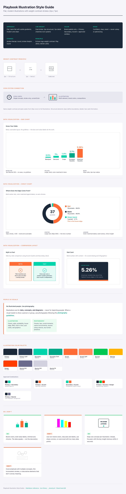

# Playbook Illustration Reference

> Canonical source: [`_brand.yml`](../../_brand.yml)
> Visual reference: [`style-guide.html`](style-guide.html)
> Related: [`icon-library.md`](../iconography/icon-library.md) (shared weight-contrast principle)



---

## Illustration style overview

Playbook illustrations explain abstract concepts — odds, probability, house edge — with clarity and confidence. The style is flat, modern, and directly connected to the icon system through the shared weight-contrast principle.

| Property | Specification |
|----------|---------------|
| **Approach** | Flat / semi-flat with subtle gradients; modern and clean |
| **Line weight** | Dual stroke: 2px structural / 1px detail (matches icon system) |
| **Color** | Brand palette only — Primary, Secondary, Accent + approved combos |
| **Fills** | Solid brand colors or subtle linear gradients between approved pairs |
| **Complexity** | Simple enough to read at small sizes; detailed enough to be engaging |
| **Mood** | Confident, clear, smart — never cutesy, childish, or patronizing |
| **Stroke properties** | `stroke-linecap: round; stroke-linejoin: round` |
| **Corner radius** | 2–4px on rectangular elements for consistency |

---

## Connection to icon system

The illustration system extends the icon system's design language to larger, more complex visuals.

| Property | Icons | Illustrations |
|----------|-------|---------------|
| **Primary stroke** | 2px | 2px (structural outlines, axes, borders) |
| **Detail stroke** | 1px | 1px (data lines, labels, annotations) |
| **Canvas** | 24 &times; 24px | Variable (typically 200–600px per dimension) |
| **Color** | `currentColor` single tone | Full brand palette, multiple colors |
| **Fills** | `none` (stroke-only) | Solid or gradient fills from brand palette |
| **Complexity** | Single concept per icon | Multi-element compositions |

### Design principle

Both systems echo the logo's weight contrast — **Play** (800 weight) / **BOOK** (300 weight). Structural elements carry visual weight; details stay light. This creates hierarchy and ties every visual element back to the wordmark.

---

## Color usage rules

### Approved palette for illustrations

| Color | Hex | Primary use in illustrations |
|-------|-----|------------------------------|
| Primary | `#1B2838` | Structural strokes, axes, borders, text |
| Primary Light | `#2A3F56` | Secondary structural elements, backgrounds |
| Secondary | `#00D4AA` | Positive data, highlights, success states |
| Secondary Dark | `#00A888` | Secondary data series, pressed states |
| Accent | `#FF6B35` | Key data callouts, alerts, primary emphasis |
| Accent Light | `#FF8A5C` | Secondary emphasis, hover states |
| Success | `#00C853` | Positive outcomes, correct answers |
| Warning | `#FFB300` | Caution indicators, approaching limits |
| Danger | `#FF3D00` | Negative outcomes, wrong answers, risk |
| Neutral 500 | `#6B6B8D` | Gridlines, secondary labels, muted elements |
| Neutral 200 | `#D1D1E0` | Backgrounds, dividers, inactive elements |
| Neutral 50 | `#F5F5FA` | Canvas background |

### Approved color combinations

| Combination | Use case |
|-------------|----------|
| Primary + Secondary | Default data viz (structure + highlight) |
| Primary + Accent | Warning/attention data viz |
| Secondary + Accent | Comparison layouts (e.g., myth vs fact) |
| Primary + Success + Danger | Right/wrong, do/don't comparisons |
| Primary + Neutral 500 | Low-emphasis, background data |

### Gradient rules

- Direction: top-to-bottom or left-to-right only (no radial gradients in illustrations)
- Only between adjacent colors in the same family (e.g., Secondary to Secondary Dark)
- Maximum two gradient fills per illustration
- Never gradient on strokes — strokes are always solid

---

## When to use illustration vs photography

| Scenario | Use | Rationale |
|----------|-----|-----------|
| Explaining odds or probability | Illustration | Abstract concept; needs visual simplification |
| Showing how RNG works | Illustration | Technical process; can't be photographed |
| Data comparison (house edge by game) | Illustration | Structured data needs charts, not photos |
| Social gaming moments | Photography | Real human emotion and connection |
| Casino environment / atmosphere | Photography | Authentic setting conveys credibility |
| Quiz question cards | Illustration | Structured layout; consistent visual language |
| Hero banners / landing pages | Photography | Emotional impact and aspirational feel |
| Infographics / educational content | Illustration | Information hierarchy and data clarity |
| Social media shareable stats | Illustration | Brand-consistent, scalable, platform-agnostic |
| Myth vs fact comparisons | Illustration | Side-by-side structured comparison |

**Hard rule:** Any visual that depicts a person or group of people uses photography — no exceptions. Illustrations are exclusively for data, concepts, and diagrams.

---

## Illustration categories

### Data visualization

Charts, graphs, and statistical comparisons that make complex data instantly understandable.

| Element | Specification |
|---------|---------------|
| **Chart types** | Bar (vertical/horizontal), donut, comparison, sparkline |
| **Axis strokes** | 2px Primary `#1B2838` |
| **Gridlines** | 1px Neutral 500 `#6B6B8D`, dashed (`stroke-dasharray: 4 4`) |
| **Data bars** | Minimum width 24px; 8px gap between bars; 4px corner radius on top |
| **Donut charts** | Stroke-width 24–32px; 50% inner radius; 2px gap between segments |
| **Labels** | Inter 600, 12px, Primary color; positioned outside chart area |
| **Value labels** | Source Code Pro 500, 14px, inside or above data elements |
| **Annotations** | 1px leader lines; Inter 400, 11px; connected to data point |
| **Legend** | 12px color squares + Inter 400 12px labels; horizontal or vertical |

### Concept explanation

Visual explanations of odds, probability, house edge, RNG, and other gambling concepts.

| Element | Specification |
|---------|---------------|
| **Metaphors** | Use familiar objects — pie slices, grids, coin flips, dice faces |
| **Comparison** | Side-by-side layouts with clear visual contrast |
| **Scale** | Proportional representations must be mathematically accurate |
| **Annotations** | Clear callout labels with leader lines (1px stroke) |
| **Simplification** | One concept per illustration; never combine multiple ideas |

### Interactive / quiz

Visual elements for quiz questions, result screens, and interactive educational content.

| Element | Specification |
|---------|---------------|
| **Question cards** | White background, 2px Primary border, 8px radius |
| **Answer options** | Neutral 100 background, hover: Secondary-tinted border |
| **Result indicators** | Success green for correct, Danger red for incorrect |
| **Progress indicators** | Secondary fill on Primary track, 4px height |
| **Score displays** | Inter 800 + Source Code Pro 500 combination |

### Social media

Shareable graphics, story frames, and platform-specific templates.

| Element | Specification |
|---------|---------------|
| **Stat cards** | Bold number (Inter 800) + context label (Source Sans 3 400) |
| **Quote graphics** | Left border accent (4px Secondary), Inter 600 italic text |
| **Story frames** | Full-bleed brand color background, centered illustration |
| **Comparison posts** | Split layout, contrasting brand colors, clear labels |

---

## Data visualization specifications

### Bar chart rules

- Minimum bar width: 40px; generous gaps between bars
- Corner radius: 4px on the value end only (flat base)
- Value labels: Inter 700, 18px, color-matched to bar, above each bar — the labels are the data
- Game/category names: Inter 500, 12px, below baseline
- Baseline: 1px Neutral 200 `#D1D1E0` — just a subtle anchor line
- No Y-axis, no gridlines, no tick marks — keep it clean for marketing use
- Maximum bars per chart: 5–6 (split into multiple charts if more)
- Always start at zero — never truncate to exaggerate differences

### Donut / pie chart rules

- Stroke-based rendering (not filled wedges) — consistent with stroke-first design language
- Stroke-width: 28–32px for bold, scannable rings
- Inner radius: 50% of outer radius
- Gap between segments: ~2px visual gap via `stroke-dasharray`
- Maximum segments: 5 (group smaller values into "Other")
- Center label: Key stat in Inter 800 36px — the hero number
- Legend: Beside chart, bold color-matched labels (Inter 700, 15px), inline insight text
- No axis chrome, no gridlines

### Annotation patterns

```
                    ┌──────────────┐
  ╌╌╌╌╌╌╌╌╌╌╌╌╌╌╌╌╌┤ Label text   │  ← Inter 400, 11px
     1px line       └──────────────┘     Background: white
         ●                                Border: 1px Neutral 300
    Data point                            Padding: 4px 8px
```

- Leader lines: 1px stroke, Primary color, straight with one 90-degree bend
- Labels: White background pill with 1px Neutral 300 border
- Connect to the specific data point, not the general area
- Maximum 3 annotations per chart

### Chrome rules

- Default: no axes, no gridlines — the data and labels do the work
- If a baseline is needed: 1px Neutral 200 `#D1D1E0`, subtle anchor only
- If axes are truly needed (complex multi-series charts): 1px Primary, no tick marks
- Gridlines: avoid entirely; if unavoidable, 1px Neutral 200, dashed, low opacity
- No axis arrows, no tick marks, no unit labels on axes
- The chart should look like marketing collateral, not a scientific paper

---

## People in visuals

**No illustrated people. Use photography.**

Illustrations are for data, concepts, and diagrams — never for depicting people. When a visual needs to show a person or group, use photography following the [photography guidelines](../photography/photography.md).

| Need | Medium | Why |
|------|--------|-----|
| Friends watching a game | Photography | Real human emotion and connection |
| Casino environment | Photography | Authentic setting conveys credibility |
| Someone checking their phone | Photography | Candid, relatable, real |
| House edge comparison | Illustration | Structured data needs charts |
| How RNG works | Illustration | Abstract concept, can't be photographed |
| Myth vs fact | Illustration | Side-by-side structured comparison |

---

## Do / Don't

### Do

- **Use brand palette exclusively** — every color in every illustration comes from the approved palette
- **Maintain weight-contrast** — 2px structure, 1px detail, consistent with icon system
- **Start Y-axes at zero** — never truncate to exaggerate differences
- **Label clearly** — assume zero domain knowledge from the viewer
- **Make the key insight obvious** — the main takeaway should be visible in 2 seconds
- **Test at small sizes** — illustrations must be legible at 300px wide
- **Use consistent styling** — all illustrations in a set should look like they belong together
- **Include alt text** — every illustration needs a descriptive text alternative

### Don't

- **Use colors outside the brand palette** — no arbitrary hues or tints
- **Create photorealistic illustrations** — stay flat and geometric
- **Overcomplicate compositions** — one concept per illustration
- **Use decorative elements without meaning** — every element should convey information
- **Make charts misleading** — accurate proportions, labeled axes, zero-based scales
- **Use cutesy or childish styles** — the audience is adult; tone is confident and smart
- **Add excessive detail** — if it doesn't help comprehension, remove it
- **Mix illustration styles** — all illustrations should follow this single style guide

---

## Accessibility

### Alt text for illustrations

| Illustration type | Alt text pattern | Example |
|------------------|-----------------|---------|
| **Bar chart** | `[Chart type] comparing [variables]. [Key insight].` | "Bar chart comparing house edge across 5 casino games. American roulette has the highest at 5.26%." |
| **Donut chart** | `[Chart type] showing [distribution]. [Key finding].` | "Donut chart showing probability distribution for roulette. Red/black covers 47.4% of outcomes." |
| **Concept diagram** | `[Concept name] illustration. [What it shows].` | "Random number generator illustration. Shows that each spin is independent of previous results." |
| **Comparison** | `Comparison of [A] vs [B]. [Key difference].` | "Comparison of myth versus fact about slot machines. Myth: machines are 'due' to pay out. Fact: each spin is random." |
| **Decorative** | `alt=""` + `role="presentation"` | Used only for purely decorative borders or backgrounds |

### Color-blind safe combinations

Use these combinations for data where color is the only differentiator:

| Pair | Colors | Safe for |
|------|--------|----------|
| Primary + Secondary | `#1B2838` + `#00D4AA` | All types |
| Primary + Accent | `#1B2838` + `#FF6B35` | All types |
| Secondary + Accent | `#00D4AA` + `#FF6B35` | Protanopia, deuteranopia, tritanopia |
| Success + Danger | `#00C853` + `#FF3D00` | **Add pattern fill** — not safe for deuteranopia |

### Pattern fills for charts

When color alone is insufficient (especially for red-green combinations), add pattern fills:

| Pattern | SVG implementation | Use with |
|---------|-------------------|----------|
| **Solid** | No pattern (default) | Primary data series |
| **Diagonal lines** | `<line>` at 45deg, 4px spacing, 1px stroke | Secondary data series |
| **Dots** | `<circle>` r=1.5, 6px spacing | Tertiary data series |
| **Crosshatch** | Overlapping diagonal lines at 45deg and -45deg | Comparison / highlight |

---

## Tier 2 data visualization

When illustrations and data visualizations appear in Tier 2 contexts (support pages, activity dashboards, session summaries), the style shifts from educational and engaging to **neutral and reflective.** The player is reviewing their own behavior, not learning about house edges. The visual tone must match.

See the [Tier 2 Visual Guide](../tier-2/tier-2-visual-guide.md) for the complete Tier 2 visual identity.

### Palette shift

| Element | Tier 1 | Tier 2 |
|---|---|---|
| Default bar/line color | Secondary (`#00D4AA`) or Accent (`#FF6B35`) | `neutral_300` (`#A8A8C0`) |
| Highlight / current period | Secondary (`#00D4AA`) | Secondary (`#00D4AA`) — same, but used sparingly |
| Gridlines | `neutral_300` (`#A8A8C0`) | `neutral_100` (`#E8E8F0`) — lighter |
| Labels and annotations | `neutral_700` (`#3D3D5C`) | `neutral_500` (`#6B6B8A`) — softer |
| Container background | Navy (`#1B2838`) or card surface | White (`#FFFFFF`) or `neutral_50` (`#F5F5FA`) |

### Chart types for Tier 2

| Chart type | Recommended? | Use case |
|---|---|---|
| **Bar chart** | Yes | Session counts, weekly deposit totals, time-played by day |
| **Line chart** | Yes | Spending trend over time, session duration trend |
| **Sparkline** | Yes | Compact activity summaries in cards |
| **Donut chart** | Avoid | Too decorative; use simple stat blocks instead |
| **Comparative bar** | Avoid | Comparisons can feel judgmental in Tier 2 |
| **Infographic** | No | Too editorial for reflection contexts |

### Tier 2 chart rules

1. **No editorial annotations.** Tier 1 might label a bar "That's 3x the average!" — Tier 2 just shows the number.
2. **No color-coded value judgments.** Don't use green for "low spending" and red for "high spending." All bars are `neutral_300` with one `secondary` highlight for the current/selected period.
3. **No animation.** Tier 1 charts can animate on entrance. Tier 2 charts render statically.
4. **No gamification.** No badges, scores, streaks, or achievement overlays on activity data.
5. **Muted chrome.** Thin borders (`neutral_100`), no drop shadows, no gradient fills.

### Activity summary pattern

The canonical Tier 2 data visualization — a compact card showing recent player activity:

```
┌───────────────────────────────────────────┐
│  Your Activity — Last 7 Days              │
│                                           │
│  ██▓░░██░  (bar chart: 7 days, neutral    │
│  M T W T F S S   with today highlighted   │
│                   in teal)                 │
│                                           │
│  Sessions: 4  ·  Time: 3h 22m  ·  Avg: 50m│
│                                           │
│  Your deposit limit: $200/week (active)   │
│  [Manage settings →]                      │
└───────────────────────────────────────────┘
```

Bars: `neutral_300` default, `secondary` for today. No Y-axis. Value labels above bars only if space permits. Single text row for key stats.

---

## Operator customization

1. **Local data:** Replace example statistics with data relevant to your market and games offered
2. **Chart content:** Adapt data visualization examples to local game types (e.g., pachinko, horse racing)
3. **People:** Always use photography for people — see the [photography guidelines](../photography/photography.md) for direction
4. **Color restrictions:** Some jurisdictions restrict use of certain colors in gambling contexts — substitute within the approved palette
5. **Language:** Translate all labels and annotations; test that translated text fits within designed space
6. **Additional categories:** Add illustration categories for region-specific content (e.g., regulatory diagrams) following the same style rules
7. **Complexity level:** Adjust detail level based on target audience literacy and familiarity with gambling concepts
