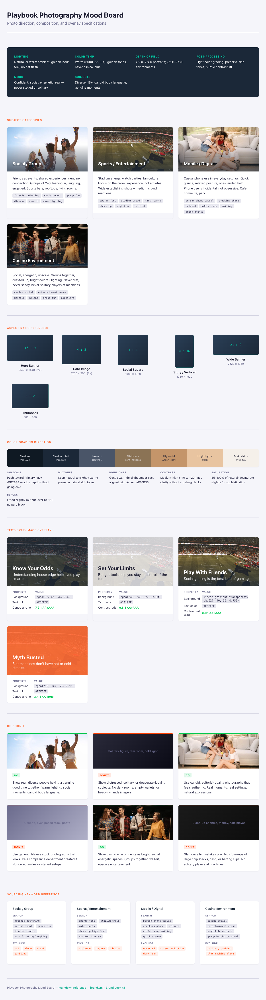

# Playbook Photography Reference

> Canonical source: [`_brand.yml`](../../_brand.yml)
> Visual reference: [`mood-board.html`](mood-board.html)



---

## Photo style overview

Playbook photography captures the social, energetic side of entertainment and sports culture. Every image should feel like a moment someone actually lived — never staged, never sterile.

| Property | Specification |
|----------|---------------|
| **Lighting** | Cinematic or warm ambient; golden-hour and dramatic editorial lighting both work; avoid flat flash and dim ambient (see [lighting guide](#lighting-guide) below) |
| **Color temperature** | Warm (5000–6500K); lean toward golden tones, never clinical blue-white |
| **Composition** | Rule of thirds; leave negative space for text overlay; clear focal point |
| **Depth of field** | Moderate to shallow (ƒ/2.0–ƒ/4.0 for portraits, ƒ/5.6–ƒ/8.0 for environments) |
| **Post-processing** | Light color grading to brand palette; preserve skin tones; subtle contrast lift |
| **Mood** | Confident, social, energetic, real — never solitary, desperate, or staged |
| **People** | Diverse ages, ethnicities, genders, abilities; 18+ only; candid body language |

---

## Subject categories

### Social / Group

Friends and acquaintances sharing real moments together.

| Aspect | Direction |
|--------|-----------|
| **Settings** | Sports bars, living rooms, rooftop gatherings, outdoor events |
| **Body language** | Leaning in, laughing, high-fives, engaged conversation |
| **Group size** | 2–6 people; avoid single isolated subjects |
| **Framing** | Medium shots that show interaction; avoid tight headshots |
| **Energy** | High but relaxed — fun, not frantic |

**Example scenarios:** Friends watching a game on a big screen, group celebration after a winning moment, people sharing food and conversation at a sports bar.

### Sports / Entertainment

Stadium energy and the thrill of live events.

| Aspect | Direction |
|--------|-----------|
| **Settings** | Stadiums, arenas, sports bars, watch parties, tailgates |
| **Focus** | The crowd and fan experience, not the athletes or game |
| **Lighting** | Stadium lights, warm evening glow, screen reflections |
| **Motion** | Slight motion blur acceptable to convey energy |
| **Composition** | Wide establishing shots + medium crowd reactions |

**Example scenarios:** Fans cheering from the stands, a packed sports bar during a big play, friends reacting to a close game in their living room.

### Mobile / Digital

Casual, everyday use of phones and devices — never obsessive.

| Aspect | Direction |
|--------|-----------|
| **Settings** | Coffee shops, commutes, park benches, kitchen tables |
| **Interaction** | Glancing at phone, quick check, casual scroll — not hunched over |
| **Screen visibility** | Screens may glow but content should not be readable |
| **Body language** | Relaxed posture; one-handed phone hold; smiling or neutral |
| **Context** | Phone use is incidental, not the entire scene |

**Example scenarios:** Person checking their phone at a café with friends nearby, someone casually glancing at odds while waiting in line, quick phone peek during a commercial break.

### Casino environment

Social energy and entertainment — never the solitary gambler stereotype.

| Aspect | Direction |
|--------|-----------|
| **Settings** | Casino floors, sports lounges, entertainment areas, gaming tables |
| **Mood** | Upscale nightlife, social energy, fun — never dim or seedy |
| **People** | Groups together, smiling, dressed up, enjoying themselves |
| **Avoid** | Solitary players, empty machines, stacks of cash, dim ambient lighting |
| **Lighting** | Cinematic or warm — dramatic editorial lighting is great; dim and dingy is not (see [lighting guide](#lighting-guide)) |

**Example scenarios:** Friends at a roulette table laughing together, a group heading into a casino entertainment show, people socializing in a sportsbook lounge.

### Game & equipment imagery

Game closeups — slot interfaces, card tables, roulette wheels, chips — are a useful visual tool **when they serve the content.** They should never appear as generic decoration.

| Context | OK? | Rationale |
|---------|-----|-----------|
| **Explaining game mechanics** (e.g., showing a slot interface to explain paylines or RTP) | Yes | The closeup IS the content — it teaches something |
| **Illustrating a CTA** (e.g., cards on a table alongside "Know your game" messaging) | Yes | The imagery directly supports the message |
| **Showing gameplay context** in an educational piece (e.g., chips on a felt table to set the scene for a house-edge explainer) | Yes | Purposeful context, not decoration |
| **Atmospheric filler** — slot machines or tables with no connection to the message | No | Generic equipment shots read as gambling promotion, not education |
| **Hero images or social posts** where the game equipment IS the entire subject | No | Puts the focus on the game, not the player or the insight |

**The test:** If you removed the image, would the message or CTA lose context? If yes, the closeup earns its place. If nothing changes, cut it.

---

## Lighting guide

Not all low-light is equal. The distinction is **intention** — cinematic lighting is deliberate and dramatic; dim lighting is just dark.

### Cinematic lighting (good)

Intentional, editorial-quality lighting that creates mood and visual interest — even in darker environments.

| Property | Direction |
|----------|-----------|
| **Key light** | Clear directional source — window light, practicals, controlled spots |
| **Contrast** | Strong but controlled; highlights and shadows are deliberate, not accidental |
| **Skin tones** | Well-exposed faces even when the environment is dark; subjects are lit, backgrounds fall off |
| **Color** | Intentional color temperature — warm golds, cool blues, or mixed — as long as it's designed |
| **Feel** | Fashion editorial, lifestyle brand, modern nightlife photography |
| **Reference** | Think Vogue, GQ, or high-end hospitality campaigns shot in evening settings |

### Dim ambient lighting (bad)

Uncontrolled, flat, dark environments where the lighting is incidental rather than designed.

| Property | Red flag |
|----------|----------|
| **No key light** | Faces are underexposed; details lost in shadow |
| **Flat contrast** | Everything is uniformly dark — no visual hierarchy |
| **Muddy color** | Mixed fluorescent and tungsten producing grey-green skin tones |
| **Noise/grain** | High ISO visible — suggests cheap camera in poor conditions, not editorial intent |
| **Feel** | Surveillance footage, phone camera in a bar, "you had to be there" snapshots |

### The lighting test

**"Does this look like it was lit — or like it happened to be dark?"**

A casino at night can be stunning if the photographer controlled the light. The same casino shot on a phone with no flash looks seedy. The setting isn't the problem — the lighting intent is.

---

## Composition guide

### Rule of thirds

Place subjects at intersection points. For text-overlay images, position subjects in the left or right third and leave the opposite side clear.

```
┌───────┬───────┬───────┐
│       │       │       │
│   ●   │       │  text │  ← Subject left, text right
│       │       │  area │
├───────┼───────┼───────┤
│       │       │       │
│       │       │       │
│       │       │       │
├───────┼───────┼───────┤
│       │       │       │
│       │       │       │
│       │       │       │
└───────┴───────┴───────┘
```

### Negative space for text overlay

- **Hero banners:** Reserve at least 40% of the frame for text placement
- **Card images:** Subject centered; text goes above or below the image, not over it
- **Social media:** Ensure key subject avoids the top 15% (UI overlays) and bottom 20% (caption area)

### Focal point

- One clear subject or moment per image
- Use depth of field to separate subject from background
- Avoid busy, cluttered compositions with competing focal points
- Leading lines should draw eye toward the subject, not away

---

## Color grading

All photos should feel consistent with the Playbook brand palette after grading.

| Parameter | Specification |
|-----------|---------------|
| **Shadows** | Push toward Primary navy `#1B2838` — adds depth without going cold |
| **Midtones** | Keep neutral to slightly warm; preserve natural skin tones |
| **Highlights** | Gentle warmth; allow slight orange/amber cast aligned with Accent `#FF6B35` |
| **Saturation** | 85–100% of natural; desaturate slightly for sophistication, never oversaturate |
| **Contrast** | Medium-high (+10 to +20 from neutral); add clarity without crushing blacks |
| **Vibrance** | +10 to +15; boost muted colors without blowing skin tones |
| **Blacks** | Lifted slightly (output level 10–15); no pure black — keeps mood open |
| **White balance** | Warm; adjust toward amber/yellow, never toward blue/cyan |

### Brand-aligned tonal direction

| Palette color | Grading use |
|---------------|-------------|
| Primary `#1B2838` | Shadow tinting; dark background treatments |
| Secondary `#00D4AA` | Accent lighting; screen glow; neon environmental light |
| Accent `#FF6B35` | Warm highlight cast; golden-hour reinforcement |
| Neutral 50 `#F5F5FA` | Highlight retention target; never let highlights go pure white |

---

## Cropping & aspect ratios

| Context | Aspect ratio | Dimensions (2×) | Usage |
|---------|-------------|------------------|-------|
| **Hero banner** | 16:9 | 2560 × 1440 | Homepage hero, feature headers |
| **Card image** | 4:3 | 1200 × 900 | Content cards, blog previews |
| **Social square** | 1:1 | 1080 × 1080 | Instagram feed, social sharing |
| **Story / vertical** | 9:16 | 1080 × 1920 | Instagram/Facebook stories, TikTok |
| **Wide banner** | 21:9 | 2520 × 1080 | Email headers, wide CTAs |
| **Thumbnail** | 3:2 | 600 × 400 | List views, small previews |

### Cropping rules

- Never crop into faces or hands in action
- Maintain compositional intent when cropping from a master image
- Keep at least 10% breathing room around key subjects
- Test crops at both desktop and mobile sizes before finalizing

---

## Text-over-image rules

### Overlay requirements

| Overlay type | Background | Text color | Min contrast ratio |
|-------------|------------|------------|-------------------|
| **Dark overlay** | `rgba(27, 40, 56, 0.65)` | `#FFFFFF` | 4.5:1 (AA) |
| **Light overlay** | `rgba(245, 245, 250, 0.80)` | `#1A1A2E` | 4.5:1 (AA) |
| **Gradient overlay** | `linear-gradient(transparent, rgba(27, 40, 56, 0.75))` | `#FFFFFF` | 4.5:1 (AA) at text position |
| **Accent overlay** | `rgba(255, 107, 53, 0.90)` | `#FFFFFF` | 3:1 (AA large text only) |

### Safe zones

```
┌──────────────────────────────────────┐
│  ░░░░░░░░░░░░░░░░░░░░░░░░░░░░░░░░  │  ← 5% margin all sides
│  ░┌────────────────────────────┐░░  │
│  ░│                            │░░  │
│  ░│     Safe area for text     │░░  │
│  ░│                            │░░  │
│  ░│                            │░░  │
│  ░└────────────────────────────┘░░  │
│  ░░░░░░░░░░░░░░░░░░░░░░░░░░░░░░░░  │
└──────────────────────────────────────┘
```

- Keep text within the inner 90% of the image (5% margin on all sides)
- On social formats, increase top margin to 15% to clear platform UI
- Never place text over high-detail areas of the photo
- Always test legibility at the smallest display size the image will appear

### Typography over images

- **Headings:** Inter 600–700, minimum 24px, with overlay
- **Body text:** Source Sans 3 400, minimum 16px, with overlay
- **Avoid:** Light font weights (300) over images — insufficient contrast
- **Drop shadows:** Subtle only (`0 1px 3px rgba(0,0,0,0.3)`); never heavy glows

---

## Do / Don't

### Do

- **Show real, diverse people** having a genuine good time
- **Use cinematic or warm lighting** — golden hour, dramatic editorial, intentional nightlife (see [lighting guide](#lighting-guide))
- **Capture social moments** — friends together, shared experiences
- **Show confident body language** — people in control, enjoying themselves
- **Represent diversity** — age, ethnicity, gender, ability in every shoot
- **Use candid, editorial-quality shots** — authentic, not posed
- **Include environmental context** — show where people are, not just faces
- **Color grade consistently** — warm shadows, lifted blacks, brand-aligned tones
- **Leave text-overlay space** — plan compositions for design use
- **Use game closeups purposefully** — when they explain mechanics or support the message (see [game & equipment imagery](#game--equipment-imagery))

### Don't

- **Show distress or desperation** — no head-in-hands, empty wallets, dark rooms
- **Use "problem gambler" stereotypes** — never reinforce harmful imagery
- **Use generic stock photography** — avoid anything that looks like a compliance deck
- **Show alcohol with gambling content** — no drinks + betting combinations
- **Include minors** — all subjects must be clearly 18+
- **Over-stage or over-pose** — should feel real, not corporate
- **Glamorize high-stakes play** — no close-ups of large chip stacks or cash
- **Show solitary gambling** — always social, never lonely
- **Use dim ambient lighting** — dark ≠ cinematic; if it looks like a phone camera in a bar, it fails (see [lighting guide](#lighting-guide))
- **Use cold, blue-tinted grading** — stays warm and inviting
- **Overprocess or over-filter** — no heavy HDR, no Instagram-style filters
- **Use game equipment as decorative filler** — slot machines and tables without purpose read as gambling promotion, not education

---

## Stock photography sourcing

Use these keyword combinations when sourcing stock imagery.

### By category

| Category | Primary keywords | Modifier keywords | Exclude keywords |
|----------|-----------------|-------------------|-----------------|
| **Social / Group** | friends gathering, social event, group fun | diverse, candid, warm lighting, laughing | sad, alone, drunk, gambling |
| **Sports / Entertainment** | sports fans, stadium crowd, watch party | cheering, high-five, excited, diverse | violence, injury, rioting |
| **Mobile / Digital** | person phone casual, checking phone | relaxed, coffee shop, smiling, quick glance | obsessed, screen addiction, dark room |
| **Casino environment** | casino social, entertainment venue, nightlife | group, fun, upscale, cinematic, editorial | solitary gambler, slot machine alone, dim, dark room |
| **Game closeups** | casino table game, slot interface, roulette wheel | detail, close-up, colorful, well-lit | empty, generic, no context, dark, blurry |

### General sourcing rules

- Always verify model releases and licensing for commercial use
- Prefer agencies with genuinely diverse talent pools
- Review for unintentional negative associations before selecting
- Check that images work at all required aspect ratios before purchasing
- Verify sufficient resolution for 2× display (minimum 2560px wide for hero use)

---

## Accessibility

### Alt text patterns

Write alt text that describes the scene and emotional context, not just objects.

| Image type | Alt text pattern | Example |
|-----------|-----------------|---------|
| **Hero / editorial** | `[People] + [action] + [setting]` | "Three friends cheering together at a sports bar during a game" |
| **Portrait / profile** | `[Person description] + [expression] + [context]` | "Smiling woman casually checking her phone at a café" |
| **Environment** | `[Setting] + [atmosphere] + [notable details]` | "Brightly lit casino floor with groups of people socializing" |
| **Decorative** | `alt=""` (empty) + `role="presentation"` | Used for purely decorative backgrounds |

### Informational vs decorative

- **Informational:** Image conveys meaning not available in surrounding text — requires descriptive alt text
- **Decorative:** Image is purely aesthetic (backgrounds, dividers) — use empty alt attribute
- When in doubt, provide alt text — over-describing is better than under-describing

### Contrast requirements

- All text over images must meet WCAG 2.1 AA: **4.5:1** for normal text, **3:1** for large text (18px+ bold or 24px+ regular)
- Test contrast at multiple points across the overlay, not just the average
- Use the overlay specifications in the "Text-over-image rules" section above

---

## Tier 2 photography

When photography appears in Tier 2 contexts — support pages, help resources, self-exclusion flows, reactivation screens — the direction changes fundamentally. Tier 1 shows "people who enjoy life and make smart choices." Tier 2 shows **calm, human warmth without gambling context.**

See the [Tier 2 Visual Guide](../tier-2/tier-2-visual-guide.md) for the complete Tier 2 visual identity.

### Do

- Show **hands** — holding a cup of coffee, resting on a table, holding a phone (not showing a gambling screen)
- Show **quiet environments** — parks, morning light, open spaces, home settings
- Show **everyday calm** — reading, walking, conversation over coffee with a friend
- Use **warm, natural lighting** — golden hour, soft daylight, no harsh studio light
- Show **diversity** — same diversity standards as Tier 1 photography
- Consider **abstract warmth** — soft-focus nature textures, sunlight through trees, calm water

### Don't

- Show gambling environments, screens, or equipment in any form
- Show people who look distressed, crying, or defeated
- Show clinical settings (doctor's office, therapy room) — support should feel accessible, not medical
- Show isolation — a person alone in a dark room reinforces stigma
- Show crowds or high-energy social scenes — the tone should be quiet
- Use the same photos as Tier 1 promotional content — the contexts are too different

### When to use photography in Tier 2

Photography is optional in most Tier 2 screens. The priority is clarity and speed, not visual richness.

| Context | Photography? | Why |
|---|---|---|
| Support page hero | Optional — a warm environmental image can set tone | Only if it doesn't slow page load or push helpline below fold |
| Self-exclusion flow | No | Screens should be clean, text-focused, fast |
| Activity dashboard | No | Data and tools only |
| Limit-reached notification | No | Compact, utilitarian |
| Cooldown confirmation | Optional — a calm environmental image below the confirmation | Adds warmth after a potentially stressful action |
| Reactivation welcome | Optional — a fresh, optimistic environmental image | "Welcome back" energy, but gentle |

### The Tier 2 photo test

Ask: **"If a player in crisis sees this image, does it feel like a safe place?"**

If the image creates any tension, anxiety, or association with gambling, it fails. When in doubt, omit the photo — Tier 2 screens work well with just typography and white space.

### Color grading for Tier 2

- **Slightly desaturated** compared to Tier 1 — reduce vibrancy by 10–15%
- **Warm midtones** — not cold or clinical
- **Soft contrast** — no harsh shadows, no dramatic lighting
- **Light backgrounds preferred** — images that work well with white/near-white page surfaces

---

## Operator customization

1. **Local talent:** Replace stock photography with locally shot images reflecting your market's demographics
2. **Sports context:** Adapt to locally popular sports — football, cricket, rugby, basketball, etc.
3. **Venue imagery:** Use your own venue photography if applicable, following the mood/lighting direction above
4. **Cultural sensitivity:** Review all imagery for cultural appropriateness in your target market
5. **Color grading:** Maintain the warm-tone direction but adjust grading to match local light conditions
6. **Subject categories:** Add categories relevant to your specific product (e.g., esports, horse racing) following the same style rules
7. **Model diversity:** Ensure representation reflects the demographics of your specific audience
