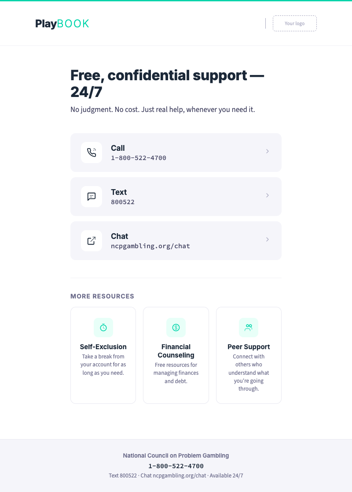
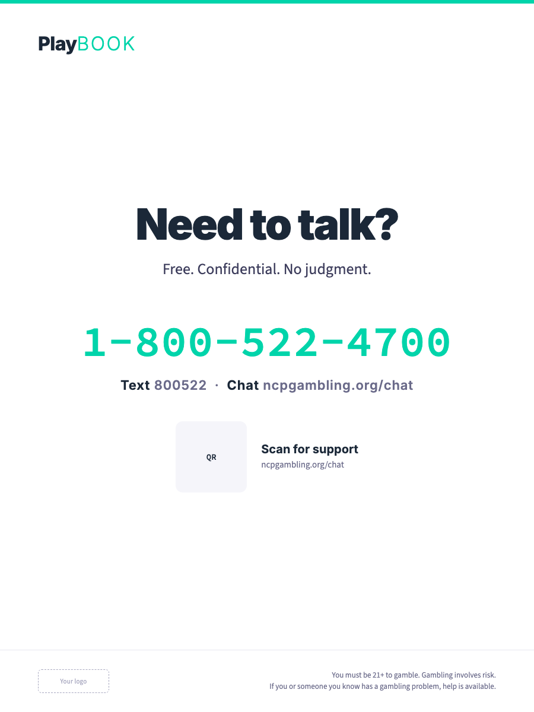

# Tier 2 Visual Identity Guide

When Playbook shifts from entertainment literacy to support and crisis contexts, the visual identity shifts with it. The voice chapter calls this "the support voice." This guide defines what that looks like.

> **Operator note**: Tier 2 content represents approximately 5% of total Playbook output but 100% of the moments that matter most. Every pixel in a Tier 2 context should reduce friction and increase clarity. If a player in distress encounters a playful chart, a witty headline, or an entertainment-grade color palette on a support page, the brand has failed them. This guide exists to prevent that.

---

## Quick-scan index

| Section | What it covers |
|---|---|
| [The visual shift](#the-visual-shift) | How and why Tier 2 looks different |
| [Color](#color) | Tier 2 color subset and usage rules |
| [Typography](#typography) | Weight, size, and spacing adjustments |
| [Layout](#layout) | Structural principles for support contexts |
| [Iconography](#iconography) | Icon usage in Tier 2 |
| [Illustration and data visualization](#illustration-and-data-visualization) | Activity dashboards, session charts |
| [Photography](#photography) | Image direction for support contexts |
| [Component patterns](#component-patterns) | Reusable UI blocks for Tier 2 screens |
| [The Tier 2 test](#the-tier-2-test) | Quality checklist |
| [Rendered previews](#rendered-previews) | PNG previews of all 8 Tier 2 templates |

---

## The visual shift

Tier 1 and Tier 2 share the same brand — same fonts, same logo, same design system. But they use it differently, the way a person uses the same voice at a party and at a hospital. The fundamentals don't change. The register does.

| Dimension | Tier 1 (Entertainment Literacy) | Tier 2 (Support & Crisis) |
|---|---|---|
| **Energy** | High — confident, energetic, engaging | Low — calm, steady, unhurried |
| **Color density** | Full palette — navy, teal, orange working together | Reduced — navy + white + warm neutrals |
| **Visual complexity** | Rich — charts, illustrations, multi-column layouts | Minimal — single focus, generous white space |
| **Tone cues** | Teal and orange signal energy and action | Neutral warmth signals safety and openness |
| **Information density** | High — multiple data points, comparisons, quiz options | Low — one idea per screen, one action per step |
| **CTAs** | Multiple options, discovery-oriented | Single primary action, direct path to help |
| **Imagery** | Lifestyle editorial, social moments, entertainment | Quiet, calm, human warmth without gambling context |

### When does Tier 2 activate?

Tier 2 visual treatment applies to:

- Help/support landing pages
- Self-exclusion and account pause flows
- Limit-reached notifications and screens
- Cooldown and waiting-period interstitials
- Helpline display contexts (beyond the standard footer strip)
- Activity summaries and session dashboards when presented in a reflection context
- Reactivation flows (returning after a pause)
- Any screen where the primary intent is connecting a player to support

Tier 2 does **not** apply to:

- The helpline number in a standard footer strip (that's Tier 1 integration)
- Deposit limit prompts during onboarding (that's Tier 1 tool promotion)
- Educational content about self-exclusion in articles (that's Tier 1 informational)
- Session reminders that pop up during play (that's Tier 1 check-in)

The distinction: Tier 2 activates when the player has *sought* support or when the system is *responding* to a concern — not when tools are being promoted as features.

---

## Color

### The Tier 2 subset

Tier 2 uses a constrained subset of the full Playbook palette. The goal is visual calm — fewer competing colors, higher contrast, more white space.

| Role | Color | Hex | Usage in Tier 2 |
|---|---|---|---|
| **Primary** | Deep navy | `#1B2838` | Headers, primary text, logo |
| **Surface** | White | `#FFFFFF` | Page backgrounds, card surfaces |
| **Surface alt** | Near-white | `#F5F5FA` (`neutral_50`) | Secondary backgrounds, alternating sections |
| **Text primary** | Dark navy | `#1A1A2E` (`neutral_900`) | Body text |
| **Text secondary** | Mid gray | `#3D3D5C` (`neutral_700`) | Supporting text, descriptions |
| **Text tertiary** | Light gray | `#6B6B8A` (`neutral_500`) | Metadata, timestamps |
| **Border** | Soft gray | `#A8A8C0` (`neutral_300`) | Dividers, card borders |
| **Accent (support)** | Teal | `#00D4AA` | Primary CTA only — "Call now," "Get support" |
| **Accent (confirm)** | Success green | `#00C853` | Confirmation states — "Account paused," "Limit set" |
| **Alert** | Danger red | `#FF3D00` | Urgent alerts only — never as theme or decoration |

### Colors NOT used in Tier 2

| Color | Why excluded |
|---|---|
| **Orange (`#FF6B35`)** | Too energetic, too associated with Tier 1 engagement. Creates urgency that's inappropriate in support contexts. |
| **Teal as background** | Teal works as a CTA button color but not as a background wash — it's too "entertainment" for Tier 2 surfaces. |
| **Navy as full-bleed background** | The dark, immersive navy backgrounds from Tier 1 feel heavy in Tier 2. White and near-white surfaces create openness. |
| **Gradient accent bar** | The orange-to-teal gradient is a Tier 1 signature. Tier 2 uses a single-color accent or no accent bar. |

### Tier 2 accent bar

Where Tier 1 uses the signature orange-to-teal gradient bar, Tier 2 uses a **solid teal bar** at reduced height (3px vs. 6px). This maintains brand recognition while signaling the tonal shift.

If the gradient bar appears on a support page, the player subconsciously reads it as "entertainment" — and that's the wrong register.

### Dark mode in Tier 2

When the operator's platform is in dark mode, Tier 2 surfaces shift:

| Light mode | Dark mode |
|---|---|
| White (`#FFFFFF`) surface | `neutral_900` (`#1A1A2E`) surface |
| `neutral_50` alt surface | `neutral_700` (`#3D3D5C`) alt surface |
| `neutral_900` text | `neutral_50` (`#F5F5FA`) text |
| Teal CTA buttons | Teal CTA buttons (same — sufficient contrast on dark) |
| Success green confirmations | Success green (slightly desaturated: `#00B84A`) |

All dark mode combinations must pass WCAG 2.1 AA. Test helpline numbers specifically — they must be immediately readable in both modes.

---

## Typography

Tier 2 uses the same font families as Tier 1 (Inter, Source Sans 3, Source Code Pro) but with different weight and spacing choices.

### Weight shift

| Element | Tier 1 | Tier 2 | Why |
|---|---|---|---|
| **Page headings** | 700–800 (bold/extrabold) | 600 (semibold) | Less visual weight reduces intensity |
| **Body text** | 400 (regular) | 400 (regular) | Same — readability is consistent |
| **Helpline numbers** | 600 (semibold) | 700 (bold) | Helpline gets *more* weight in Tier 2 — it's the most important element |
| **CTA labels** | 600 (semibold) | 600 (semibold) | Same — CTAs need to be findable |
| **Metadata** | 400–500 | 400 | Lighter, less visual noise |

### Size adjustments

| Element | Tier 1 | Tier 2 | Why |
|---|---|---|---|
| **Body text** | 16px (1rem) | 18px (1.125rem) | Larger body text for stressed readers |
| **Line height** | 1.5–1.6 | 1.7–1.8 | More breathing room between lines |
| **Paragraph spacing** | 1rem | 1.5rem | More space between paragraphs |
| **Helpline number** | Context-dependent | 24px minimum | Must be scannable from arm's length on mobile |

### The readability principle

A player in distress may be:
- Reading through tears or anxiety
- Scanning quickly, not reading carefully
- On a phone, possibly shaking
- In a dimly lit environment (late at night)

Design for these conditions. Larger text, more spacing, higher contrast, fewer words.

---

## Layout

### Core principles

1. **One action per screen.** If a screen has two CTAs competing for attention, one of them shouldn't be there.
2. **Helpline above the fold.** On every Tier 2 screen, the helpline number or "Get support" CTA is visible without scrolling.
3. **Maximum white space.** Tier 2 layouts use at most 60% of available screen area. The remaining 40% is breathing room.
4. **No sidebars, no multi-column.** Tier 2 content is a single column, centered, max-width 640px.
5. **Touch targets: 56px minimum.** Larger than the standard 44px because precision is harder under stress.
6. **No auto-dismiss.** Tier 2 content stays visible until the player actively navigates away. No timers, no auto-close.

### Structural patterns

**Support page:**
```
[Solid teal accent bar — 3px]
[Logo]
[Heading — semibold, navy]
[1-2 sentences — what this page is for]

[Resource block — phone, text, chat]
  Large, tappable, high contrast

[Separator]

[Secondary resources — self-exclusion, financial counseling, peer support]
  Card layout, one resource per card

[Footer — helpline repeated]
```

**Self-exclusion flow:**
```
[Step indicator — 1 of 3, simple dots]
[Heading — clear, short]
[Body — one paragraph maximum]
[Options — large radio buttons or cards]
[Single primary CTA]
[Back link — low-key, not competing with primary action]
```

**Limit-reached notification:**
```
[Subtle top border — teal, 2px]
[Icon — small, muted]
[Heading — "Weekly limit reached"]
[One sentence — when it resets]
[Primary CTA — "View activity" or "Adjust limits"]
[Dismiss — text link, not competing]
```

### Responsive behavior

| Breakpoint | Tier 2 adjustment |
|---|---|
| **Desktop (>1024px)** | Max-width 640px, centered. Generous margins. |
| **Tablet (768–1024px)** | Full width with 48px padding. |
| **Mobile (<768px)** | Full width with 24px padding. Helpline becomes sticky bottom bar. |

On mobile, the helpline number should become a persistent, tappable element at the bottom of the screen for all Tier 2 pages.

---

## Iconography

Tier 2 uses the same 31-icon library but with different usage patterns.

### Tier 2 icon rules

- **Stroke weight:** Use the lighter 1px detail strokes only — the bold 2px structural strokes feel too assertive for Tier 2.
- **Size:** 24px default. Never smaller than 20px in Tier 2 (legibility under stress).
- **Color:** `neutral_500` (`#6B6B8A`) for decorative icons. `neutral_900` for functional icons (phone, help, external link).
- **Pairing:** Icons accompany text labels — never standalone in Tier 2. A player shouldn't have to interpret an icon to find help.

### Key Tier 2 icons

| Icon | Tier 2 context |
|---|---|
| `icon-phone` | Helpline display — primary support CTA |
| `icon-help` | Support page header, help section identifier |
| `icon-timer` | Session duration in activity summaries |
| `icon-limit` | Limit-reached notifications, settings |
| `icon-budget` | Spending summaries, activity dashboard |
| `icon-activity` | Session history, play pattern visualization |
| `icon-check` | Confirmation states (limit set, account paused) |
| `icon-external` | External support resource links |

---

## Illustration and data visualization

### Activity dashboards

When Tier 2 contexts show player activity data (session history, spending patterns, time played), the visualization style shifts from Tier 1's confident data presentation to something quieter and more reflective.

| Dimension | Tier 1 data viz | Tier 2 data viz |
|---|---|---|
| **Palette** | Full brand colors — teal highlights, orange accents | Muted — `neutral_300` bars/lines, single teal highlight for current period |
| **Annotations** | Bold callouts, comparative labels | Minimal — data labels only, no editorial annotations |
| **Chrome** | Styled containers, branded headers | Clean containers, white background, thin borders |
| **Interactivity** | Hover states, clickable segments | Static or minimal interaction — no gamification |
| **Tone** | "Here's how the math works" | "Here's your activity" — neutral, factual |

### Chart rules for Tier 2

- **Bar charts:** Use `neutral_300` (`#A8A8C0`) as the default bar color. Use `secondary` teal (`#00D4AA`) for the current period or highlighted data point. Maximum 5 bars visible.
- **Line charts:** Use `neutral_500` (`#6B6B8A`) for the line. `neutral_300` for gridlines. No area fill — clean line only.
- **Donut charts:** Not recommended in Tier 2. If required, use a muted two-tone (neutral + one highlight).
- **Sparklines:** Acceptable for compact summaries. `neutral_500` line, no fill.

### What NOT to show

- Leaderboards, rankings, or competitive comparisons
- Streaks, badges, or achievement-style UI
- Animated transitions on data changes
- Color coding that implies "good" or "bad" (green/red) for spending amounts — use neutral colors for all data, highlight only for informational emphasis

### Session summary card

A key Tier 2 component — shows a player their recent activity at a glance:

```
┌─────────────────────────────────────────┐
│  Your Activity — Last 7 Days            │
│                                         │
│  Sessions          4                    │
│  Time played       3h 22m              │
│  Average session   50 min              │
│                                         │
│  [Mini bar chart — neutral with teal    │
│   highlight on today]                   │
│                                         │
│  Your limits: $200/week (active)        │
│  [Manage settings →]                    │
└─────────────────────────────────────────┘
```

---

## Photography

### Tier 2 photo direction

Where Tier 1 photography shows "people who enjoy life and make smart choices," Tier 2 photography shows **calm, human warmth without gambling context.**

### Do

- Show **hands** — holding a cup of coffee, resting on a table, holding a phone (not showing a gambling screen)
- Show **quiet environments** — parks, morning light, open spaces, home settings
- Show **everyday calm** — reading, walking, conversation with a friend
- Use **warm, natural lighting** — golden hour, soft daylight, no harsh studio light
- Show **diversity** — same diversity standards as Tier 1

### Don't

- Show gambling environments, screens, or equipment in any form
- Show people who look distressed, crying, or defeated
- Show clinical settings (doctor's office, therapy room) — support should feel accessible, not medical
- Show isolation — a person alone in a dark room reinforces stigma
- Show crowds or high-energy social scenes — the tone should be quiet

### The photo test for Tier 2

Ask: "If a player in crisis sees this image, does it feel like a safe place?"

If the image creates any tension, anxiety, or association with gambling, it fails.

---

## Component patterns

Reusable UI blocks for Tier 2 screens. These are specifications — see `collateral/render/` for rendered visual examples.

### Support resource block

The most important Tier 2 component. Displays helpline and support channels.

**Structure:**
- Heading: "Free, confidential support — 24/7"
- Three channels stacked vertically: Call, Text, Chat
- Each channel: icon + label + contact info, all tappable
- Background: white surface with subtle border (`neutral_300`)
- Padding: 32px (desktop), 24px (mobile)
- Corner radius: 12px

**Sizing:**
- Phone number: 24px, bold (Inter 700)
- Channel labels: 14px, semibold (Inter 600)
- Supporting text: 16px, regular (Source Sans 3 400)
- Touch targets: 56px height minimum per channel row

### Self-exclusion option card

Used in the self-exclusion duration selection step.

**Structure:**
- Radio button or card-select pattern
- Duration label: "7 days" — large, clear
- Description: "Your account will be paused until {{DATE}}" — smaller, gray
- Selected state: teal left border (4px), light teal background tint
- Unselected state: neutral_300 border, white background

### Confirmation banner

Used after a player completes a Tier 2 action (set limit, paused account, etc.).

**Structure:**
- Full-width banner, top of screen
- Background: `neutral_50` with 2px teal top border
- Icon: `icon-check` in success green, 24px
- Message: "Your account is paused. Take all the time you need."
- Sub-message: "Support is available: {{HELPLINE_NUMBER}}"
- No auto-dismiss — player closes manually

### Limit-reached banner

In-app notification when a deposit or session limit is hit.

**Structure:**
- Card or banner format, non-intrusive
- Background: white with subtle teal left border (3px)
- Heading: "Weekly limit reached" — navy, semibold
- Body: "Resets {{DATE}}. That's your budget working as designed." — neutral_700
- CTA: "View activity" (text link, not button)
- Dismiss: small X, top-right

---

## The Tier 2 test

Before shipping any Tier 2 content, run this checklist:

### Visual
- [ ] No orange (`#FF6B35`) appears anywhere on the screen
- [ ] No gradient accent bar (orange-to-teal) — solid teal or none
- [ ] White or near-white surface backgrounds — not dark navy immersive
- [ ] Single column layout, max-width 640px
- [ ] Helpline number visible without scrolling

### Tone
- [ ] No playful or witty copy — warm and direct only
- [ ] No quiz prompts, myth-busting hooks, or educational CTAs
- [ ] Helpline description: "Free. Confidential. 24/7." — not marketing copy

### Interaction
- [ ] One primary action per screen
- [ ] Touch targets 56px minimum
- [ ] No auto-dismiss on any element
- [ ] No confirmation dialogs on help-seeking actions (don't ask "are you sure?" before showing helpline)
- [ ] Back/cancel is always available but low-key

### Accessibility
- [ ] All text meets WCAG 2.1 AA contrast on the chosen surface
- [ ] Body text 18px minimum
- [ ] Line height 1.7 minimum
- [ ] Keyboard navigable in correct tab order
- [ ] Screen reader: heading hierarchy is logical, helpline is announced early

### Emotional
- [ ] No gambling imagery in photos or illustrations
- [ ] No gamification (badges, scores, streaks) in data displays
- [ ] The page feels calm. If it feels "fun," it's wrong for Tier 2.
- [ ] Would a person in crisis feel safe here?

---

## Rendered previews

All Tier 2 collateral templates with PNG previews. Click the template name to view the full HTML source.

### Digital screens

| Template | Description | Preview |
|---|---|---|
| [Support page](../../collateral/render/support-page-10a.html) | Help/support landing page — phone, text, chat channels |  |
| [Self-exclusion](../../collateral/render/self-exclusion-10b.html) | Self-exclusion flow — duration selection, confirmation |  |
| [Session summary](../../collateral/render/session-summary-10c.html) | Activity dashboard card — time, spend, sessions |  |
| [Limit reached](../../collateral/render/limit-reached-10d.html) | In-app notification banner — deposit limit hit |  |
| [Cooldown](../../collateral/render/cooldown-10e.html) | Account pause confirmation screen |  |

### Outreach and communications

| Template | Description | Preview |
|---|---|---|
| [Social card](../../collateral/render/card-tier2-10f.html) | Support-focused social media card (1080x1080) |  |
| [Venue poster](../../collateral/render/poster-tier2-10g.html) | Helpline poster for restrooms/private areas (900x1200) |  |
| [Support email](../../collateral/render/email-support-10h.html) | Warm outreach email with help resources |  |

---

## Cross-references

- **Voice and tone**: [Chapter 4](../../brand-book/04-voice-and-tone.md) — Warm/Direct register, the support voice
- **Messaging for help-seekers**: [`messaging/player-segments/help-seekers.md`](../../messaging/player-segments/help-seekers.md)
- **Messaging for at-risk players**: [`messaging/player-segments/at-risk-players.md`](../../messaging/player-segments/at-risk-players.md)
- **Stigma-free language**: [`messaging/stigma-free-language.md`](../../messaging/stigma-free-language.md)
- **Color accessibility**: [`visual-identity/color/accessibility-matrix.md`](../color/accessibility-matrix.md)

---

*Related: [Chapter 3 — Visual Identity](../../brand-book/03-visual-identity.md) | [Illustration Guide](../illustration/illustration.md) | [Photography Guide](../photography/photography.md)*
