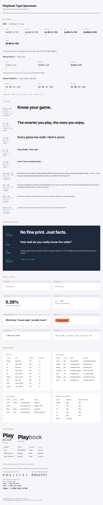

# Playbook Typography Reference

> Canonical source: [`_brand.yml`](../../_brand.yml)
> Drop-in CSS: [`playbook-typography.css`](playbook-typography.css)
> Visual reference: [`type-specimen.html`](type-specimen.html)



---

## Font families

| Role | Family | Source | License | Weights |
|---|---|---|---|---|
| **Headings, UI, logo** | Inter | [Google Fonts](https://fonts.google.com/specimen/Inter) | SIL OFL 1.1 | 300, 400, 600, 700, 800, 900 |
| **Body text** | Source Sans 3 | [Google Fonts](https://fonts.google.com/specimen/Source+Sans+3) | SIL OFL 1.1 | 300, 400, 600 |
| **Data, odds, helplines** | Source Code Pro | [Google Fonts](https://fonts.google.com/specimen/Source+Code+Pro) | SIL OFL 1.1 | 400, 500, 600 |

### Why these fonts?

- **Inter** — Designed for computer screens. Excellent x-height, clear at small sizes, broad weight range for the logo (800 vs 300 contrast) and heading hierarchy.
- **Source Sans 3** — Adobe's open-source workhorse. Highly readable for long-form content, good at body sizes (16-18px).
- **Source Code Pro** — Monospaced companion to Source Sans. Chosen for helpline numbers because 0/O, 1/l/I are fully disambiguated.

### Loading fonts

**Option A — Self-hosted (recommended):**

```html
<link rel="stylesheet" href="visual-identity/typography/playbook-typography.css">
```

Font files are variable-weight woff2 in `fonts/`:
- `inter-latin.woff2` (47 KB)
- `source-sans-3-latin.woff2` (28 KB)
- `source-code-pro-latin.woff2` (22 KB)

**Option B — Google Fonts CDN:**

```html
<link rel="preconnect" href="https://fonts.googleapis.com">
<link rel="preconnect" href="https://fonts.gstatic.com" crossorigin>
<link href="https://fonts.googleapis.com/css2?family=Inter:wght@300;400;600;700;800;900&family=Source+Sans+3:wght@300;400;600&family=Source+Code+Pro:wght@400;500;600&display=swap" rel="stylesheet">
```

---

## Type scale

Base: 16px (1rem). Minimum body text: 16px — no exceptions.

| Level | Size | rem | Font | Weight | Leading | Tracking | CSS class |
|---|---|---|---|---|---|---|---|
| Display | 48px | 3.0 | Inter | 700 | 1.2 | -0.02em | `.pb-display` |
| H1 | 40px | 2.5 | Inter | 700 | 1.2 | -0.02em | `.pb-h1` |
| H2 | 32px | 2.0 | Inter | 600 | 1.2 | 0 | `.pb-h2` |
| H3 | 24px | 1.5 | Inter | 600 | 1.3 | 0 | `.pb-h3` |
| H4 | 20px | 1.25 | Inter | 600 | 1.3 | 0 | `.pb-h4` |
| Body large | 18px | 1.125 | Source Sans 3 | 400 | 1.6 | 0 | `.pb-body-lg` |
| Body | 16px | 1.0 | Source Sans 3 | 400 | 1.6 | 0 | `.pb-body` |
| Small | 14px | 0.875 | Source Sans 3 | 400 | 1.6 | 0 | `.pb-small` |
| Caption | 12px | 0.75 | Source Sans 3 | 400 | 1.5 | 0 | `.pb-caption` |

### Responsive scale

On viewports ≤768px, headings scale down to stay readable without scrolling:

| Level | Desktop | Mobile |
|---|---|---|
| Display | 48px | 36px |
| H1 | 40px | 32px |
| H2 | 32px | 24px |
| H3 | 24px | 20px |
| H4 | 20px | 18px |
| Body and below | unchanged | unchanged |

---

## Font weights

| Name | Value | CSS token | CSS class | Primary usage |
|---|---|---|---|---|
| Light | 300 | `--pb-weight-light` | `.pb-light` | Logo "BOOK" half, body light |
| Regular | 400 | `--pb-weight-regular` | `.pb-regular` | Body text, form labels |
| Medium | 500 | `--pb-weight-medium` | `.pb-medium` | Mono data displays, odds |
| Semibold | 600 | `--pb-weight-semibold` | `.pb-semibold` | H2–H4, CTAs, labels, UI |
| Bold | 700 | `--pb-weight-bold` | `.pb-bold` | H1, Display, helpline numbers |
| Extrabold | 800 | `--pb-weight-extrabold` | `.pb-extrabold` | Logo "Play" half, hero stats |
| Black | 900 | `--pb-weight-black` | `.pb-black` | Campaign accent headlines |

---

## Letter spacing

| Name | Value | CSS token | CSS class | Usage |
|---|---|---|---|---|
| Tight | -0.02em | `--pb-tracking-tight` | `.pb-tracking-tight` | Display, H1 headlines |
| Normal | 0 | `--pb-tracking-normal` | `.pb-tracking-normal` | Body text, H2–H4 |
| Wide | 0.05em | `--pb-tracking-wide` | `.pb-tracking-wide` | Labels, CTAs, uppercase UI |
| Wider | 0.1em | `--pb-tracking-wider` | `.pb-tracking-wider` | Eyebrows, small-cap treatments |

**Logo-specific:**
| Element | Tracking |
|---|---|
| "Play" | -0.03em |
| "BOOK" (stacked) | 0.15em |
| "book" (horizontal) | 0.02em |

---

## Semantic classes

These classes combine font, size, weight, leading, and tracking into single-purpose styles for common Playbook content patterns.

| Class | Description | Font | Size | Weight | Use for |
|---|---|---|---|---|---|
| `.pb-label` | Uppercase label | Inter | 14px | 600 | Category labels, section markers |
| `.pb-eyebrow` | Tiny uppercase | Inter | 12px | 600 | Eyebrow text above headings |
| `.pb-stat` | Large data number | Inter | 48px | 800 | Hero statistics (5.26%, 1:37) |
| `.pb-odds` | Odds display | Source Code Pro | 24px | 500 | Odds, ratios, probabilities |
| `.pb-quiz-question` | Quiz heading | Inter | 24px | 700 | Quiz and trivia questions |
| `.pb-cta` | Button text | Inter | 16px | 600 | Call-to-action buttons |
| `.pb-helpline` | Helpline number | Source Code Pro | 18px | 600 | Crisis/support phone numbers |
| `.pb-mono` | General mono | Source Code Pro | 16px | 400 | Data, code, technical text |
| `.pb-mono-lg` | Large mono | Source Code Pro | 18px | 500 | Featured data, RTP displays |

---

## Modifier classes

### Weight
`.pb-light` `.pb-regular` `.pb-medium` `.pb-semibold` `.pb-bold` `.pb-extrabold` `.pb-black`

### Font family
`.pb-font-heading` `.pb-font-body` `.pb-font-mono`

### Tracking
`.pb-tracking-tight` `.pb-tracking-normal` `.pb-tracking-wide` `.pb-tracking-wider`

### Leading
`.pb-leading-heading` `.pb-leading-tight` `.pb-leading-body`

---

## Typography rules

1. **Minimum body text**: 16px (1rem). No exceptions.
2. **Line length**: 50–75 characters per line for body text.
3. **Paragraph spacing**: 1em between paragraphs.
4. **Alignment**: Left-aligned always. Never justified.
5. **Helpline numbers**: Always in `.pb-helpline` (Source Code Pro 600). Never in a font where 1/l/I or 0/O are ambiguous.
6. **Caption text** (12px): Legal lines only. Never for content players should read.

---

## Adapting typography

When customizing fonts for your operator brand:

1. Choose fonts with broad weight support (minimum: regular and bold).
2. Match the quality and modernity of your operator's commercial typography.
3. Ensure the font supports character sets for your operating jurisdictions.
4. Test readability at small sizes — Playbook content often appears in constrained spaces.
5. Update `_brand.yml` and regenerate `playbook-typography.css`.
6. If replacing Inter, ensure your heading font has a weight ≥700 for the logo and a weight ≤300 for the "BOOK" contrast.

---

## Design tokens

All typography values are available as CSS custom properties (`--pb-*` prefix). See [`design-tokens.css`](../design-tokens.css) for the complete token set.

### Token reference

```css
/* Families */
--pb-font-heading    /* Inter */
--pb-font-body       /* Source Sans 3 */
--pb-font-mono       /* Source Code Pro */

/* Scale */
--pb-text-display    /* 3rem / 48px */
--pb-text-h1         /* 2.5rem / 40px */
--pb-text-h2         /* 2rem / 32px */
--pb-text-h3         /* 1.5rem / 24px */
--pb-text-h4         /* 1.25rem / 20px */
--pb-text-body-lg    /* 1.125rem / 18px */
--pb-text-body       /* 1rem / 16px */
--pb-text-small      /* 0.875rem / 14px */
--pb-text-caption    /* 0.75rem / 12px */

/* Weights */
--pb-weight-light       /* 300 */
--pb-weight-regular     /* 400 */
--pb-weight-medium      /* 500 */
--pb-weight-semibold    /* 600 */
--pb-weight-bold        /* 700 */
--pb-weight-extrabold   /* 800 */
--pb-weight-black       /* 900 */

/* Leading */
--pb-leading-heading    /* 1.2 */
--pb-leading-tight      /* 1.3 */
--pb-leading-body       /* 1.6 */

/* Tracking */
--pb-tracking-tight     /* -0.02em */
--pb-tracking-normal    /* 0 */
--pb-tracking-wide      /* 0.05em */
--pb-tracking-wider     /* 0.1em */
```
